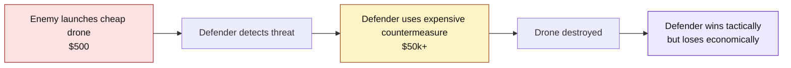
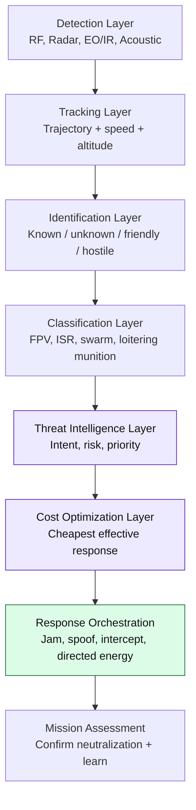
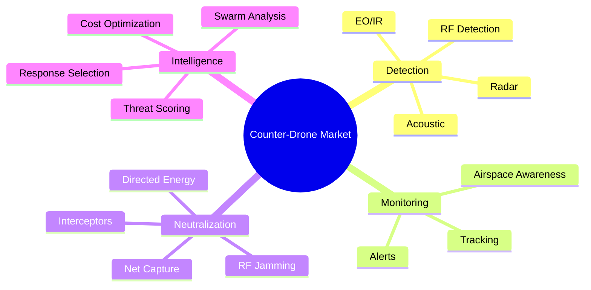
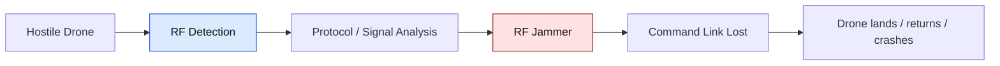
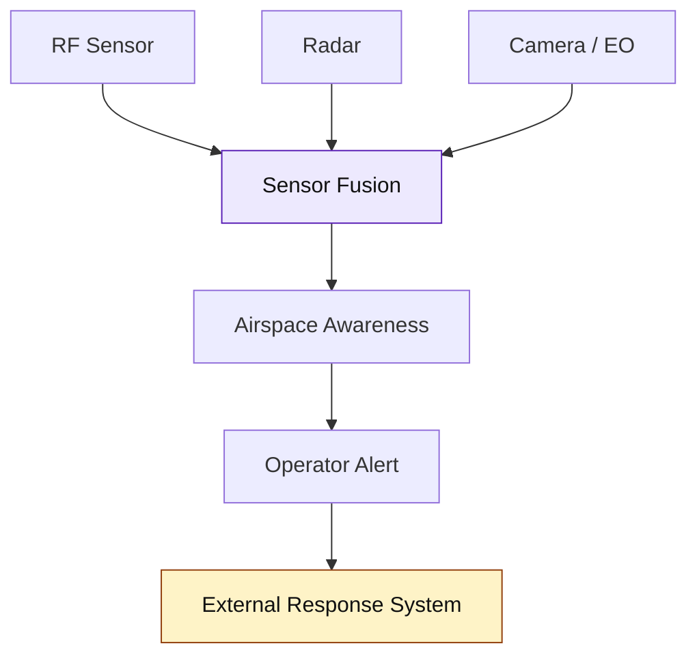
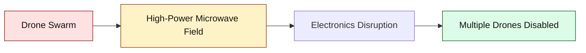
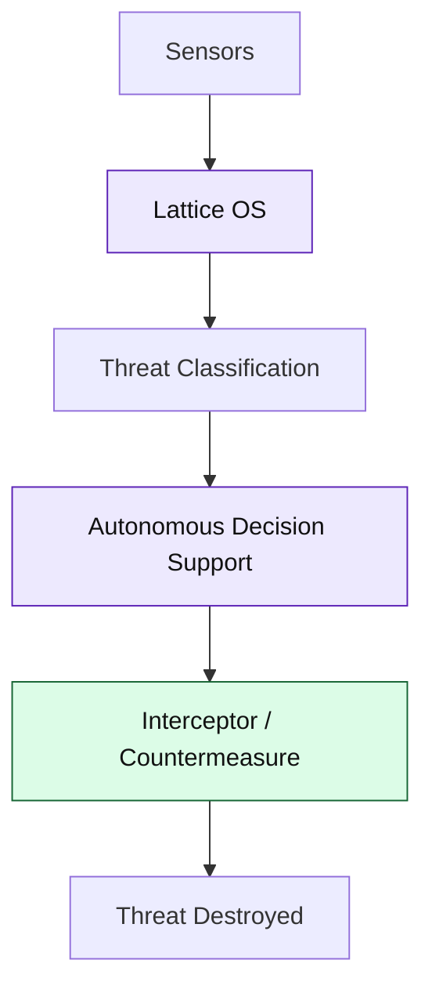
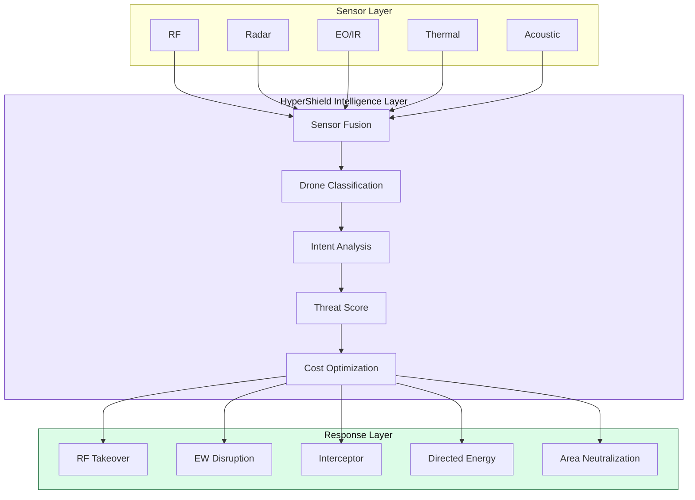
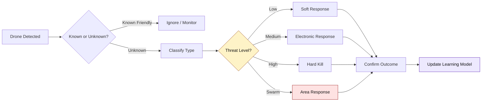
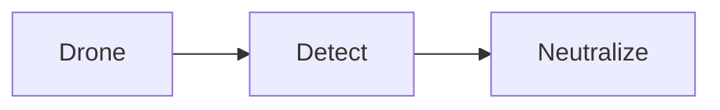

# HyperShield

## Autonomous Airspace Security Operating System

> **Core thesis:** Existing counter-drone systems are built to destroy drones. HyperShield is built to win the economics of drone warfare.

---

# 1. Executive Summary

Modern warfare has shifted from expensive aircraft to cheap, disposable, networked drone threats.

A defender can destroy a drone and still lose economically.

<div className="grid grid-cols-2 gap-4">

<div className="rounded-2xl border p-6 bg-card">

## Attacker Cost

```text
FPV Drone
$300 — $2,000
```

Low-cost, disposable, scalable.

</div>

<div className="rounded-2xl border p-6 bg-card">

## Defender Cost

```text
Missile / Interceptor
$10,000 — $500,000+
```

Expensive per engagement.

</div>

</div>

## HyperShield Positioning

```text
Not a jammer.
Not a radar.
Not only an interceptor.

HyperShield = Airspace Intelligence + Response Optimization Layer
```

---

# 2. The Core Problem

## The Cost-Asymmetry Trap



## Key Insight

> Future counter-drone systems must optimize **cost per neutralized threat**, not just kill rate.

---

# 3. Threat Classification

| Threat Type        |       Cost Range | Typical Use               | Risk Level  | Best Response                        |
| ------------------ | ---------------: | ------------------------- | ----------- | ------------------------------------ |
| Hobby drone        |      $300–$1,000 | Surveillance / nuisance   | Low         | RF takeover / warning                |
| Smuggling drone    |    $1,000–$5,000 | Border drops / contraband | Medium      | EW disruption                        |
| ISR drone          |   $5,000–$25,000 | Recon / targeting         | Medium-High | Track + disable                      |
| FPV attack drone   |      $300–$2,000 | Direct strike             | High        | Fast hard kill                       |
| Drone swarm        |         Variable | Saturation attack         | Critical    | Area response / swarm neutralization |
| Loitering munition | $10,000–$50,000+ | Strike mission            | Critical    | Hard kill / layered defense          |

---

# 4. Counter-Drone Industry Stack



## HyperShield owns the intelligence gap

Most companies focus on detection or neutralization.
HyperShield focuses on **decision superiority**.

---

# 5. Market Category Map



---

# 6. Competitor Classification Table

| Company         |       Country | Founded | Category                    | Core Approach                             | Main Consumers                       | Major Use Cases                       |
| --------------- | ------------: | ------: | --------------------------- | ----------------------------------------- | ------------------------------------ | ------------------------------------- |
| **DroneShield** |     Australia |    2014 | RF Counter-Drone / EW       | Detect + jam drone links                  | Military, airports, government       | Portable C-UAS, RF detection, jamming |
| **Dedrone**     | Germany / USA |    2014 | Airspace Monitoring         | Multi-sensor detection + tracking         | Airports, enterprise, public sector  | Airport security, facility protection |
| **Epirus**      |           USA |    2018 | Directed Energy             | High-power microwave neutralization       | US military / defense programs       | Drone swarm defeat                    |
| **Anduril**     |           USA |    2017 | Autonomous Defense Platform | Sensors + Lattice + interceptors          | US DoD, border security, allies      | Full kill-chain defense               |
| **Fortem**      |           USA |    2016 | Radar + Interceptor         | Radar detection + DroneHunter interceptor | Defense, airports, critical infra    | Physical drone capture / defeat       |
| **Echodyne**    |           USA |    2014 | Radar Provider              | Compact electronically scanned radar      | Defense integrators, border security | Detection and tracking layer          |

---

# 7. Competitor Engagement Models

## 7.1 DroneShield

### Category

**Electronic Warfare / RF Counter-Drone**



### What They Do Well

| Strength            | Why It Matters                              |
| ------------------- | ------------------------------------------- |
| RF detection        | Finds drones emitting control/video signals |
| Jamming             | Can disrupt command/control links           |
| Portable systems    | Useful for mobile military teams            |
| Mature product line | Easier procurement confidence               |

### Weakness

```text
Works best when drone depends on RF control.

Less effective against:
- Autonomous drones
- Pre-programmed routes
- GPS-independent drones
- Silent / low-emission drones
- Larger coordinated swarms
```

### Their Category

```text
DroneShield = Detect + Jam
```

---

## 7.2 Dedrone

### Category

**Airspace Monitoring / Sensor Fusion**



### What They Do Well

| Strength               | Why It Matters                         |
| ---------------------- | -------------------------------------- |
| Multi-sensor detection | Higher confidence than RF-only systems |
| Airspace awareness     | Good for airports and large facilities |
| Enterprise deployments | Works for non-military buyers          |
| Tracking               | Useful for incident response           |

### Weakness

```text
Awareness is not neutralization.

Dedrone can tell you:
"Drone is here."

But the harder question is:
"What is the cheapest effective way to stop it?"
```

### Their Category

```text
Dedrone = Detect + Track + Alert
```

---

## 7.3 Epirus

### Category

**Directed Energy / Swarm Neutralization**



### What They Do Well

| Strength                    | Why It Matters                    |
| --------------------------- | --------------------------------- |
| Area effect                 | Can affect many drones at once    |
| Swarm relevance             | Strong against mass drone attacks |
| Low marginal cost per drone | Better economics than missiles    |
| Defense-grade positioning   | Strong military appeal            |

### Weakness

```text
Epirus is strong at neutralization,
but needs external systems for:

- Detection
- Tracking
- Classification
- Threat intelligence
- Response decisioning
```

### Their Category

```text
Epirus = Destroy Many
```

---

## 7.4 Anduril

### Category

**Autonomous Defense Platform**



### What They Do Well

| Strength               | Why It Matters            |
| ---------------------- | ------------------------- |
| Full kill chain        | Detect to destroy         |
| Lattice OS             | Strong software layer     |
| Autonomous response    | Reduces operator load     |
| Military relationships | Strong procurement access |

### Weakness

```text
Highly capable, but likely:
- Expensive
- Large-footprint
- Complex procurement
- Built for premium defense deployments
```

### Their Category

```text
Anduril = Full-Stack Defense Platform
```

---

## 7.5 Fortem Technologies

### Category

**Radar + Interceptor Drone**


### What They Do Well

| Strength              | Why It Matters                      |
| --------------------- | ----------------------------------- |
| Radar-based detection | Works even when RF is silent        |
| Interceptor drone     | Physical defeat option              |
| Useful for airports   | Lower collateral risk than missiles |
| Layered defense fit   | Can plug into wider systems         |

### Weakness

```text
Interceptor-per-target economics can still become costly
when facing large swarm attacks.
```

### Their Category

```text
Fortem = Detect + Intercept
```

---

# 8. Competitor Coverage Matrix

| Layer               | DroneShield | Dedrone | Epirus | Anduril | Fortem  | HyperShield         |
| ------------------- | ----------- | ------- | ------ | ------- | ------- | ------------------- |
| Detection           | High        | High    | Low    | High    | High    | High                |
| Tracking            | Medium      | High    | Low    | High    | High    | High                |
| Identification      | Medium      | Medium  | Low    | High    | Medium  | High                |
| Classification      | Low         | Medium  | Low    | High    | Medium  | High                |
| Threat Intelligence | Low         | Low-Med | Low    | High    | Low-Med | High                |
| Cost Optimization   | Low         | Low     | Medium | Low-Med | Low     | High                |
| Swarm Analysis      | Low         | Low     | High   | High    | Medium  | High                |
| Response Selection  | Medium      | Low     | Low    | High    | Medium  | High                |
| Neutralization      | Medium      | Low     | High   | High    | High    | Partner / Integrate |
| Mission Learning    | Low         | Low     | Low    | Medium  | Low     | High                |

---

# 9. Visual Capability Heatmap

```text
Capability Coverage

DroneShield
Detection          ██████████
Tracking           █████
Classification     ██
Threat Intel       ██
Neutralization     ███████

Dedrone
Detection          ██████████
Tracking           █████████
Classification     █████
Threat Intel       ███
Neutralization     ██

Epirus
Detection          ██
Tracking           ██
Classification     ██
Threat Intel       ██
Neutralization     ██████████

Anduril
Detection          ██████████
Tracking           ██████████
Classification     ██████████
Threat Intel       ██████████
Neutralization     ██████████

HyperShield
Detection          █████████
Tracking           █████████
Classification     ██████████
Threat Intel       ██████████
Cost Optimization  ██████████
Response Engine    ██████████
```

---

# 10. HyperShield Architecture



---

# 11. HyperShield Decision Model



---

# 12. Cost-Based Response Matrix

| Drone Type         | Risk        | Cheap Response               | Escalated Response   | Avoid                                |
| ------------------ | ----------- | ---------------------------- | -------------------- | ------------------------------------ |
| Hobby drone        | Low         | RF takeover / warning        | Jam                  | Missile                              |
| Smuggling drone    | Medium      | EW disruption                | Interceptor          | Expensive missile                    |
| ISR drone          | Medium-High | Track + jam                  | Interceptor          | Blind jamming if intelligence needed |
| FPV attack drone   | High        | Fast interceptor / hard kill | Area defense         | Slow operator approval               |
| Swarm              | Critical    | Area neutralization          | Directed energy      | One-drone-one-shot logic             |
| Loitering munition | Critical    | Layered hard kill            | Missile if necessary | Under-response                       |

---

# 13. HyperShield vs Existing Systems

## Existing Systems



## HyperShield


---

# 14. Strategic Differentiation

| Existing Counter-Drone Vendors | HyperShield                            |
| ------------------------------ | -------------------------------------- |
| Sell hardware                  | Sells decision layer                   |
| Optimize kill rate             | Optimizes cost-per-neutralization      |
| Single-threat logic            | Swarm-first logic                      |
| Fixed responses                | Adaptive response engine               |
| Detection or weapon focused    | Intelligence and orchestration focused |
| Expensive scaling              | Economically scalable defense          |
| Reactive                       | Predictive                             |
| Platform lock-in               | Integrates sensors + countermeasures   |

---

# 15. Strategic Positioning Map

```text
                         AUTONOMY / INTELLIGENCE
                                  ▲
                                  │
                                  │       Anduril
                                  │
                                  │
                                  │ HyperShield
                                  │
                                  │
Dedrone                           │
                                  │
──────────────────────────────────┼────────────────────────► NEUTRALIZATION
                                  │
DroneShield                       │       Epirus
                                  │
                                  │       Fortem
                                  │
                                  ▼
                              HARDWARE
```

---

# 16. Final Category Map

```text
DroneShield
= RF Counter-Drone / Electronic Warfare

Dedrone
= Airspace Monitoring

Epirus
= Directed Energy / Swarm Neutralization

Fortem
= Radar + Interceptor

Anduril
= Autonomous Defense Platform

HyperShield
= Autonomous Airspace Security Operating System
```

---

# 17. Final Positioning Statement

> HyperShield is an Autonomous Airspace Security Operating System that detects, classifies, prioritizes, and neutralizes hostile drones using the lowest-cost effective response.

The goal is not just to take down drones.

The goal is to make drone attacks economically unsustainable.
