# Product Note 02: Counter-Drone Systems

# Executive Summary

Counter-drone systems are rapidly becoming one of the highest-priority defense technology categories globally.

The proliferation of low-cost drones has fundamentally changed warfare, border security, critical infrastructure protection, and homeland security.

The future opportunity is not simply detecting or jamming drones.

The future opportunity is building an:

# Autonomous Airspace Security Operating System

---

# Category Definition

## Traditional Counter-Drone Approach

```text
Drone Detected
      │
      ▼
    Jam It
```

Reactive.

Limited.

Hardware-centric.

---

## Future Counter-Drone Approach

```text
Detect
  ↓
Identify
  ↓
Classify
  ↓
Threat Score
  ↓
Select Response
  ↓
Neutralize
```

Intelligence-driven.

Autonomous.

Scalable.

---

# Why This Product Matters

Modern threats include:

- FPV attack drones
- ISR surveillance drones
- Swarm attacks
- Border intrusions
- GPS-denied autonomous drones
- Commercial drones modified for military use

Traditional security systems were not designed for low-cost aerial threats.

---

# Threat Landscape

```text
Airspace Threats

├── FPV Attack Drones
├── Reconnaissance Drones
├── Drone Swarms
├── Loitering Munitions
├── Autonomous UAVs
├── GPS-Denied Drones
└── Modified Commercial Drones
```

---

# Airspace Security Kill Chain

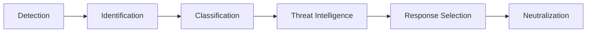

---

# Market Evolution

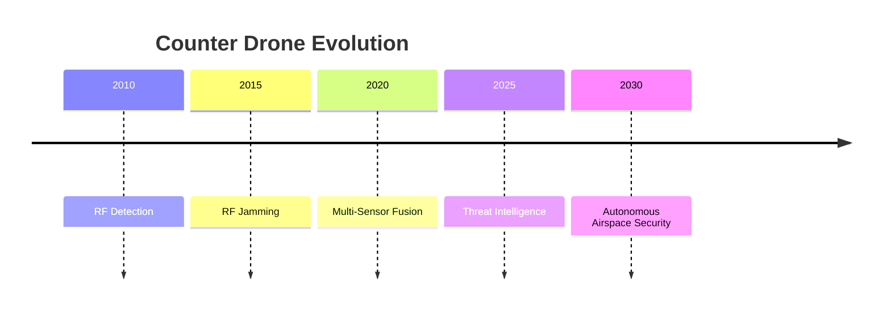

---

# Market Structure

```text
Layer 1
Detection

Layer 2
Identification

Layer 3
Classification

Layer 4
Threat Intelligence

Layer 5
Response

Layer 6
Neutralization
```

Most competitors only own one or two layers.

---

# Competitor Ecosystem

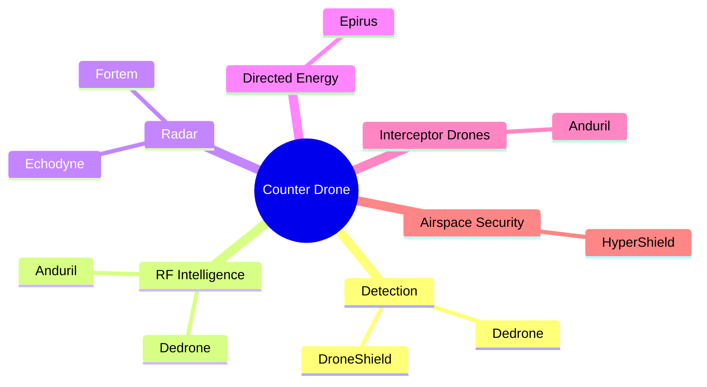

---

# Competitor 1: DroneShield

## Overview

DroneShield specializes in RF-based drone detection and electronic warfare systems.

Used by:

- Military
- Border Security
- Airports
- Government Agencies

---

## Architecture

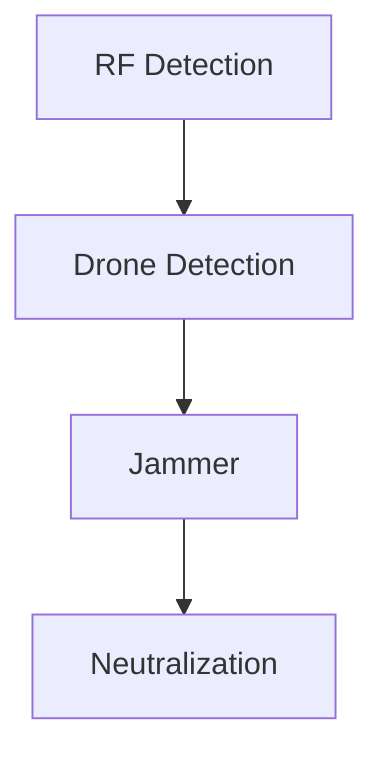

---

## USP

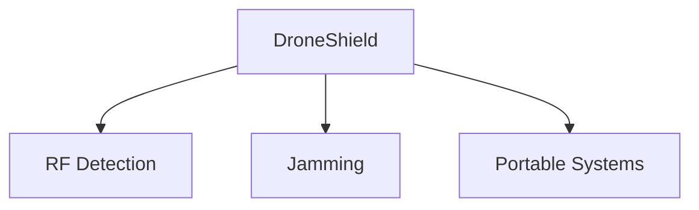

---

## Strengths

- Strong RF expertise
- Portable deployment
- Proven military deployments

---

## Weaknesses

```text
Weak Areas

├── Threat Intelligence
├── AI Classification
├── Fleet Learning
└── Autonomous Response
```

---

## Strategic Position

```text
Detect
  ↓
Jam
```

---

# Competitor 2: Dedrone

## Overview

Dedrone focuses on airspace awareness and drone monitoring.

---

## Architecture

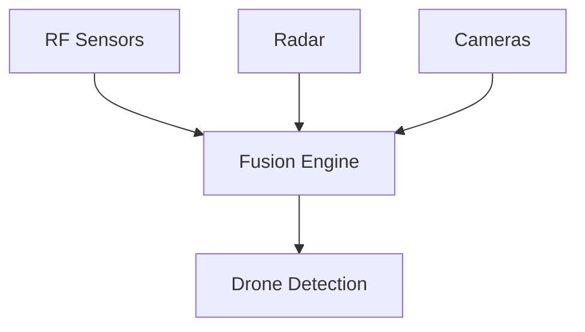

---

## USP

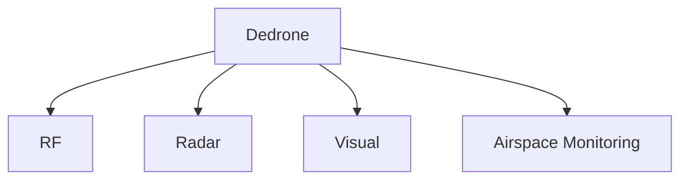

---

## Strengths

- Sensor fusion
- Enterprise deployments
- Airport security

---

## Weaknesses

```text
Weak Areas

├── Autonomous Response
├── Threat Intelligence
└── Countermeasure Orchestration
```

---

## Strategic Position

```text
Detect
  ↓
Track
```

---

# Competitor 3: Anduril

## Overview

Anduril operates the most advanced integrated counter-drone ecosystem.

---

## Architecture

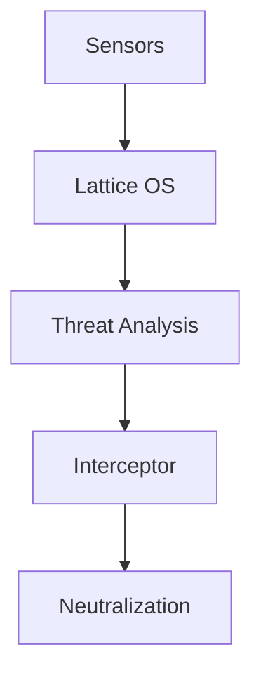

---

## USP

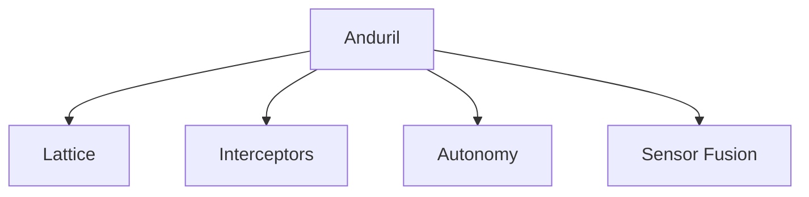

---

## Strengths

- Full kill chain ownership
- Military adoption
- Sensor fusion
- Autonomous response

---

## Weaknesses

```text
Weak Areas

├── Extremely expensive
├── Complex procurement
└── Large-system focused
```

---

## Strategic Position

```text
Detect
  ↓
Track
  ↓
Destroy
```

---

# Competitor 4: Epirus

## Overview

Epirus builds directed-energy systems.

---

## Architecture

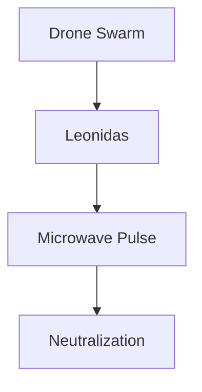

---

## USP

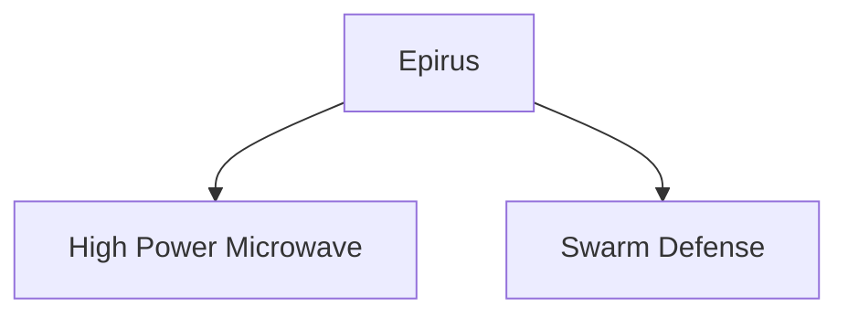

---

## Strengths

- Swarm defense
- Directed energy
- High throughput neutralization

---

## Weaknesses

```text
Weak Areas

├── Detection
├── Classification
├── Threat Analysis
└── Airspace Intelligence
```

---

## Strategic Position

```text
Destroy
```

---

# Capability Matrix

| Capability | DroneShield | Dedrone | Anduril | Epirus | HyperShield |
|------------|------------|----------|----------|----------|------------|
| RF Detection | ✅ | ✅ | ✅ | ❌ | ✅ |
| Radar Integration | ❌ | ✅ | ✅ | ❌ | Partner |
| EO / IR Fusion | ❌ | ✅ | ✅ | ❌ | Partner |
| Sensor Fusion | ❌ | ✅ | ✅ | ❌ | ✅ |
| AI Classification | ❌ | ⚠️ | ✅ | ❌ | ✅ |
| Threat Scoring | ❌ | ⚠️ | ✅ | ❌ | ✅ |
| Automated Response | ❌ | ❌ | ✅ | ❌ | ✅ |
| Interceptor Integration | ❌ | ❌ | ✅ | ❌ | ✅ |
| Fleet Learning | ❌ | ❌ | ⚠️ | ❌ | ✅ |
| Airspace Security OS | ❌ | ❌ | ⚠️ | ❌ | ✅ |

---

# The Missing Layer

Most companies stop here:

```text
Drone Detected
```

HyperShield continues:

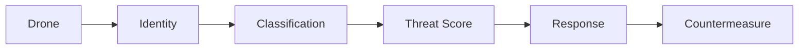

---

# HyperShield Architecture

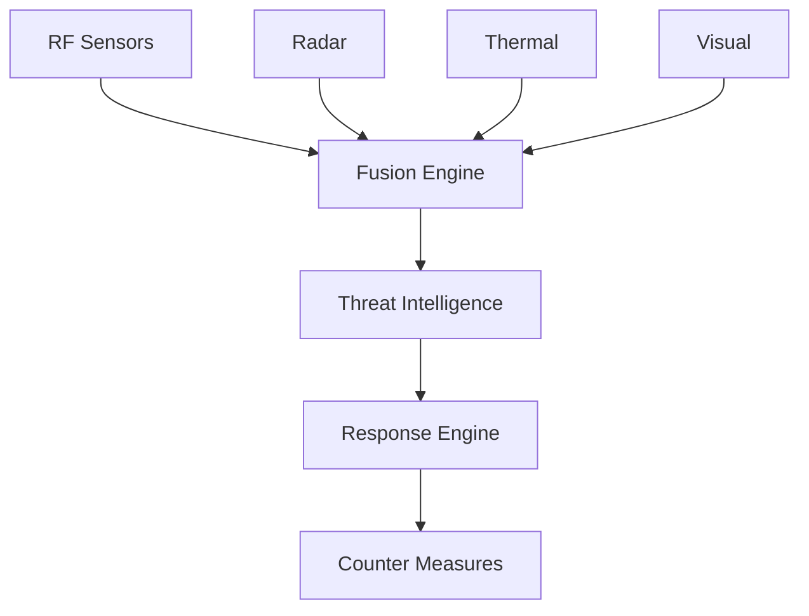

---

# Sensor Fusion

## Traditional

```text
RF
 ↓
Maybe Drone
```

---

## HyperShield

```text
RF
 +
Radar
 +
Thermal
 +
Visual

      ↓

Confirmed Drone
```

---

# Threat Intelligence Layer

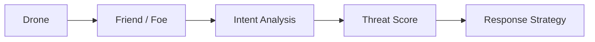

---

# HyperShield Platform

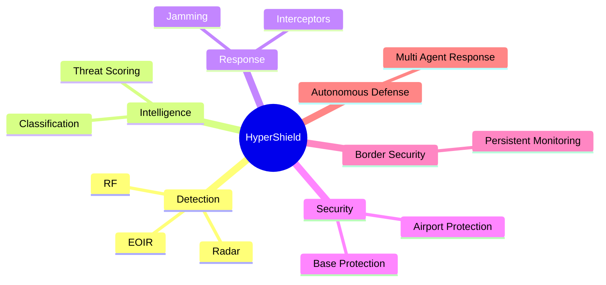

---

# Customer Segments

## Defense

- Army
- Navy
- Air Force
- Special Forces
- Border Security

---

## Government

- Homeland Security
- Police
- Intelligence Agencies

---

## Enterprise

- Airports
- Oil & Gas
- Refineries
- Power Plants
- Ports
- Data Centers

---

# Why HyperShield Wins

## Existing Market

```text
DroneShield
 = Detection + Jam

Dedrone
 = Monitoring

Epirus
 = Destroy

Anduril
 = Defense Platform
```

---

## HyperShield

```text
Detection
     ↓
Identification
     ↓
Classification
     ↓
Threat Intelligence
     ↓
Response Engine
     ↓
Countermeasure Orchestration
```

---

# Strategic Moat

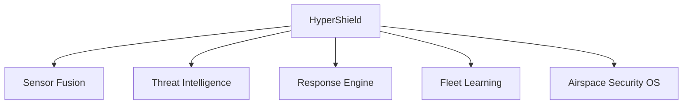

---

# Expansion Path


---

# Final Positioning

```text
DroneShield
 = Counter Drone Hardware

Dedrone
 = Airspace Monitoring

Epirus
 = Directed Energy

Anduril
 = Defense Platform

HyperShield
 = Autonomous Airspace Security OS
```

---

# Vision

> HyperShield is building the intelligence, trust, and response layer that secures autonomous airspace against hostile drones.

The goal is not to build another jammer.

The goal is to become the operating system that manages detection, classification, response, and security across future autonomous airspace.
