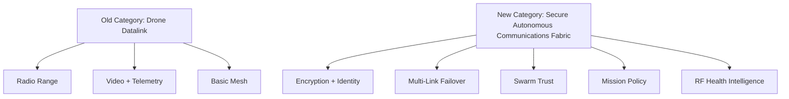
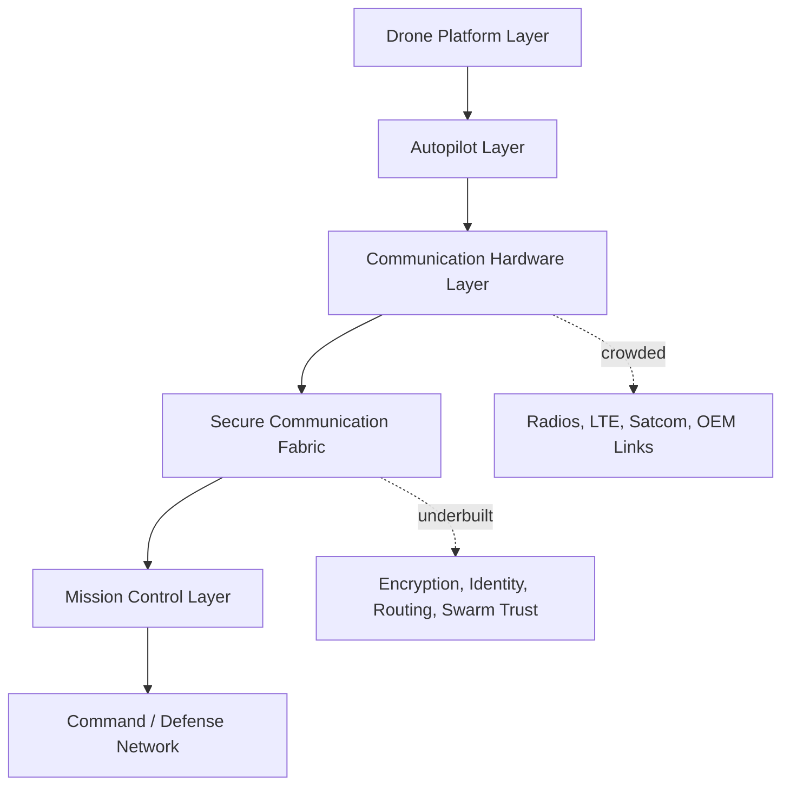
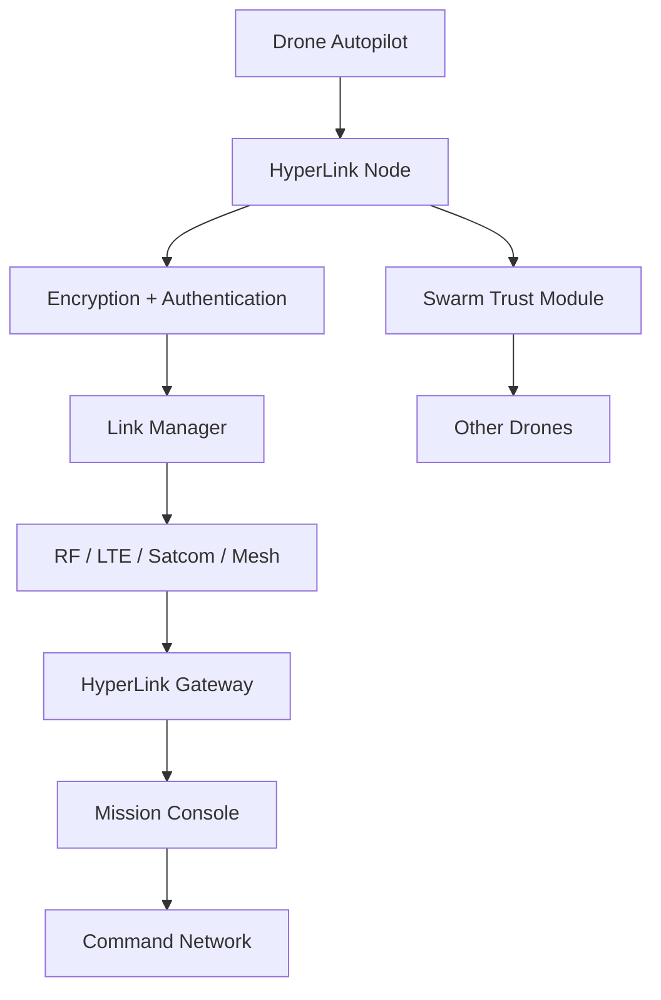
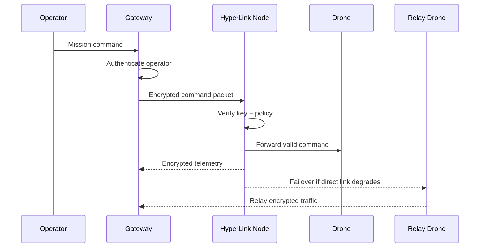
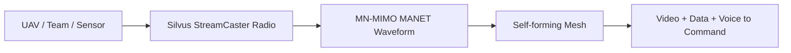
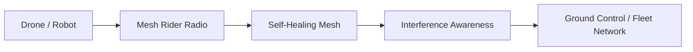
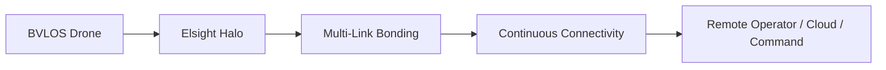
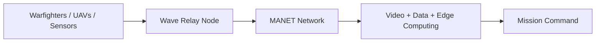
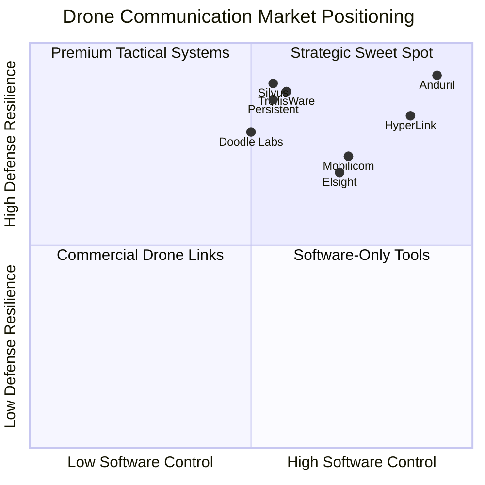
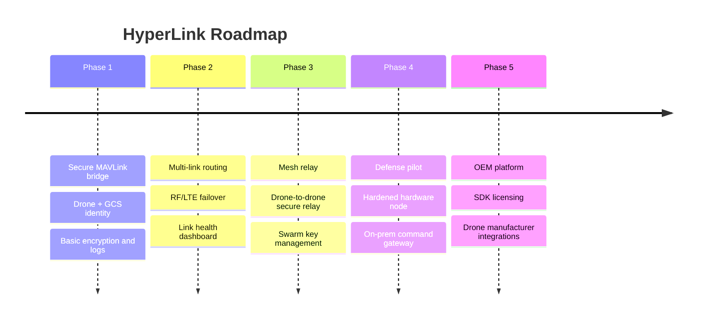

# HyperLink

**Category:** Encrypted Drone Communication / Secure Autonomous Communications Fabric  
**One-line thesis:** HyperLink is a secure, modular, and cost-effective communication layer for drones, swarms, ground stations, and tactical edge networks operating in contested or unreliable environments.

---

## 1. Product Definition

| Item | Description |
|---|---|
| **Product name** | HyperLink |
| **Category** | Encrypted drone communication |
| **New category framing** | Secure Autonomous Communications Fabric |
| **Core users** | Defense forces, drone OEMs, border security, critical infrastructure operators, police, disaster response teams |
| **Core value** | Keep drone command, telemetry, video, identity, and mission data secure even when links degrade |
| **Strategic wedge** | Secure MAVLink / PX4 / ArduPilot communication layer with drone identity, key management, and multi-link failover |

---

## 2. Executive Summary

HyperLink is a secure communication system for drones, drone swarms, ground stations, command vehicles, and edge defense nodes.

It solves three major problems:

1. **Drone links are vulnerable**
   - Drones depend on RF, GNSS, LTE, Wi-Fi, satcom, or proprietary datalinks.
   - These links can be jammed, spoofed, intercepted, degraded, or hijacked.

2. **Existing military-grade systems are expensive**
   - Tactical MANET radios are strong, but they are often built for high-end defense budgets.
   - Low-cost ISR drones, attritable drones, and mass drone fleets cannot always carry expensive communication payloads.

3. **Most solutions are hardware-first**
   - Incumbents sell radios, waveforms, and closed ecosystems.
   - The gap is a platform-neutral encrypted communication fabric that can work across multiple radios, drone types, and mission systems.

HyperLink can become a company, not just a feature, because secure communication is becoming a core infrastructure layer for autonomous warfare, border security, BVLOS operations, critical infrastructure protection, disaster response, and swarm robotics.

---

## 3. Why This Matters Now

Drone warfare has shifted from premium UAVs to mass deployment of cheaper systems. The bottleneck is no longer only the drone body, camera, or battery. The bottleneck is trusted command, control, telemetry, and mission data under RF stress.

Modern conflicts show that electromagnetic warfare can decide whether drones remain useful or become blind, lost, or compromised. UAV security research also repeatedly highlights the need for lightweight encryption, secure key management, authentication, and UAV-specific multilayer security frameworks.

The market is moving toward:

- More low-cost drones.
- More BVLOS operations.
- More drone swarms.
- More electronic warfare.
- More cyber attacks on unmanned systems.
- More demand for sovereign defense supply chains.

This creates a clear opening for HyperLink.

---

## 4. Core Problem

Most drones communicate through one or more of these channels:

| Link Type | Used For | Weakness |
|---|---|---|
| RF datalink | Control, telemetry, video | Jamming, interception, line-of-sight limits |
| Wi-Fi / ISM band | Low-cost drones | Congestion, weak security, short range |
| LTE / 5G | BVLOS and commercial drones | Network dependency, SIM dependency, coverage gaps |
| Satcom | Long-range UAVs | Expensive, latency, payload cost |
| Proprietary drone link | OEM drones | Vendor lock-in, limited interoperability |
| Tactical MANET radio | Military mesh networks | Expensive, integration-heavy |

The gap is not just encryption. The real gap is **mission-resilient secure communication**.

A defense-grade drone communication product must handle:

- Confidentiality: enemy should not read mission data.
- Authentication: fake drones or fake ground stations should not join.
- Integrity: command messages should not be modified.
- Availability: link should survive degradation and failover.
- Swarm trust: drones should verify each other.
- Key rotation: compromised units should be removed quickly.
- Multi-link operation: RF, LTE, satcom, and mesh should work together.
- Edge autonomy: mission should continue if cloud or command link drops.

---

## 5. Market Gap Analysis

| Gap | Current Market Reality | HyperLink Opportunity |
|---|---|---|
| **Cost gap** | Military MANET radios are powerful but expensive for low-cost fleets | Affordable secure comm module for small and attritable drones |
| **Interoperability gap** | Many systems work inside one OEM or radio ecosystem | Vendor-neutral secure communication middleware |
| **Swarm gap** | Most systems support links, but not swarm identity and command trust | Swarm-native encrypted trust fabric |
| **Software gap** | Market is hardware-radio heavy | Software-defined security, routing, identity, and policy layer |
| **Sovereignty gap** | Defense customers need trusted local supply chains | Indigenous secure comm stack with local deployment |
| **Retrofit gap** | Existing drone fleets are hard to upgrade | Plug-in module for PX4, ArduPilot, and custom UAVs |
| **Cyber gap** | Drone cybersecurity is often added later | Security-first communication architecture |
| **Mission continuity gap** | Link loss often means mission failure | Degraded-mode operation and policy-based failover |

---

## 6. Old Category vs New Category

### Old Category: Drone Datalink / Tactical Radio

The old category is mainly about:

- Sending video.
- Sending telemetry.
- Sending control commands.
- Extending range.
- Creating mesh networks.
- Improving RF resilience.

### New Category: Secure Autonomous Communications Fabric

The new category is bigger because it combines:

- Encrypted drone communication.
- Drone identity and authentication.
- Multi-link routing.
- Mesh and swarm communication.
- Key management.
- Mission authorization.
- Anti-spoofing.
- RF health intelligence.
- Command handover.
- Sovereign deployment.

---

## 7. Product Thesis

HyperLink should not start as another radio manufacturer.

The stronger thesis:

> HyperLink is the secure communication brain that runs on top of many radios, many drones, many ground stations, and many mission environments.

This gives the product multiple expansion paths:

| Product Layer | Description |
|---|---|
| **HyperLink Node** | Lightweight onboard module for drone communication security |
| **HyperLink Gateway** | Ground station, command vehicle, or field base communication node |
| **HyperLink SDK** | Integrates with PX4, ArduPilot, MAVLink, custom autopilots, and defense systems |
| **HyperLink Relay** | Drone-to-drone and ground-to-air relay mode |
| **HyperLink Mission Console** | Policy, keys, identities, link health, mission logs |
| **HyperLink Swarm Trust** | Identity and encrypted coordination between drones |
| **HyperLink Sovereign KMS** | Local key generation, rotation, revocation, and audit |

---

## 8. Threat / Use Case Classification

| Threat / Use Case | Buyer Type | Urgency | Current Pain | HyperLink Response |
|---|---:|---:|---|---|
| Border surveillance drone | Defense / paramilitary | Very high | Jamming, interception, terrain gaps | Encrypted mesh + relay failover |
| Tactical ISR drone | Army / special forces | Very high | Link loss in contested RF zones | Multi-link routing + degraded mode |
| Drone swarm | Defense R&D / military | High | Swarm identity and coordination risk | Drone-to-drone authentication |
| Critical infrastructure inspection | Oil, gas, power, ports | Medium | Data leakage, BVLOS compliance | Secure BVLOS communication layer |
| Police / homeland security drone | Police / disaster response | Medium | Public network dependency | Encrypted LTE/RF hybrid link |
| Agricultural drone fleet | Enterprise / government | Low-medium | Low-cost links, data privacy | Affordable secure telemetry |
| Defense training drones | Military training | Medium | Need low-cost secure fleet control | Low-cost encrypted comm kit |
| Autonomous logistics drone | Enterprise / defense logistics | High | BVLOS and route integrity | Secure command + telemetry audit |

---

## 9. Priority Matrix

| Segment | Willingness to Pay | Urgency | Sales Complexity | Best Entry Strategy |
|---|---:|---:|---:|---|
| Defense ISR drones | High | Very high | High | Pilot with defense lab / advisor network |
| Border security | High | High | High | Demonstrate terrain relay and secure command |
| Drone OEMs | Medium-high | High | Medium | Offer SDK + embedded module |
| Friendly drone networks in C-UAS environments | High | High | High | Pair with RF fingerprinting and counter-drone systems |
| Critical infrastructure | Medium | Medium | Medium | BVLOS secure link compliance |
| Agriculture / mapping | Low-medium | Low | Low | Later commercial version |

---

## 10. Industry Stack

| Layer | Examples | Crowding | Gap |
|---|---|---:|---|
| Drone airframe | DJI, Skydio, Red Cat, Teal, Anduril | High | Hardware is crowded |
| Autopilot | PX4, ArduPilot, proprietary systems | Medium | Security varies |
| Radio hardware | Silvus, Doodle Labs, Mobilicom, Persistent, TrellisWare | High | Strong but often costly |
| Secure communication middleware | Few clear leaders | Low | Biggest opportunity |
| Swarm trust layer | Early market | Low | Strong opening |
| Mission command | Anduril Lattice, ATAK, custom GCS | Medium-high | Needs neutral integration |
| RF/cyber intelligence | DroneShield, RF analytics players | Medium | Can be paired with HyperLink |

---

## 11. Proposed Product Architecture

### Architecture Components

| Component | Function |
|---|---|
| HyperLink Node | Runs onboard drone, secures command/video/telemetry |
| Link Manager | Chooses best available link based on health and policy |
| Identity Module | Verifies drone, operator, ground station, and relay nodes |
| Key Manager | Handles key rotation, revocation, and mission-specific keys |
| Mesh Relay | Allows drones or ground nodes to relay traffic |
| Mission Policy Engine | Defines who can control what, when, and under what conditions |
| Secure Logs | Creates audit trail for command, handover, and link events |
| API / SDK | Integrates with PX4, ArduPilot, MAVLink, and custom mission systems |

---

## 12. Communication Flow

---

## 13. Product Differentiation

| Existing Market | Weakness | HyperLink Difference |
|---|---|---|
| Tactical radios | Excellent RF, but expensive and hardware-centric | Software security layer that can run across multiple radios |
| Drone OEM links | Closed ecosystem | Platform-neutral |
| LTE BVLOS systems | Depend on public/private mobile networks | Multi-link fallback with RF and mesh |
| Satcom UAV systems | Expensive and not suitable for every small drone | Uses satcom only where needed |
| Generic VPN/encryption | Not drone-aware | Drone identity, mission policy, and command handover |
| Counter-drone systems | Focus on detecting/defeating enemy drones | Protects friendly drones from disruption and takeover |

---

## 14. Competitor Overview

| Company | Founded | Country | Valuation / Market Cap | Category | Core Product | Main Customers |
|---|---:|---|---:|---|---|---|
| **Silvus Technologies** | 2004 | USA | Private; acquired by The Jordan Company in 2019 | Tactical MANET radio | StreamCaster / MN-MIMO | Military, law enforcement, broadcast, unmanned systems |
| **Doodle Labs** | 1999 | USA / Singapore | Private | Mesh radio for robotics | Mesh Rider Radios | Drone OEMs, defense robotics, Blue UAS ecosystem |
| **Elsight** | 2009 | Israel / Australia-listed | Approx. A$1.7B-A$1.8B range in 2026 public sources | BVLOS drone connectivity | Halo | Defense, HLS, UAV OEMs, commercial BVLOS |
| **Mobilicom** | Public NASDAQ | Israel / USA-listed | Approx. $70M-$90M range in 2026 public sources | Cybersecure drone datalink | SkyHopper, MCU, cybersecurity stack | Drone manufacturers, U.S. defense market |
| **Persistent Systems** | 2007 approx. | USA | Private | Tactical MANET | Wave Relay | U.S. military, UAV/UGV programs, sensors |
| **TrellisWare** | 2000 | USA | Private | Tactical waveform / MANET | TSM, Katana, UAS waveform | USSOCOM, FBI, military networks |
| **Anduril** | 2017 | USA | Reported around $61B valuation in 2026 funding reports | Defense autonomy + C2 mesh | Lattice Mesh / Lattice C2 | U.S. DoD, allied defense forces |
| **DroneShield** | 2014 approx. | Australia | Approx. A$2.8B-A$3.0B range in 2026 public sources | Counter-UAS / EW | RF sensing, AI sensor fusion, EW systems | Defense, government, law enforcement, critical infrastructure |

---

## 15. Competitor Deep Dive

## 15.1 Silvus Technologies

| Field | Details |
|---|---|
| Company | Silvus Technologies |
| Founded | 2004 |
| Country | USA |
| Category | Tactical MANET radio |
| Core Product | StreamCaster radios, MN-MIMO waveform |
| Main Customers | Military, law enforcement, broadcast, unmanned systems |
| Strategic Positioning | Premium tactical communications for high-performance operations |
| Strength | Strong MANET, high throughput, EW-resilient positioning |
| Weakness | High-end radio-first system; not positioned as low-cost universal drone middleware |
| Category | Tactical mesh communication hardware |

**How they solve the problem:**  
Silvus improves drone and tactical communication through powerful MANET radios and its MN-MIMO waveform.

**Opening for HyperLink:**  
Do not compete head-on as a premium radio. Instead, become the secure software layer that can integrate with Silvus-like radios, lower-cost radios, LTE, satcom, and indigenous hardware.

---

## 15.2 Doodle Labs

| Field | Details |
|---|---|
| Company | Doodle Labs |
| Founded | 1999 |
| Country | USA / Singapore |
| Category | Mesh radio for robotics |
| Core Product | Mesh Rider Radios |
| Main Customers | UAVs, UGVs, AMRs, government, defense, robotics OEMs |
| Strategic Positioning | Robotics-first resilient wireless mesh |
| Strength | Strong drone/OEM fit, lightweight form factors, Blue UAS relevance |
| Weakness | Still radio-platform centric |
| Category | Robotics mesh radio |

**How they solve the problem:**  
Doodle Labs provides resilient mesh radio hardware for drones and robotics, including long-range links and multi-band radios.

**Opening for HyperLink:**  
Offer drone identity, encryption policy, mission keying, multi-radio routing, and swarm trust above the physical radio layer.

---

## 15.3 Elsight

| Field | Details |
|---|---|
| Company | Elsight |
| Founded | 2009 |
| Country | Israel / Australia-listed |
| Category | BVLOS connectivity |
| Core Product | Halo |
| Main Customers | Defense, HLS, medical delivery, UAV OEMs, commercial BVLOS |
| Market Cap | Approx. A$1.7B-A$1.8B range in 2026 public sources |
| Strategic Positioning | Always-connected BVLOS drone communication |
| Strength | Strong BVLOS positioning and multilink connectivity |
| Weakness | More focused on connectivity assurance than full tactical swarm trust |
| Category | BVLOS communication platform |

**How they solve the problem:**  
Elsight bonds multiple communication links to maintain BVLOS connectivity.

**Opening for HyperLink:**  
Build a defense-first encrypted comm fabric with mission policy, command authority, swarm identity, and sovereign deployment as the main differentiators.

---

## 15.4 Mobilicom

| Field | Details |
|---|---|
| Company | Mobilicom |
| Country | Israel / USA-listed |
| Category | Cybersecure drone and robotics datalink |
| Core Product | SkyHopper, MCU, cybersecurity stack |
| Main Customers | Drone manufacturers, defense OEMs, robotics companies |
| Market Cap | Approx. $70M-$90M range in 2026 public sources |
| Strategic Positioning | Cybersecure end-to-end drone communication |
| Strength | Strong cyber + drone positioning |
| Weakness | Still tied to productized hardware modules and OEM sales |
| Category | Cybersecure drone datalink |

**How they solve the problem:**  
Mobilicom packages secure communication hardware and cybersecurity tools for drones and robotics.

**Opening for HyperLink:**  
Compete through lower-cost modularity, India-friendly sovereign deployments, open integration with multiple autopilots, and swarm-native architecture.

---

## 15.5 Persistent Systems

| Field | Details |
|---|---|
| Company | Persistent Systems |
| Country | USA |
| Category | Tactical MANET |
| Core Product | Wave Relay |
| Main Customers | Military, UAV/UGV programs, sensors, tactical teams |
| Strategic Positioning | Secure MANET network for warfighters, UAVs, and sensors |
| Strength | Mature tactical mesh ecosystem |
| Weakness | Defense-heavy procurement and hardware ecosystem |
| Category | Tactical battlefield network |

**How they solve the problem:**  
Persistent Systems connects soldiers, UAVs, sensors, and vehicles through a battlefield MANET network.

**Opening for HyperLink:**  
Target lightweight drone-first deployments where the customer cannot afford or cannot integrate full battlefield MANET systems.

---

## 15.6 TrellisWare

| Field | Details |
|---|---|
| Company | TrellisWare |
| Founded | 2000 |
| Country | USA |
| Category | Tactical waveform and MANET |
| Core Product | TSM waveform, Katana, UAS waveform |
| Main Customers | USSOCOM, FBI, military users |
| Strategic Positioning | Advanced tactical waveform company |
| Strength | Strong waveform IP and military credibility |
| Weakness | High defense integration complexity |
| Category | Waveform-first tactical communication |

**How they solve the problem:**  
TrellisWare focuses on advanced waveforms and MANET systems for tactical networks, including UAS-focused anti-jam/ECCM work.

**Opening for HyperLink:**  
Avoid waveform-only competition. Build the application/security layer that can work with multiple waveforms and radios.

---

## 15.7 Anduril

| Field | Details |
|---|---|
| Company | Anduril |
| Founded | 2017 |
| Country | USA |
| Category | Defense autonomy and command platform |
| Core Product | Lattice, Lattice Mesh |
| Main Customers | U.S. DoD and allied defense forces |
| Valuation | Reported around $61B in 2026 funding reports |
| Strategic Positioning | Full-stack defense autonomy operating system |
| Strength | Strong software, autonomy, C2, and defense contracts |
| Weakness | Large ecosystem play; not a small modular comm product |
| Category | Defense C2 + autonomous systems platform |

**How they solve the problem:**  
Anduril builds a full command-and-control and autonomy platform where mesh networking supports tactical edge operations.

**Opening for HyperLink:**  
Position as a focused, affordable, sovereign encrypted communication layer for countries, OEMs, and drone fleets that cannot buy or adopt a full Anduril-like stack.

---

## 15.8 DroneShield

| Field | Details |
|---|---|
| Company | DroneShield |
| Country | Australia |
| Category | Counter-UAS / Electronic Warfare |
| Core Product | RF detection, AI sensor fusion, counter-drone systems |
| Main Customers | Defense, government, law enforcement, critical infrastructure |
| Market Cap | Approx. A$2.8B-A$3.0B range in 2026 public ASX sources |
| Strategic Positioning | Detect, track, and defeat enemy drones |
| Strength | Strong counter-drone market position |
| Weakness | Focuses on enemy drones, not protecting friendly drone communication |
| Category | Counter-UAS / EW |

**How they solve the problem:**  
DroneShield focuses on detecting and defeating hostile drones.

**Opening for HyperLink:**  
Counter-drone systems create demand for friendly drones that can survive RF-contested zones. HyperLink protects the friendly drone network instead of attacking enemy drones.

---

## 16. Strategic Positioning Map

---

## 17. What We Do Differently

There are already many drone communication systems, tactical radios, mesh radios, and defense C2 platforms.

But most of them are either:

- Too expensive for mass drone fleets.
- Too hardware-dependent.
- Too closed.
- Not designed for low-cost retrofitting.
- Not designed around drone identity and mission policy.
- Not optimized for small UAVs and swarm operations.
- Not built for sovereign/local defense deployment.

**HyperLink is different because it is not just a radio.**

It is a secure communication fabric that can sit above existing radios and below mission software.

| Dimension | Existing Systems | HyperLink |
|---|---|---|
| Primary model | Hardware radio / closed platform | Secure communication layer |
| Cost structure | High-end defense hardware | Modular and scalable |
| Drone fit | Often platform-specific | Platform-neutral |
| Swarm support | Limited or ecosystem-specific | Swarm-native trust model |
| Security | Often link-level | Identity + policy + encryption + logs |
| Deployment | Vendor-controlled | Sovereign/on-prem capable |
| Integration | OEM or procurement heavy | SDK + module + gateway |
| Best use | Premium tactical network | Mass secure drone deployment |

---

## 18. Product Modules

| Module | Description | Buyer Value |
|---|---|---|
| HyperLink Secure Drone Node | Onboard encryption and identity device/software | Protects command and telemetry |
| HyperLink Ground Gateway | Secure base station module | Controls multiple drones securely |
| HyperLink Swarm Key Manager | Drone-to-drone trust and key rotation | Enables secure swarms |
| HyperLink Multi-Link Router | RF/LTE/satcom/mesh failover | Maintains mission continuity |
| HyperLink Mission Policy Engine | Defines command authority | Prevents unauthorized control |
| HyperLink RF Health Monitor | Monitors link quality and interference | Supports mission decisions |
| HyperLink Secure Mission Logs | Records commands and handovers | Audit and defense compliance |
| HyperLink OEM SDK | Integrates into drone platforms | Easier adoption by manufacturers |

---

## 19. MVP Scope

### MVP 1: Secure Command + Telemetry Layer

| Feature | Included |
|---|---|
| Drone identity | Yes |
| Ground station identity | Yes |
| Encrypted telemetry | Yes |
| Encrypted command | Yes |
| Key rotation | Basic |
| MAVLink bridge | Yes |
| PX4 / ArduPilot support | Yes |
| Link health dashboard | Basic |
| Multi-drone support | 3-5 drones |
| RF hardware | Use existing radios first |

### MVP 2: Mesh + Relay

| Feature | Included |
|---|---|
| Drone-to-drone relay | Yes |
| Ground-to-drone relay | Yes |
| Mesh topology view | Yes |
| Link failover | Yes |
| Mission logs | Yes |

### MVP 3: Defense Pilot

| Feature | Included |
|---|---|
| Hardened node | Yes |
| On-prem mission server | Yes |
| Sovereign key management | Yes |
| Role-based command | Yes |
| Red-team testing | Yes |
| Field demo | Yes |

---

## 20. Suggested Roadmap

---

## 21. Business Model

| Model | Description | Best For |
|---|---|---|
| Hardware + software kit | Secure node + gateway + dashboard | Defense pilots |
| Per-drone license | Annual software license per drone | OEMs and fleet operators |
| SDK license | Integration license for drone makers | Drone manufacturers |
| Defense deployment | On-prem secure comm stack | Military and government |
| Maintenance contract | Support, upgrades, security patches | Long-term defense customers |
| Sovereign version | Local cryptography, local key infra, local hosting | Indian defense and allied markets |

---

## 22. Buyer Personas

| Buyer | What They Care About | Pitch |
|---|---|---|
| Military advisor | Operational survivability | Your drones stay trusted and connected under degraded conditions |
| Drone OEM | Faster defense qualification | Add secure comms without rebuilding your full stack |
| Border force | Range and control | Secure drone operations across terrain and relay zones |
| Critical infra operator | BVLOS safety and data protection | Secure inspection data and control links |
| Defense lab | Indigenous stack | Build sovereign encrypted drone communication infrastructure |
| Investor | Category creation | Secure drone communication is becoming the operating layer for autonomous defense |

---

## 23. Key Technical Principles

| Principle | Meaning |
|---|---|
| Radio-agnostic | Works over RF, LTE, satcom, mesh, or wired test networks |
| Drone-aware | Understands telemetry, command, handover, and mission roles |
| Zero-trust control | Every drone, user, and gateway must authenticate |
| Degraded-mode capable | Mission continues with limited connectivity |
| Swarm-native | Drone-to-drone trust is built in |
| Sovereign-ready | Keys and logs can stay inside national infrastructure |
| Lightweight | Designed for low-power onboard systems |
| Audit-friendly | Every command and control handover can be logged |

---

## 24. Strategic Wedge

### Best First Wedge

**Secure MAVLink / PX4 / ArduPilot communication layer for defense and industrial drones.**

Why:

- Easy to prototype.
- Clear pain point.
- Existing protocol security weaknesses are known.
- Can be demonstrated without building a full radio.
- Creates path to hardware module, gateway, and defense pilots.

---

## 25. Board-Level Strategic Positioning

### Simple Positioning

> HyperLink is the secure communication layer for drones operating in contested, disconnected, or high-risk environments.

### Defense Positioning

> A sovereign encrypted communications fabric for UAVs, swarms, ground stations, and tactical edge networks.

### Investor Positioning

> The world is building more drones. The next bottleneck is trusted control, secure connectivity, and swarm coordination. HyperLink owns that layer.

### Client Positioning

> We help your drone fleet stay secure, authenticated, and operational even when networks degrade or adversaries attempt disruption.

---

## 26. Final Recommendation

Build **HyperLink** as a software-first, hardware-compatible encrypted drone communication platform.

Do not start by competing directly with Silvus, Doodle Labs, TrellisWare, or Persistent Systems on premium radio hardware.

Start with:

1. Secure drone communication middleware.
2. MAVLink/PX4/ArduPilot integration.
3. Ground gateway.
4. Drone identity and mission keys.
5. Link health dashboard.
6. Multi-link failover.
7. Swarm trust module.
8. Hardened defense hardware later.

This gives HyperLink a realistic entry point, strong differentiation, and a path to become core infrastructure for military and industrial drone operations.

---

## 27. Reference Sources

- [Silvus UGV and UAV Communication Systems](https://silvustechnologies.com/applications/unmanned-systems/)
- [Doodle Labs Wireless Broadband Solutions for UAS](https://doodlelabs.com/blog/wireless-broadband-solutions-for-unmanned-aerial-systems/)
- [Doodle Labs Auterion Government Solutions Case Study](https://doodlelabs.com/case-studies/auterion/)
- [Secure Communication in Drone Networks, Drones Journal, 2025](https://www.mdpi.com/2504-446X/9/8/583)
- [MAVSec: Securing the MAVLink Protocol for ArduPilot/PX4 UAS](https://arxiv.org/abs/1905.00265)
- [MAVShield: Lightweight Cipher for MAVLink Security](https://arxiv.org/abs/2504.20626)
- [Unmanned Systems Technology Drone Communication Systems Overview](https://www.unmannedsystemstechnology.com/expo/drone-communications/)
- [MarketsandMarkets Drone Communication Market 2025-2030](https://www.marketsandmarkets.com/Market-Reports/drone-communication-market-220457835.html)
