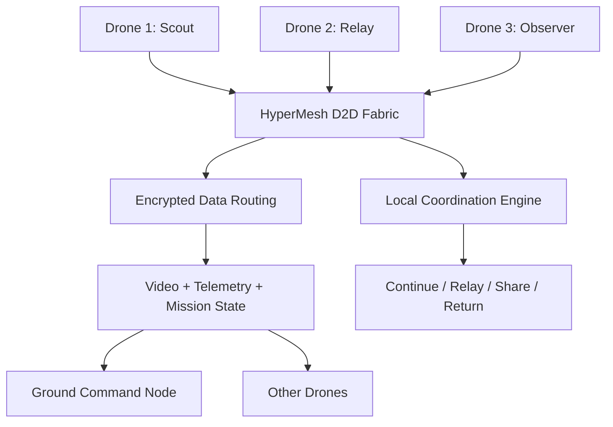
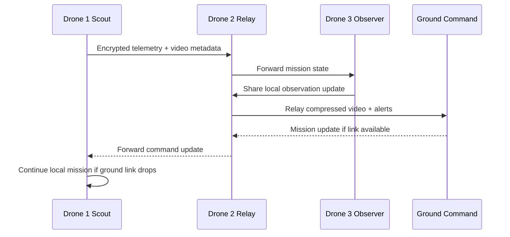
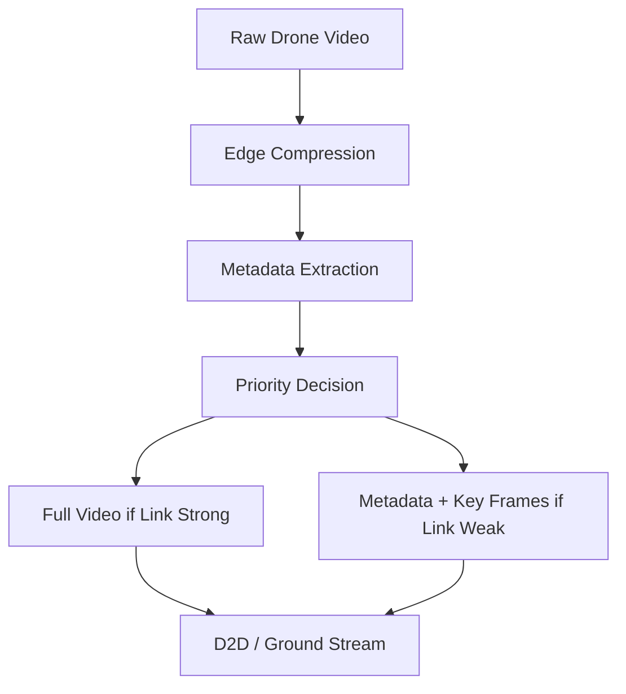
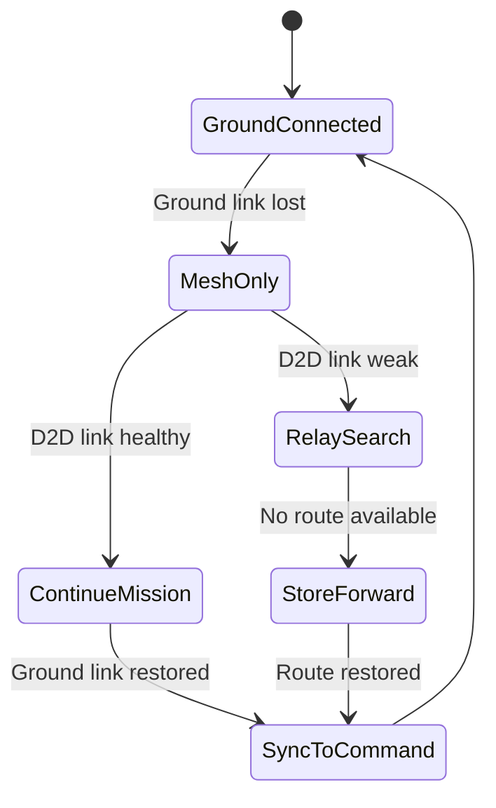
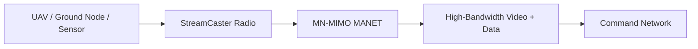
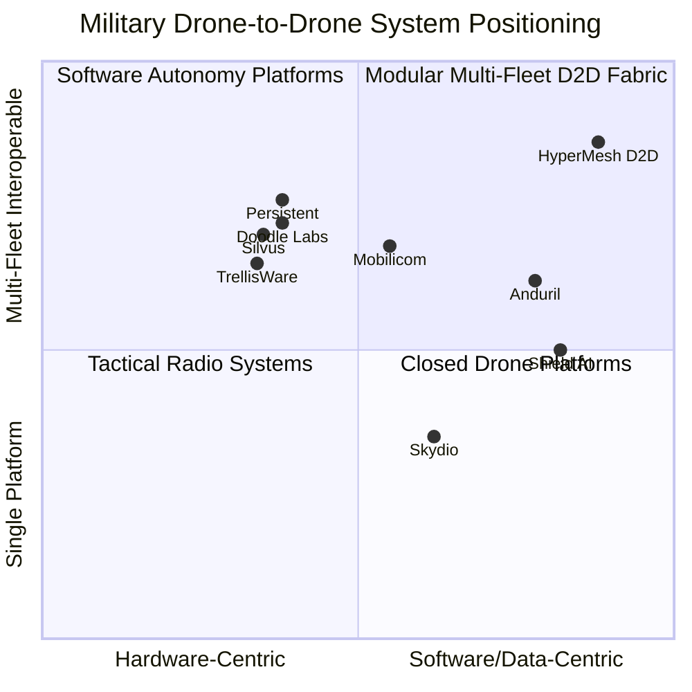
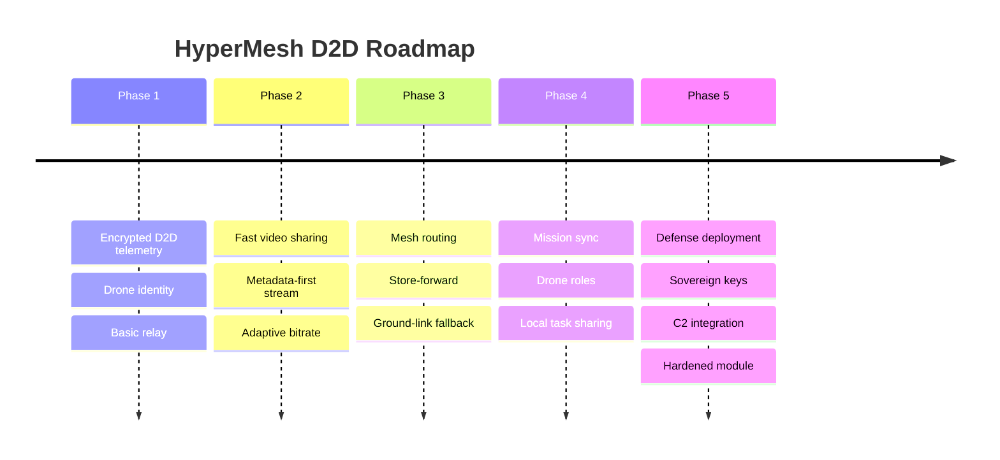

# HyperMesh D2D

**Category:** Drone-to-Drone Communication / Military Multi-Drone Collaboration System  
**One-line thesis:** HyperMesh D2D enables military drones to share encrypted data, low-latency video, telemetry, mission status, and local intelligence directly with each other so teams of drones can continue operating even when GPS, ground control, or long-range communication is degraded.

---

## 1. Product Definition

| Item | Description |
|---|---|
| **Product name** | HyperMesh D2D |
| **Category** | Drone-to-drone communication and coordination |
| **New category framing** | Military Multi-Drone Data Fabric |
| **Core users** | Army, air force, border security, special forces, ISR teams, electronic warfare units, drone OEMs |
| **Core value** | Let drones communicate, relay, coordinate, and share intelligence directly with each other |
| **Strategic wedge** | Encrypted drone-to-drone video, telemetry, relay, and mission data sharing for contested military environments |

---

## 2. Executive Summary

HyperMesh D2D is a military drone-to-drone system that allows multiple drones to work as a connected team instead of isolated flying units.

Today, many drones still depend heavily on:

- One ground control station.
- One pilot per drone.
- One direct control link.
- One video feed per drone.
- Centralized mission decisions.
- GPS and long-range communication links.

In military environments, this creates a major weakness. If the ground link is jammed, blocked, degraded, or overloaded, drones can lose coordination and mission value.

HyperMesh D2D solves this by enabling drones to:

- Share video with nearby drones and ground nodes.
- Relay encrypted data through other drones.
- Share target-zone observations at a high level.
- Share telemetry and health status.
- Coordinate search patterns.
- Maintain local awareness without continuous ground control.
- Continue mission logic if the ground link drops.
- Build a temporary airborne mesh network.

The product is not just a radio. It is a **multi-drone communication, coordination, and data-sharing layer**.

---

## 3. Why This Matters for Military

Military drone operations are shifting from single-drone missions to multi-drone teams.

Single-drone systems are useful, but they have limits:

- One drone sees only one angle.
- One drone can be jammed or lost.
- One drone cannot cover a large area quickly.
- One drone cannot act as a relay and sensor at the same time.
- One ground station can become a single point of failure.

Drone-to-drone systems create a major advantage because drones can become a distributed network.

In a battlefield, this means:

- More coverage.
- Faster situational awareness.
- Lower dependence on ground infrastructure.
- Better resilience under jamming.
- Faster video and sensor sharing.
- Less operator overload.
- Better coordination between ISR, relay, and logistics drones.

---

## 4. Core Problem

| Problem | Current Reality | Military Impact |
|---|---|---|
| Ground-link dependency | Many drones send data directly to ground station | If link is blocked, mission value drops |
| Limited video sharing | Each drone often streams separately | Operators see fragmented feeds |
| High operator workload | Multiple drones require multiple control workflows | Slower decisions |
| Weak coordination | Drones do not always share local context | Duplicate coverage and blind spots |
| No local data fabric | Drone data is not easily shared between drones | Slower battlefield awareness |
| Jamming risk | RF and GPS can be degraded | Drones lose control or route confidence |
| Centralized failure point | Ground station is the main hub | Enemy can disrupt the mission by targeting one link |
| Poor relay flexibility | Fixed relay planning is difficult | Range and terrain limits remain |

HyperMesh D2D reduces these weaknesses by allowing drones to communicate directly and form a resilient airborne data network.

---

## 5. Current Solution Landscape

Current military multi-drone systems usually fall into four groups:

| Current Solution Type | What It Does | Limitation |
|---|---|---|
| Tactical MANET radios | Connect drones, vehicles, sensors, and soldiers in a mesh | Powerful but expensive and hardware-heavy |
| Drone autonomy platforms | Let drones execute missions with AI/autonomy | Often full-stack, closed, expensive, platform-specific |
| Ground control systems | Control and view multiple drones | Still ground-station centric |
| Drone OEM swarm systems | Vendor-specific swarm coordination | Limited interoperability across mixed fleets |

The market gap is a modular **drone-to-drone data fabric** that works across different drones, radios, payloads, and mission software.

---

## 6. What HyperMesh D2D Can Offer Differently

| Differentiation | Description | Military Value |
|---|---|---|
| **Fast video sharing** | Drones can share low-latency compressed video with other drones, relay drones, and ground nodes | Faster ISR and better multi-angle awareness |
| **Encrypted data fabric** | Telemetry, command metadata, video metadata, and mission data are encrypted between drones | Reduces interception and spoofing risk |
| **Drone-to-drone relay** | One drone can forward data for another drone | Extends range behind terrain/buildings |
| **Ground-link independence** | Drones can keep sharing data locally even if ground link drops | Mission continues under comms degradation |
| **Multi-drone awareness** | Each drone knows nearby drone health, position estimate, role, and mission state | Better coordination |
| **Role-based coordination** | Drones can act as scout, relay, observer, mapper, decoy, or return node | Flexible mission planning |
| **Bandwidth prioritization** | Critical telemetry gets priority over video when links degrade | Better resilience |
| **Interoperability layer** | Works across PX4, ArduPilot, custom defense stacks, and multiple radios | Easier adoption |
| **Edge task sharing** | Drones can divide search or inspection areas locally | Less operator workload |
| **Sovereign deployment** | Keys, routing rules, and mission data can stay locally controlled | Defense-grade national control |

---

## 7. What the System Can Carry

| Data Type | Purpose | Priority |
|---|---|---:|
| Encrypted telemetry | Position estimate, altitude, battery, health, status | Very high |
| Mission state | Task progress, route status, fallback mode | Very high |
| Video stream | ISR, reconnaissance, inspection, situational awareness | High |
| Video metadata | Object tags, scene summaries, timestamps, coordinates | High |
| Map fragments | Local map, obstacle zones, explored/unexplored areas | Medium-high |
| Drone health | Battery, motor status, sensor status, link confidence | High |
| RF/link status | Signal quality, interference, route quality | High |
| Control handover metadata | Which node/operator has authority | Very high |
| Event alerts | Intrusion, obstacle, target-zone event, emergency | Very high |
| Logs | Mission record and audit | Medium |

---

## 8. Core Military Use Cases

| Use Case | How Drone-to-Drone Helps | Advantage |
|---|---|---|
| Border ISR patrol | Drones relay video and telemetry across terrain | Larger coverage with fewer ground stations |
| Convoy overwatch | Scout drones share video with trailing drones and vehicle command | Faster route awareness |
| Urban reconnaissance | Drones maintain mesh around buildings and blocked streets | Less dependence on line-of-sight ground link |
| Mountain / forest operations | Relay drone maintains network between low-altitude scouts and command | Better range and continuity |
| Airbase perimeter security | Multiple drones share live feeds and patrol state | Continuous area awareness |
| Disaster or battlefield search | Drones divide search areas and share map fragments | Faster coverage |
| GPS/comms-denied missions | Local drone network continues without constant ground control | Mission resilience |
| Decentralized mapping | Each drone maps part of the area and shares updates | Faster 3D/2D battlefield picture |
| Friendly drone deconfliction | Drones share identity and location estimate | Reduces collision and confusion |
| High-value asset protection | Drones form distributed surveillance bubble | More angles, earlier warnings |

---

## 9. System Architecture

### Architecture Layers

| Layer | Function |
|---|---|
| D2D Link Layer | Maintains direct drone-to-drone connectivity |
| Encryption Layer | Protects video, telemetry, identity, and mission metadata |
| Routing Layer | Chooses best path: direct, relay, mesh, or ground |
| Video Layer | Compresses, prioritizes, and forwards video streams |
| Mission State Layer | Shares task progress and fallback status |
| Coordination Layer | Helps drones divide roles and avoid duplication |
| Identity Layer | Verifies friendly drones before accepting data |
| C2 Bridge | Sends consolidated data to ground command when available |

---

## 10. Drone-to-Drone Communication Flow

---

## 11. Battlefield Modes

| Mode | Description | Use Case |
|---|---|---|
| Direct D2D | Drone sends data directly to nearby drone | Close formation, local sharing |
| Relay Mode | Drone forwards data for another drone | Terrain/building blockage |
| Mesh Mode | Multiple drones route data through best path | Swarms, wide-area ISR |
| Video Broadcast Mode | One drone shares live feed to multiple nodes | Multi-team awareness |
| Silent Metadata Mode | Send only compressed metadata, not full video | Low bandwidth or stealthier operation |
| Store-and-Forward | Drone stores data and forwards when link returns | Comms-denied zones |
| Leader-Follower Mode | One drone coordinates local group state | Patrol and mapping |
| Fully Decentralized Mode | No single leader; drones share state locally | Ground-link failure |

---

## 12. Video Fast Streaming Layer

Military drone video has a common problem: every drone streaming full video to a ground station can overload the network.

HyperMesh should use a smarter video strategy:

| Feature | Description | Benefit |
|---|---|---|
| Adaptive bitrate | Video quality changes based on link health | Prevents total video loss |
| Priority frames | Critical frames/events get transmitted first | Faster decisions |
| Metadata-first mode | Send object tags, coordinates, and thumbnails before full video | Useful in low bandwidth |
| Multi-view sync | Time-align video from multiple drones | Better situational awareness |
| Relay video | Drone with better link forwards another drone's feed | Extends coverage |
| Edge compression | Compress onboard before sending | Lower bandwidth load |
| Event-triggered streaming | Stream high quality only when important activity is detected | Saves bandwidth |
| Encrypted video stream | Protects ISR feed | Reduces intelligence leakage |

---

## 13. Encrypted Data Layer

HyperMesh should treat all drone-to-drone data as sensitive.

| Security Need | HyperMesh Response |
|---|---|
| Prevent enemy interception | Encrypt D2D traffic |
| Prevent fake drone joining | Drone identity verification |
| Prevent command spoofing | Signed mission updates |
| Prevent compromised drone spread | Key revocation and role limits |
| Protect video | Encrypted video and metadata |
| Protect mission data | Encrypted task state and route data |
| Protect swarm coordination | Group keys and role-based authorization |

---

## 14. Operating Without Continuous Ground Communication

HyperMesh is designed for degraded communication.

When the ground control link drops:

1. Drones keep sharing local telemetry.
2. Drones continue pre-approved mission rules.
3. Relay drones try alternate paths.
4. Video switches to metadata-first mode.
5. Mission logs are stored locally.
6. When link returns, the network syncs data back to command.

---

## 15. Current Competitor Landscape

| Company | Founded | Country | Valuation / Market Cap | Category | Core Product | Main Customers |
|---|---:|---|---:|---|---|---|
| **Anduril** | 2017 | USA | Reported $61B valuation in 2026 | Defense autonomy + C2 | Lattice, Lattice Mesh, Mission Autonomy | U.S. DoD, allied defense |
| **Shield AI** | 2015 | USA | Reported $12.7B valuation in 2026 | AI pilot / autonomous teaming | Hivemind | Defense forces, OEMs |
| **Doodle Labs** | 1999 | USA / Singapore | Private | Mesh radios for robotics | Mesh Rider Radios | Drone OEMs, defense robotics |
| **Silvus Technologies** | 2004 | USA | Private; Motorola announced Silvus acquisition in 2025 reporting context | Tactical MANET radios | StreamCaster / MN-MIMO | Military, law enforcement, unmanned systems |
| **Mobilicom** | Public NASDAQ | Israel / USA-listed | Public micro/small-cap; market varies | Cybersecure drone datalink | SkyHopper, ICE cybersecurity, GCS | Drone manufacturers, defense OEMs |
| **Persistent Systems** | 2007 approx. | USA | Private | Tactical MANET | Wave Relay | U.S. military, UAV/UGV programs |
| **TrellisWare** | 2000 | USA | Private | Tactical waveform / MANET | TSM, Katana | USSOCOM, FBI, military |
| **Skydio** | 2014 | USA | Reported $4.4B valuation in 2026 | Autonomous drones | Skydio drones and autonomy | Public safety, defense, enterprise |

---

## 16. Competitor Deep Dive

## 16.1 Anduril

| Field | Details |
|---|---|
| Category | Defense autonomy and C2 |
| Core Product | Lattice, Lattice Mesh, Mission Autonomy |
| Strength | Full-stack battlefield command, autonomy, sensor integration |
| Weakness | Large ecosystem platform; not a modular D2D product for mixed drone fleets |
| Strategic Positioning | Operating system for autonomous defense systems |

**HyperMesh difference:**  
Position as a focused drone-to-drone layer that can integrate with mixed fleets and existing command systems rather than requiring a full defense ecosystem.

---

## 16.2 Shield AI

| Field | Details |
|---|---|
| Category | AI pilot and autonomous teaming |
| Core Product | Hivemind |
| Strength | GPS/comms-denied autonomous mission execution and multi-agent autonomy |
| Weakness | More focused on autonomy software and AI pilot than open D2D data fabric |
| Strategic Positioning | AI pilot for defense aircraft and autonomous systems |

**HyperMesh difference:**  
Focus on encrypted data movement, video sharing, relay, and interoperability between drones, not only autonomous piloting.

---

## 16.3 Doodle Labs

| Field | Details |
|---|---|
| Category | Mesh radios for robotics |
| Core Product | Mesh Rider Radios |
| Strength | Strong tactical mesh radios, swarm/relay support, low-latency video positioning |
| Weakness | Radio-focused; customers still need mission data, video policy, identity, and coordination layer |
| Strategic Positioning | Resilient wireless mesh for drones and robotics |

**HyperMesh difference:**  
Use radio vendors as transport options while owning encrypted D2D video, task state, drone identity, and data-routing intelligence.

---

## 16.4 Silvus Technologies

| Field | Details |
|---|---|
| Category | Tactical MANET radio |
| Core Product | StreamCaster radios, MN-MIMO waveform |
| Strength | High-throughput video, voice, and data mesh across many nodes |
| Weakness | Premium tactical radio focus; not a lightweight software fabric for all drone classes |
| Strategic Positioning | High-performance tactical edge communications |

**HyperMesh difference:**  
Offer a radio-agnostic coordination and encrypted data layer that can run over Silvus-like radios or lower-cost alternatives.

---

## 16.5 Mobilicom

| Field | Details |
|---|---|
| Category | Cybersecure drone datalink |
| Core Product | SkyHopper, ICE cybersecurity, drone GCS |
| Strength | Drone-specific secure communication, point-to-point, multipoint, mesh and relay positioning |
| Weakness | Productized datalink/GCS focus; less broad as a cross-vendor D2D mission fabric |
| Strategic Positioning | Cybersecure communication solutions for drones and robotics |

**HyperMesh difference:**  
Provide open mission-data APIs, video prioritization, and multi-drone state sharing across different drone and radio ecosystems.

---

## 16.6 Persistent Systems

| Field | Details |
|---|---|
| Category | Tactical MANET |
| Core Product | Wave Relay |
| Strength | Peer-to-peer tactical network for warfighters, UAVs, UGVs, sensors, and command centers |
| Weakness | Broader battlefield MANET; not drone-specific data coordination layer |
| Strategic Positioning | Unified tactical communications network |

**HyperMesh difference:**  
Focus specifically on drone-to-drone coordination, video streams, drone roles, and task data over any available network.

---

## 16.7 TrellisWare

| Field | Details |
|---|---|
| Category | Tactical waveform and MANET |
| Core Product | TSM waveform, Katana waveform |
| Strength | Strong waveform IP, scalable tactical networking |
| Weakness | Waveform/radio layer, not complete drone collaboration product |
| Strategic Positioning | Tactical communications and waveform company |

**HyperMesh difference:**  
Work above the waveform layer: encrypted drone identity, video policy, task sync, and mission-state routing.

---

## 16.8 Skydio

| Field | Details |
|---|---|
| Category | Autonomous drone platform |
| Core Product | Skydio drones and autonomy |
| Strength | Strong onboard autonomy and public safety/defense adoption |
| Weakness | Closed platform compared to cross-fleet D2D middleware |
| Strategic Positioning | Full drone system with autonomy built in |

**HyperMesh difference:**  
Build the D2D layer for mixed drone fleets instead of only one drone hardware ecosystem.

---

## 17. Strategic Positioning Map

---

## 18. Product Modules

| Module | Description | Buyer Value |
|---|---|---|
| HyperMesh Node | Runs onboard each drone | D2D identity, routing, data sync |
| HyperMesh Relay | Enables drones to forward traffic | Range extension and terrain resilience |
| HyperMesh Video | Adaptive encrypted video streaming | Faster ISR sharing |
| HyperMesh Mission Sync | Shares task state between drones | Better coordination |
| HyperMesh Identity | Authenticates friendly drones | Prevents rogue nodes |
| HyperMesh Link Manager | Selects direct, relay, mesh, or ground path | Better reliability |
| HyperMesh Store-Forward | Stores data during blackout and syncs later | Comms-denied resilience |
| HyperMesh C2 Bridge | Integrates with ground command systems | Easy adoption |
| HyperMesh Swarm API | Lets autonomy systems exchange high-level state | Enables future swarm capability |

---

## 19. MVP Scope

### MVP 1: Encrypted D2D Telemetry + Video Metadata

| Feature | Included |
|---|---|
| Drone-to-drone identity | Yes |
| Encrypted telemetry sharing | Yes |
| Drone health/status sharing | Yes |
| Video metadata sharing | Yes |
| Basic relay mode | Yes |
| PX4 / ArduPilot bridge | Yes |
| Ground dashboard | Basic |

### MVP 2: Low-Latency Video + Relay

| Feature | Included |
|---|---|
| Adaptive video streaming | Yes |
| Key-frame / metadata-first mode | Yes |
| Multi-drone video switching | Yes |
| Relay path selection | Yes |
| Store-and-forward | Yes |
| Link quality scoring | Yes |

### MVP 3: Military Multi-Drone Coordination

| Feature | Included |
|---|---|
| Role assignment | Yes |
| Scout/relay/observer modes | Yes |
| Mission-state sync | Yes |
| Local task division | Yes |
| C2 integration | Yes |
| Sovereign key management | Yes |
| Hardened edge module | Yes |

---

## 20. Roadmap

---

## 21. Business Model

| Model | Description | Best For |
|---|---|---|
| Per-drone license | Software license per drone node | Drone fleets |
| Hardware + software kit | Onboard module + gateway + dashboard | Defense pilots |
| SDK license | Integrate into OEM drone platforms | Drone manufacturers |
| C2 integration package | Connect to military command systems | Defense customers |
| Sovereign deployment | Local key management and on-prem mission stack | National defense |
| Maintenance contract | Updates, security patches, support | Long-term programs |

---

## 22. Buyer Personas

| Buyer | What They Care About | Pitch |
|---|---|---|
| Military advisor | Mission resilience | Drones keep sharing data even when ground link is degraded |
| ISR unit | Fast video and awareness | Multi-drone video and metadata reach command faster |
| EW unit | Comms survivability | Mesh relay reduces single-link dependency |
| Drone OEM | Product differentiation | Add encrypted D2D and relay without building full stack |
| Border force | Terrain coverage | Drones can relay across hills, forests, and dead zones |
| Defense investor | Category creation | Drone-to-drone data fabric becomes core infrastructure for swarm warfare |

---

## 23. Key Advantages

| Advantage | Why It Matters |
|---|---|
| Less ground dependency | Drones can share data locally if ground link drops |
| Faster video distribution | ISR video can be relayed and prioritized |
| Encrypted data movement | Protects telemetry, video, identity, and mission data |
| Better range | Relay drones extend communication paths |
| Better resilience | Mesh routes around weak links |
| Lower operator workload | Drones share state and reduce manual coordination |
| Multi-drone awareness | Each drone knows nearby friendly status |
| More flexible missions | Scout, relay, observer, and mapper roles can change |
| Platform-neutral | Can integrate with multiple drone fleets |
| Sovereign control | Keys, routing, and mission data stay locally managed |

---

## 24. Final Strategic Positioning

### Simple Positioning

> HyperMesh D2D lets military drones talk to each other directly, securely, and fast.

### Defense Positioning

> An encrypted drone-to-drone data fabric for video, telemetry, relay, and mission coordination in contested environments.

### Investor Positioning

> The future military drone fleet will not be one drone and one pilot. It will be many drones sharing data locally. HyperMesh owns that communication layer.

### Client Positioning

> We help your drone fleet keep sharing video, telemetry, and mission state even when ground communication is weak, jammed, or unavailable.

---

## 25. Final Recommendation

Build **HyperMesh D2D** as a modular, encrypted drone-to-drone system for military and critical operations.

Do not position it only as a mesh radio. That market already has strong players.

Position it as:

1. Drone-to-drone encrypted data fabric.
2. Fast video streaming and metadata sharing layer.
3. Drone relay and range-extension system.
4. Mission-state synchronization layer.
5. Ground-link fallback system.
6. Multi-drone coordination API.
7. Sovereign defense communication layer.

The strongest wedge is:

> A lightweight onboard D2D module that allows two to ten drones to share encrypted telemetry, video metadata, and relay data without continuous dependence on the ground station.

---

## 26. Reference Sources

- [Anduril Lattice Mission Autonomy](https://www.anduril.com/lattice/mission-autonomy)
- [Anduril Lattice Command & Control](https://www.anduril.com/lattice/command-and-control)
- [Anduril Series H Valuation Announcement](https://www.anduril.com/news/anduril-announces-usd5b-series-h-raise)
- [Shield AI Hivemind for Swarming](https://shield.ai/hivemind-for-operational-read-and-react-swarming/)
- [Shield AI Hivemind Overview](https://shield.ai/hivemind/)
- [Doodle Labs Mesh Capability](https://doodlelabs.com/capabilities/mesh/)
- [Doodle Labs Drone Performance and Use Cases](https://techlibrary.doodlelabs.com/drone-performance-usecases)
- [Doodle Labs Battlefield Drone Swarms](https://doodlelabs.com/blog/how-tomorrows-battlefield-will-evolve-with-drone-swarms/)
- [Silvus UAV and UGV Communication Systems](https://silvustechnologies.com/applications/unmanned-systems/)
- [Silvus StreamCaster MANET Radio DoD Certification](https://silvustechnologies.com/silvus-streamcaster-4400-enhanced-manet-radio-receives-department-of-defense-dod-certification-for-secure-u-s-military-drone-operations/)
- [Mobilicom SkyHopper Pro](https://mobilicom.com/products/skyhopperpro/)
- [Mobilicom SkyHopper Tactical SEC Filing](https://www.sec.gov/Archives/edgar/data/1898643/000121390026054220/ea029008002ex99-1.htm)
- [Persistent Systems Secure MANET Solutions](https://persistentsystems.com/)
- [Persistent Systems Wave Relay MANET Overview](https://www.unmannedsystemstechnology.com/company/persistent-systems/)
- [Secure Wireless Mesh Networks for UAV Swarm Connectivity](https://arxiv.org/abs/2108.13154)
- [Communication and Control in Collaborative UAVs](https://arxiv.org/abs/2302.12175)
- [Authentication and Handover Challenges for Drone Swarms](https://arxiv.org/abs/2201.05657)
- [Fraunhofer: Mesh Networks for Drone Swarms](https://www.fraunhofer.de/en/press/research-news/2026/june-2026/innovation-from-above-how-mesh-networks-help-control-drone-swarms.html)
