# HyperPilot VLMA

**Category:** Vision-Language-Action Models / Drone Mission Autonomy  
**One-line thesis:** HyperPilot VLMA gives drones the ability to see the environment, understand human mission intent, reason about the scene, choose safe actions, and complete tasks with less continuous manual control.

---

## 1. Product Definition

| Item | Description |
|---|---|
| **Product name** | HyperPilot VLMA |
| **Category** | Vision-Language-Action Models for drones |
| **Expanded framing** | Vision-Language-Mission-Action autonomy layer |
| **Core users** | Defense ISR teams, border security, disaster response, industrial inspection, drone OEMs, public safety |
| **Core value** | Convert visual understanding and natural-language instructions into safe drone actions |
| **Strategic wedge** | Onboard drone mission copilot for autonomous inspection, ISR, search, navigation, and operator control |

---

## 2. Executive Summary

Vision-Language-Action models are AI systems that connect three things:

1. **Vision**: what the robot or drone sees.
2. **Language**: what the human asks it to do.
3. **Action**: what physical action the robot or drone should take next.

In robotics, these models are already being used to help robots understand scenes, follow natural-language commands, manipulate objects, navigate spaces, and adapt to new tasks.

For drones, the same idea becomes even more powerful:

> A drone should not only fly waypoints. It should understand the mission, inspect the scene, decide the next safe step, ask for confirmation when needed, and finish the task even when the operator is not manually controlling every movement.

HyperPilot VLMA is a drone autonomy layer that helps drones:

- Understand spoken or typed mission instructions.
- Interpret live camera feeds.
- Detect objects, people, vehicles, damage, smoke, fire, obstacles, landing zones, and terrain features.
- Convert high-level mission goals into flight actions.
- Continue tasks under GPS/comms degradation.
- Explain what it is doing to the operator.
- Reduce pilot workload.
- Support human-in-the-loop command decisions.

---

## 3. How VLMA Is Currently Used in Robotics

Robotics is moving from scripted automation to foundation-model-based autonomy.

Earlier robots needed rigid commands:

- Move arm to coordinate X.
- Pick object ID 17.
- Follow waypoint path.
- Stop if obstacle is detected.

VLA/VLMA systems allow higher-level commands:

- “Pick up the red cup.”
- “Put the tool in the box.”
- “Go to the door and check if it is open.”
- “Inspect this shelf and report missing items.”
- “Navigate to the damaged area and avoid people.”

### Current Robotics Examples

| System / Research | What It Shows | Why It Matters |
|---|---|---|
| **Google DeepMind RT-2** | Vision-language model adapted into a vision-language-action robot control model | Shows web-scale visual/language knowledge can help robots act in real environments |
| **Open X-Embodiment / RT-X** | Large robot dataset across many robot types and tasks | Shows robot learning can generalize across embodiments |
| **OpenVLA** | Open-source 7B VLA trained on large robot demonstration data | Makes VLA research more accessible for robotic control |
| **Physical Intelligence π0 / π0.5** | Generalist robot control model using heterogeneous robot data | Shows VLA models can learn broad physical tasks |
| **NVIDIA GR00T N1** | Open humanoid robot foundation model using vision-language-action structure | Shows the shift toward generalist robot foundation models |
| **Figure Helix** | Generalist humanoid VLA for onboard real-time task execution | Shows VLA can connect perception, reasoning, and movement |
| **AutoFly** | VLA model for UAV autonomous navigation | Shows drone-specific VLA can support navigation in complex outdoor environments |

---

## 4. Why This Matters for Drones

Most drones today are still controlled through:

- Manual joystick control.
- Waypoint planning.
- Basic obstacle avoidance.
- Fixed mission scripts.
- Human interpretation of video feed.
- Centralized ground control.

This creates a problem in high-pressure missions. The drone sees the world, but the human has to interpret everything.

HyperPilot VLMA changes that.

The drone can become an active mission assistant:

- It sees something.
- It understands what it is.
- It compares it to the mission objective.
- It chooses the next safe action.
- It reports the reason.
- It asks for confirmation when required.

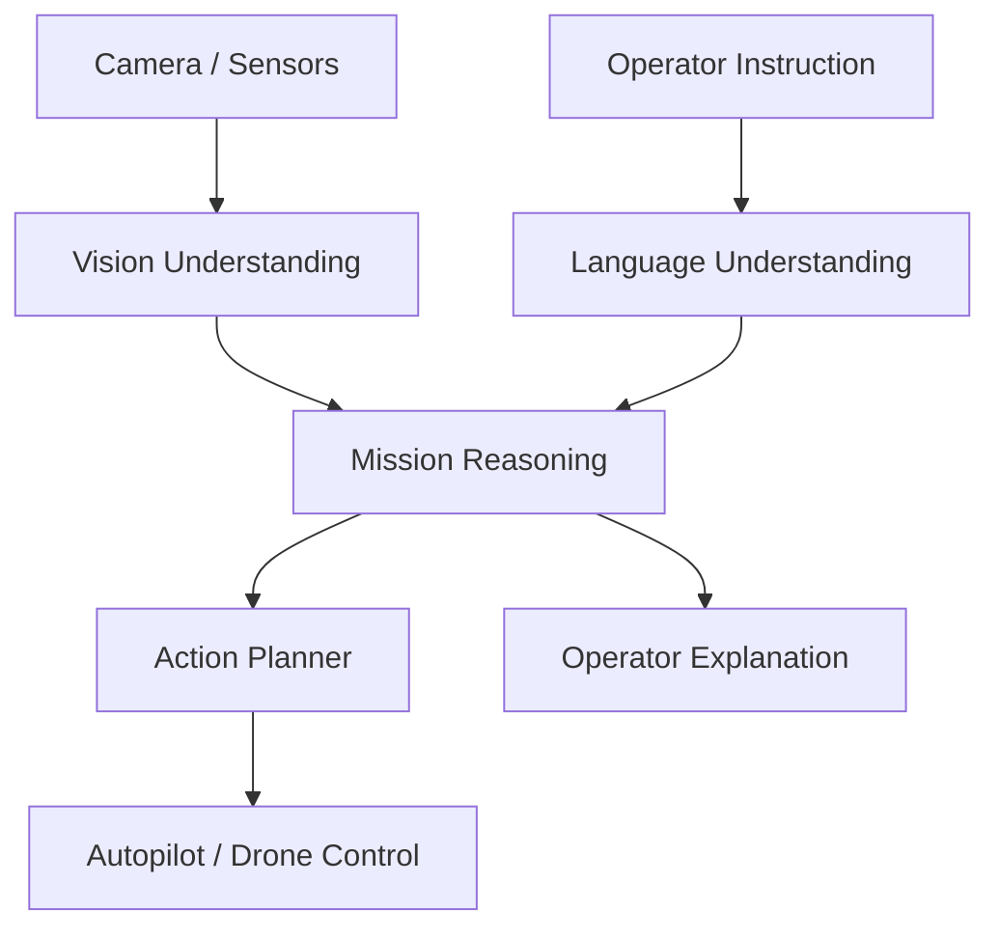

---

## 5. Core Problem

| Problem | Current Drone Reality | Impact |
|---|---|---|
| Operator overload | Humans must watch video and control flight simultaneously | Slower decisions, fatigue, missed events |
| Rigid waypoint missions | Drone follows route but does not understand mission intent | Poor adaptation |
| Weak scene understanding | Drone captures video but does not reason deeply about it | Valuable data is underused |
| Comms dependency | Human must often control or interpret live feed | Mission suffers when link drops |
| Poor task completion | Drone may reach location but not know what to inspect next | Incomplete missions |
| Limited autonomy | Obstacle avoidance is not mission intelligence | Drone avoids things but does not solve tasks |
| Multi-drone complexity | More drones mean more video feeds and more operator burden | Hard to scale operations |

---

## 6. What HyperPilot VLMA Can Do

| Capability | What It Means | Drone Value |
|---|---|---|
| Natural-language mission input | Operator gives goal in simple language | Easier control |
| Scene understanding | Drone identifies objects, terrain, damage, people, vehicles, smoke, fire, landing zones | Better situational awareness |
| Action generation | Model proposes next drone action | Less manual piloting |
| Task decomposition | Breaks mission into steps | Better completion |
| Visual search | Looks for mission-relevant objects or changes | Faster inspection/ISR |
| Local decision-making | Chooses continue, inspect, avoid, hover, return, or ask | Safer autonomy |
| Human confirmation | Requests approval for sensitive actions | Keeps operator in control |
| Mission explanation | Explains why it changed route or stopped | Builds trust |
| Multi-drone tasking | Assigns or recommends roles across drones | Scales operations |
| Offline/edge inference | Runs key decisions onboard | Works when communication is degraded |

---

## 7. How It Helps Drones Take Autonomous Decisions

HyperPilot VLMA should not mean uncontrolled autonomy. It should mean **bounded autonomy**.

The operator defines mission rules. The model makes decisions inside those rules.

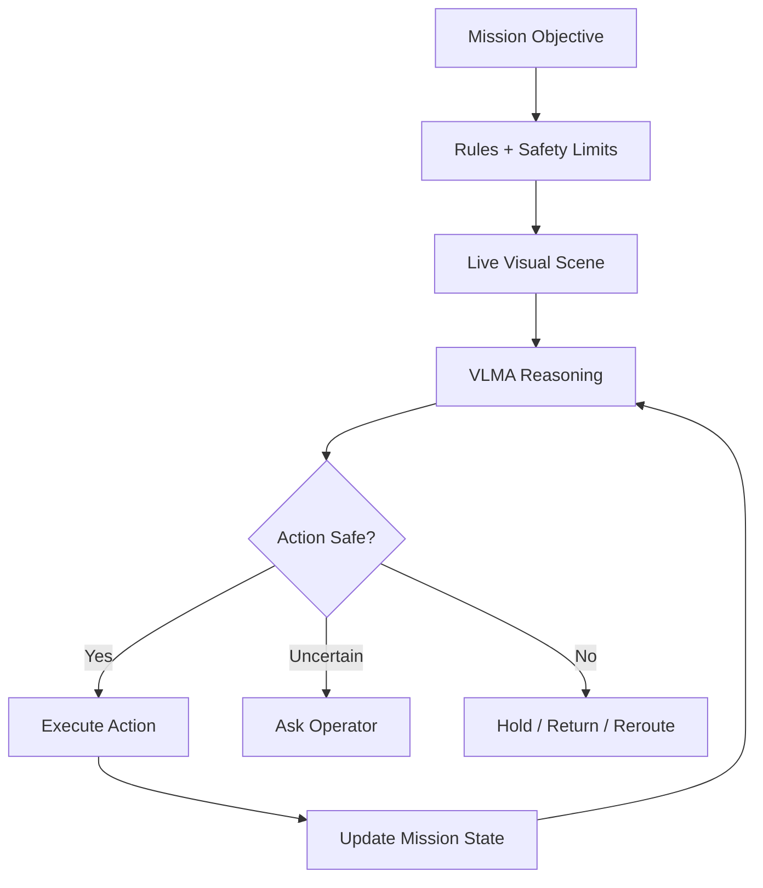

### Example Decisions

| Situation | VLMA Decision | Why Useful |
|---|---|---|
| Obstacle blocks route | Reroute around obstacle | Continues mission safely |
| Target area not visible | Change altitude or angle | Better observation |
| Smoke detected | Mark location and widen search pattern | Faster incident response |
| Human detected in restricted zone | Alert operator and maintain safe distance | Safer operations |
| GPS confidence drops | Switch to VPS/local navigation mode | Mission continuity |
| Battery low | Prioritize return or handoff to another drone | Prevents loss |
| Video link weak | Switch to metadata-first reporting | Maintains useful communication |
| Task complete | Return, hold, or move to next objective | Reduces operator workload |

---

## 8. Drone Control Advantages

HyperPilot VLMA can make drones easier to control.

Instead of controlling every movement, the operator can give intent:

| Traditional Control | HyperPilot VLMA Control |
|---|---|
| “Fly to waypoint 4, lower altitude, rotate camera, inspect roof.” | “Inspect the rooftop for damage and send close-up images.” |
| “Move forward 20m, yaw right, zoom.” | “Look behind the building and check for movement.” |
| “Follow this path and avoid tower.” | “Patrol this perimeter and avoid civilian areas.” |
| “Return to base when battery reaches 25%.” | “Complete the inspection if safe, otherwise return before low battery.” |

### Control Modes

| Mode | Description | Use Case |
|---|---|---|
| Manual Assist | Human flies, VLMA gives warnings and suggestions | Training, high-risk control |
| Natural Language Control | Human gives intent; drone converts to actions | Fast missions |
| Task Autonomy | Drone executes task with periodic updates | Inspection, ISR, search |
| Human-in-the-Loop | Drone asks for approval for important decisions | Defense/public safety |
| Human-on-the-Loop | Drone acts inside rules while operator supervises | Long patrols |
| Offline Autonomy | Drone continues task if comms drop | GPS/comms-degraded areas |

---

## 9. Military and Critical Use Cases

HyperPilot VLMA should be positioned carefully for military use as decision support, ISR, autonomy, search, logistics, inspection, and operator assistance. Sensitive or kinetic decisions should remain under human command.

| Use Case | What VLMA Does | Advantage |
|---|---|---|
| Border surveillance | Understands terrain, detects movement, summarizes observations | Faster situational awareness |
| ISR mission support | Identifies objects/changes and recommends next viewing angle | Better intelligence collection |
| Route reconnaissance | Looks for blocked roads, damaged bridges, unusual activity | Safer movement planning |
| Perimeter patrol | Understands patrol zones and reports anomalies | Lower operator burden |
| Search and rescue | Searches for people, smoke, heat indicators, signals, vehicles | Faster discovery |
| Disaster assessment | Identifies collapsed structures, waterlogging, fire, blocked routes | Better emergency response |
| Critical infrastructure inspection | Detects damage, leaks, open gates, smoke, broken panels | Faster inspection |
| Logistics drone support | Finds safe landing zone and adapts route | More reliable delivery |
| GPS-denied mission | Uses scene understanding with VPS to continue task | Mission continuity |
| Multi-drone scouting | Assigns drones to inspect different zones | Faster area coverage |
| Operator copilot | Converts mission intent into drone actions | Easier control |
| Post-mission reporting | Summarizes findings from video and logs | Faster decision cycle |

---

## 10. What HyperPilot Can Detect or Understand

| Category | Examples |
|---|---|
| Objects | Vehicles, people, equipment, containers, towers, roads, bridges, gates |
| Terrain | Water, forest, open field, building roof, road, cliff, wall, tunnel entrance |
| Safety risks | Obstacles, wires, smoke, fire, crowded area, unsafe landing zone |
| Mission targets | Inspection points, damaged asset, suspicious movement, missing object |
| Scene changes | New vehicle, damaged structure, blocked road, open door, fresh smoke |
| Navigation cues | Landmark, corridor, road direction, rooftop, entry point, landing marker |
| Operational state | Task complete, target not visible, path blocked, sensor degraded |

---

## 11. Product Architecture

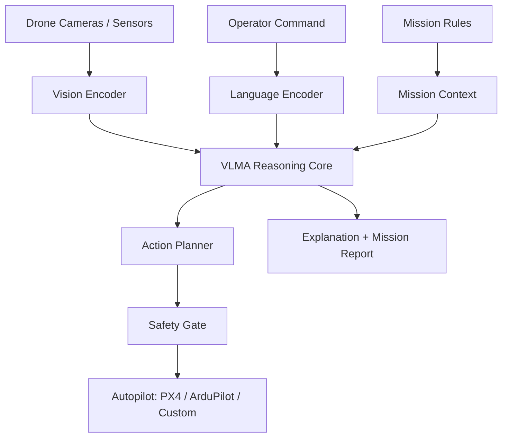

### Architecture Components

| Component | Function |
|---|---|
| Vision Encoder | Understands image/video frames |
| Language Encoder | Understands operator instruction |
| Mission Context | Stores task, route, rules, safety limits |
| VLMA Reasoning Core | Connects what the drone sees with what it should do |
| Action Planner | Converts intent into drone actions |
| Safety Gate | Blocks unsafe or unauthorized actions |
| Autopilot Bridge | Sends safe commands to PX4, ArduPilot, or custom flight stack |
| Memory Layer | Remembers mission state, explored areas, findings |
| Explanation Layer | Reports why the drone acted or stopped |
| Edge Runtime | Runs critical model locally where possible |

---

## 12. Task Completion Loop

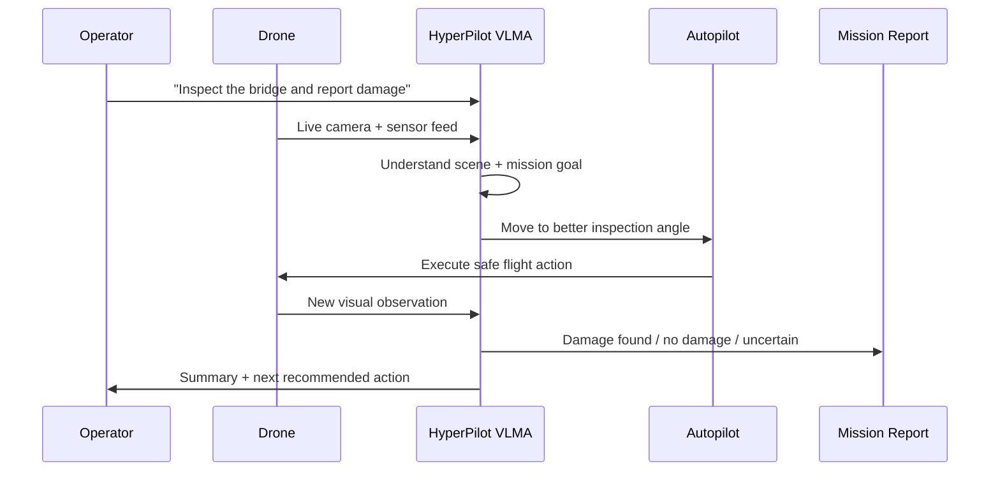

---

## 13. Data Flow

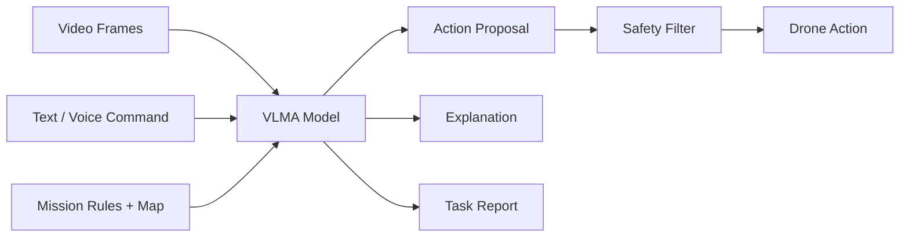

---

## 14. Current Solution Landscape

| Current Approach | What It Does | Limitation |
|---|---|---|
| Manual drone piloting | Human watches feed and controls drone | High workload, hard to scale |
| Waypoint autonomy | Drone follows preplanned path | Weak adaptation to changing scene |
| Computer vision modules | Detect objects or anomalies | Usually does not convert findings into mission actions |
| VLM-only systems | Understand images and language | Do not directly control drone actions |
| Autonomy stacks | Navigate and avoid obstacles | Often do not understand human mission intent |
| Full-stack defense autonomy | High-end mission autonomy | Expensive, closed, platform-specific |

HyperPilot VLMA fills the gap between **vision intelligence** and **physical drone action**.

---

## 15. How We Can Be Different

| Dimension | Existing Systems | HyperPilot VLMA |
|---|---|---|
| Control model | Manual or waypoint-based | Natural-language mission control |
| Intelligence | Object detection or navigation | Scene understanding + task reasoning + action |
| Deployment | Often cloud or closed platform | Edge-first, platform-neutral |
| Autonomy | Route following | Mission completion loop |
| Safety | Basic obstacle/failsafe | Safety gate + human confirmation + mission rules |
| Defense use | Full-stack expensive systems | Modular layer for existing drones |
| Reporting | Raw video and logs | Summaries, findings, confidence, next actions |
| Training | Platform-specific | Fine-tune on mission/domain data |
| Multi-drone support | Often separate feeds | Shared task state and role suggestions |

---

## 16. Competitor and Ecosystem Overview

| Company / Project | Country | Category | Core Product | Relevance |
|---|---|---|---|---|
| **Google DeepMind RT-2** | USA / UK | Robotics VLA | Vision-language-action robot control model | Shows VLMs can be adapted for robot action |
| **Open X-Embodiment / RT-X** | Global collaboration | Robot learning dataset/model | Large real-robot dataset and generalist robot models | Shows cross-robot generalization |
| **OpenVLA** | USA research ecosystem | Open-source VLA | 7B VLA trained on robot demos | Useful open foundation for VLA development |
| **Physical Intelligence** | USA | Generalist robot intelligence | π0 / π0.5 VLA models | General robot action learning |
| **NVIDIA** | USA | Robot foundation model infrastructure | Isaac GR00T N1, simulation/data stack | VLA + synthetic data infrastructure |
| **Figure AI** | USA | Humanoid robotics | Helix VLA | Onboard real-time vision-language-action control |
| **Shield AI** | USA | Defense autonomy | Hivemind | Mission autonomy in GPS/comms-degraded environments |
| **Skydio** | USA | Autonomous drones | Drone autonomy stack | Strong drone autonomy baseline |
| **AutoFly Research** | Academic | UAV VLA | VLA for UAV autonomous navigation | Directly relevant drone VLA research |

---

## 17. Competitor Diagrams

## 17.1 Google DeepMind RT-2

| Field | Details |
|---|---|
| Category | Robotics VLA |
| Strength | Uses web-scale vision/language knowledge for robotic actions |
| Weakness | Research/product ecosystem, not drone-specific |
| Strategic Positioning | General robot control from vision and language |


**HyperPilot difference:**  
Specialize VLA for aerial tasks: navigation, inspection, ISR, search, obstacle-aware movement, and BVLOS workflows.

---

## 17.2 Open X-Embodiment / RT-X

| Field | Details |
|---|---|
| Category | Multi-robot learning |
| Strength | Large dataset across many robot embodiments |
| Weakness | Mostly manipulation/robotics dataset, not drone mission execution |
| Strategic Positioning | General-purpose robotics learning foundation |


**HyperPilot difference:**  
Build a drone-specific embodiment dataset: aerial video, operator commands, flight actions, safe-state decisions, and mission outcomes.

---

## 17.3 OpenVLA

| Field | Details |
|---|---|
| Category | Open-source robotics VLA |
| Strength | Open model, fine-tunable, trained on large robot demonstration data |
| Weakness | Focused on robotic manipulation, not aerial navigation |
| Strategic Positioning | Accessible VLA foundation model |

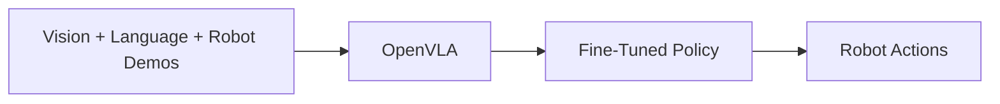

**HyperPilot difference:**  
Use open VLA ideas but train/fine-tune for aerial decision-making and drone control.

---

## 17.4 Physical Intelligence

| Field | Details |
|---|---|
| Category | General robot foundation model |
| Strength | Generalist physical action learning |
| Weakness | Primarily broader robotics, not drone-specific |
| Strategic Positioning | Foundation model for general robot control |

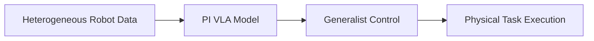

**HyperPilot difference:**  
Focus on flight-specific constraints: altitude, velocity, obstacle avoidance, no-fly zones, battery, link confidence, and safety gates.

---

## 17.5 NVIDIA GR00T N1

| Field | Details |
|---|---|
| Category | Robot foundation model and simulation ecosystem |
| Strength | Open humanoid foundation model, synthetic data, simulation tooling |
| Weakness | Humanoid-focused, not drone-specific |
| Strategic Positioning | Infrastructure for physical AI and generalist robotics |

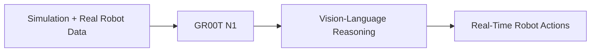

**HyperPilot difference:**  
Use the same physical-AI direction, but optimize for aerial autonomy and edge drone compute.

---

## 17.6 Figure Helix

| Field | Details |
|---|---|
| Category | Humanoid VLA |
| Strength | Onboard perception, reasoning, and movement control |
| Weakness | Humanoid use case, not UAVs |
| Strategic Positioning | Generalist humanoid robot intelligence |


**HyperPilot difference:**  
Make the drone equivalent: onboard reasoning for flight, inspection, navigation, and reporting.

---

## 17.7 Shield AI Hivemind

| Field | Details |
|---|---|
| Category | Defense autonomy |
| Strength | GPS/comms-degraded mission autonomy and multi-platform deployment |
| Weakness | High-end defense autonomy platform, less accessible to smaller drone OEMs |
| Strategic Positioning | AI pilot for military autonomous systems |


**HyperPilot difference:**  
Offer a modular VLMA copilot layer for existing drones with human-readable mission control and reporting.

---

## 17.8 AutoFly

| Field | Details |
|---|---|
| Category | UAV VLA research |
| Strength | Directly targets autonomous UAV navigation with vision-language-action modeling |
| Weakness | Research-stage, not a complete product stack |
| Strategic Positioning | Drone-specific VLA navigation model |


**HyperPilot difference:**  
Productize the idea into mission planning, safety gates, operator control, reporting, and integration with real drone stacks.

---

## 18. Drone VLMA System Modes

| Mode | Description | Use Case |
|---|---|---|
| Observe | Understand and summarize live scene | ISR, inspection, patrol |
| Guide | Suggest next best action to operator | Manual assist |
| Execute | Perform bounded autonomous actions | Inspection, search |
| Ask | Request confirmation when uncertain | Sensitive decisions |
| Explain | Tell operator why it acted | Trust and audit |
| Recover | Choose safe return/hold/land state | GPS/comms/battery issue |
| Coordinate | Share task state with other drones | Multi-drone missions |
| Report | Create mission summary | Post-mission intelligence |

---

## 19. Edge vs Cloud Deployment

| Deployment | Best For | Advantage | Limitation |
|---|---|---|---|
| Onboard edge model | Defense, BVLOS, comms-denied missions | Works without internet, faster local decisions | Smaller model, limited compute |
| Ground station model | Field command post | More compute, local control | Needs drone-ground link |
| Cloud model | Training, post-mission analysis, non-critical missions | High compute, large model | Not suitable for disconnected missions |
| Hybrid model | Most practical setup | Edge handles safety/action, cloud/ground handles deeper analysis | More complex architecture |

### Recommended Architecture

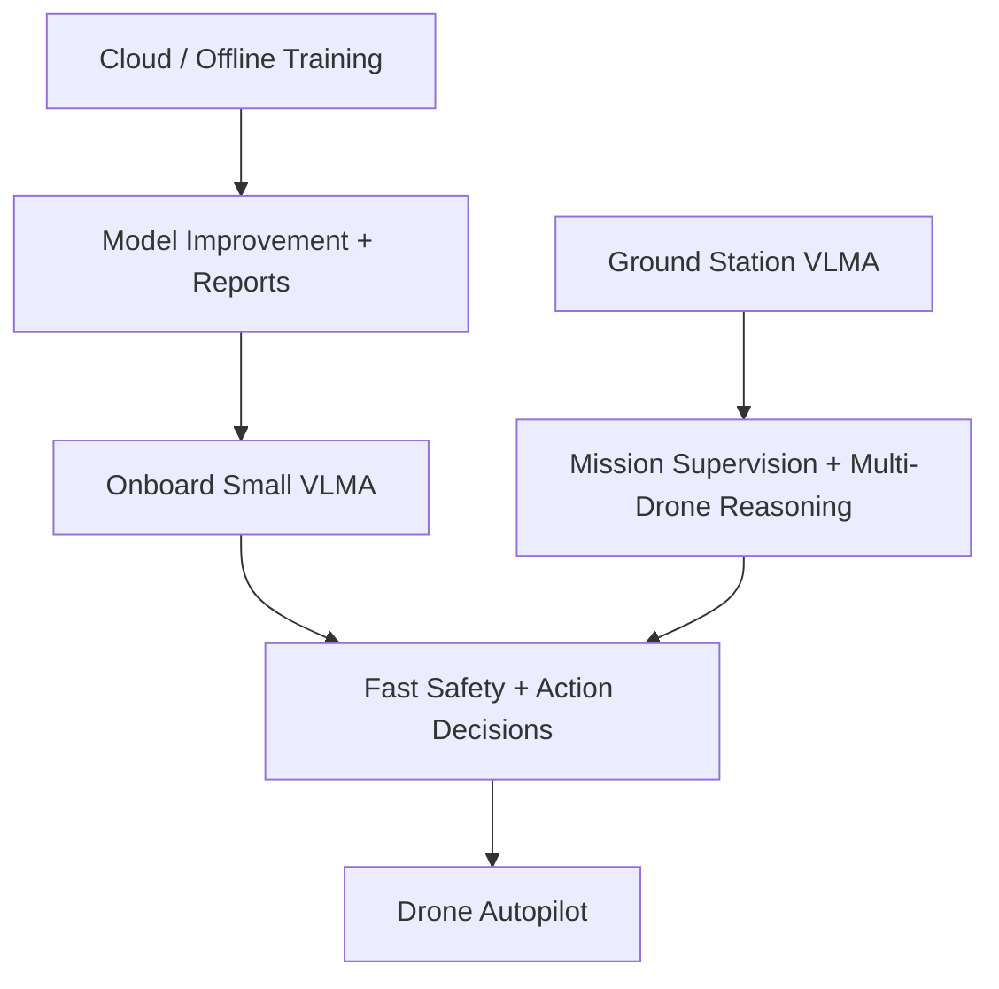

---

## 20. Safety and Control

HyperPilot VLMA should be designed with strict safety boundaries.

| Safety Layer | Purpose |
|---|---|
| Mission rules | Defines what the drone is allowed to do |
| No-fly zones | Blocks unsafe or restricted areas |
| Human confirmation | Requires approval for sensitive actions |
| Confidence threshold | Prevents low-confidence actions |
| Autopilot safety limits | Keeps speed, altitude, geofence, and return rules |
| Emergency fallback | Hold, return, land, or handoff |
| Audit log | Records decisions and reasons |

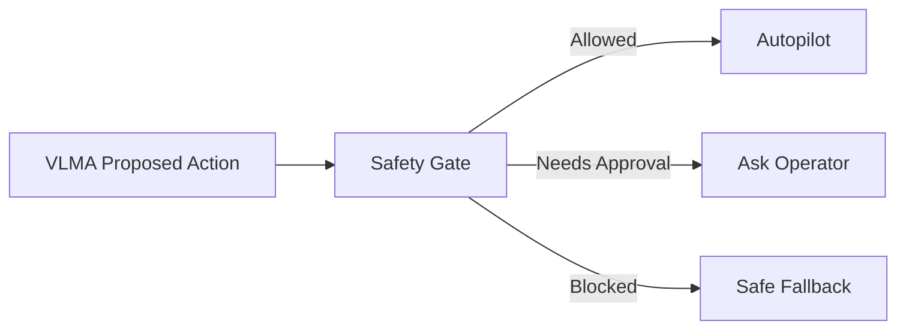

---

## 21. MVP Scope

### MVP 1: Drone Mission Copilot

| Feature | Included |
|---|---|
| Natural-language mission input | Yes |
| Live scene understanding | Yes |
| Mission checklist generation | Yes |
| Operator suggestions | Yes |
| Basic report generation | Yes |
| PX4 / ArduPilot integration | Read-only initially |

### MVP 2: Bounded Action Execution

| Feature | Included |
|---|---|
| Safe action proposals | Yes |
| Autopilot command bridge | Yes |
| Human confirmation workflow | Yes |
| Object/scene-based inspection | Yes |
| Continue/hold/return recommendation | Yes |
| Mission logs | Yes |

### MVP 3: Edge Drone Autonomy

| Feature | Included |
|---|---|
| Onboard small VLMA | Yes |
| Offline mode | Yes |
| Visual task completion | Yes |
| VPS integration | Yes |
| D2D mission-state sharing | Yes |
| Multi-drone task suggestions | Yes |
| Domain fine-tuning | Yes |

---

## 22. Roadmap

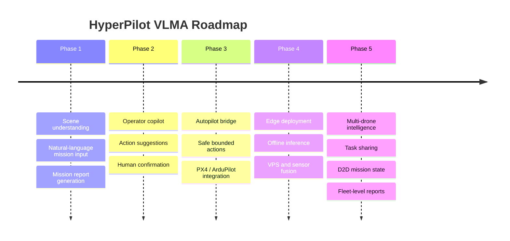

---

## 23. Business Model

| Model | Description | Best For |
|---|---|---|
| Per-drone license | VLMA copilot license per drone | Drone fleets |
| SDK license | Integrate VLMA into OEM drone platforms | Drone manufacturers |
| Defense deployment | On-prem model, maps, logs, and mission server | Military and government |
| Inspection package | Domain-tuned model for asset inspection | Infrastructure operators |
| Training data service | Fine-tune on customer mission data | Enterprise and defense |
| Edge hardware kit | Compute module + model runtime | Offline/BVLOS missions |
| Maintenance contract | Updates, safety tuning, model improvements | Long-term programs |

---

## 24. Strategic Positioning Map

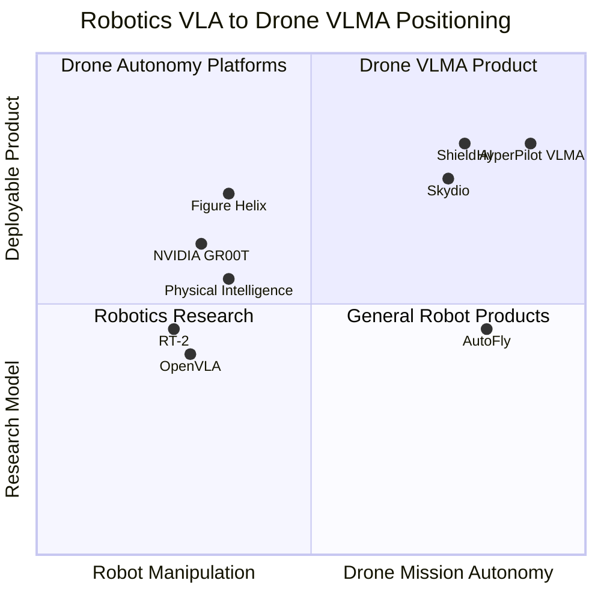

---

## 25. Is Anyone Doing This for Drones?

Short answer: **yes in research, but not yet clearly as a mature commercial drone product category.**

The drone-specific VLA/VLMA space is emerging quickly:

| Project / Paper | Stage | What It Does | Gap Left Open |
|---|---|---|---|
| **UAV-VLA** | Research / prototype | Converts natural-language requests and satellite imagery into aerial mission paths and action plans | More mission planning than onboard closed-loop drone autonomy |
| **AutoFly** | Research | End-to-end VLA for UAV autonomous navigation using vision, language, and action policies | Research-stage; not a full commercial mission copilot |
| **VLA-AN** | Research | Efficient onboard VLA framework for aerial navigation in complex environments | Strong technical direction, but still paper/prototype stage |
| **AerialVLA** | Research | End-to-end UAV navigation from visual observations and fuzzy language instructions | Focused on navigation, not full mission reporting/control stack |
| **Shield AI / Skydio / Anduril** | Commercial autonomy | Advanced drone autonomy, mission systems, and defense platforms | Not positioned as an open drone VLMA copilot layer for mixed fleets |

### First-Mover Conclusion

There is **no obvious market leader yet** offering a complete productized **Vision-Language-Action mission brain for drones** that combines:

- Natural-language drone control.
- Live scene understanding.
- Safe action generation.
- PX4 / ArduPilot integration.
- Onboard edge inference.
- Human confirmation.
- Mission reporting.
- Multi-drone task sharing.
- VPS and D2D integration.

That means HyperPilot can become a first mover by turning current research into a deployable product.

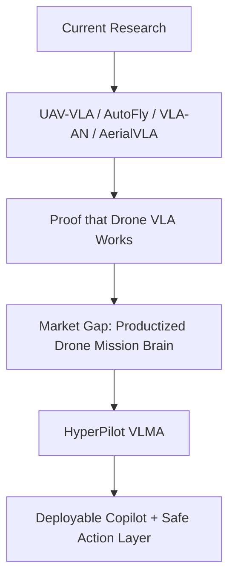

---

## 26. MDX / Mermaid: How HyperPilot Works

### 26.1 Full Mission Brain Flow

HyperPilot connects the operator's intent, the drone's live visual feed, the mission rules, and the autopilot.

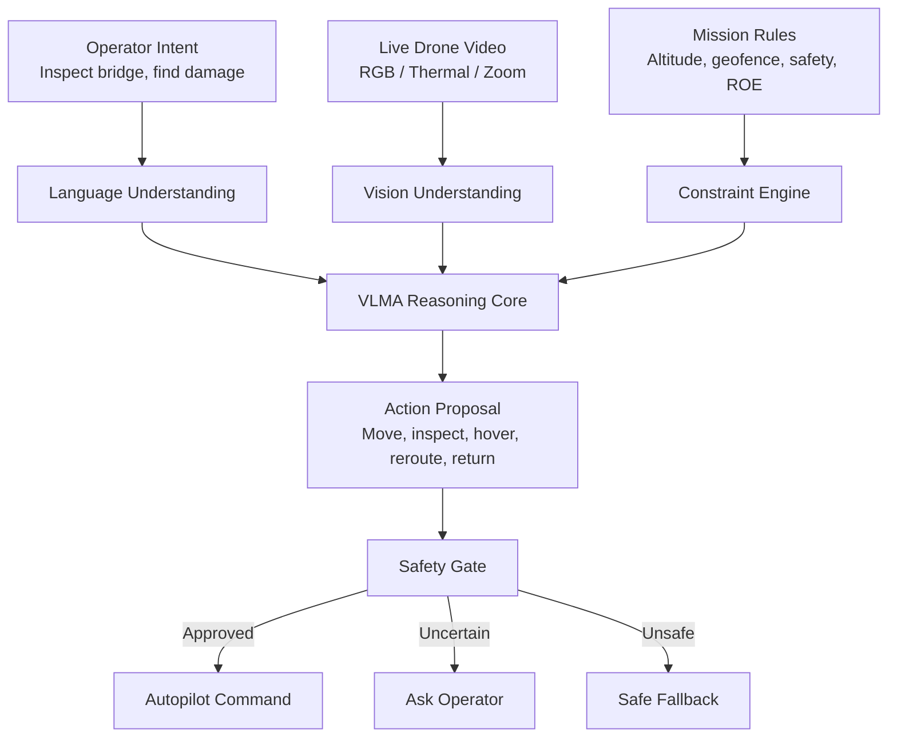

### 26.2 Natural-Language Control Flow

This is how a user can control the drone without manually piloting every movement.

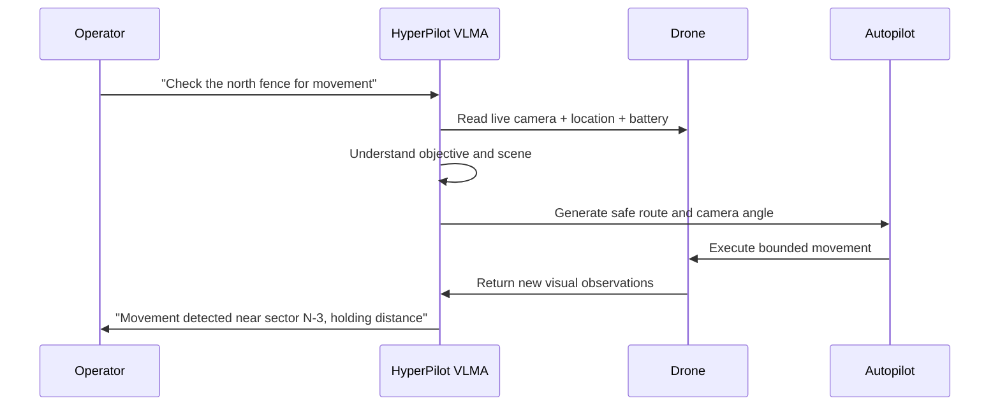

### 26.3 Action Safety Gate

The model should never directly control the drone without a safety layer.

```mermaid
flowchart LR
    A["VLMA Action"] --> B{"Allowed by Mission Rules?"}
    B -->|No| C["Block Action"]
    B -->|Yes| D{"Confidence High?"}
    D -->|No| E["Ask Operator"]
    D -->|Yes| F{"Autopilot Safety OK?"}
    F -->|No| G["Fallback: Hold / Return / Land"]
    F -->|Yes| H["Execute"]
```

### 26.4 Task Completion Loop

The drone should not just reach a waypoint. It should finish the mission objective.

```mermaid
stateDiagram-v2
    [*] --> UnderstandTask
    UnderstandTask --> SearchScene
    SearchScene --> InspectTarget: Target found
    SearchScene --> AdjustView: Target unclear
    AdjustView --> SearchScene
    InspectTarget --> ConfirmResult
    ConfirmResult --> AskOperator: Low confidence
    ConfirmResult --> GenerateReport: High confidence
    AskOperator --> InspectTarget: Need closer view
    AskOperator --> GenerateReport: Operator confirms
    GenerateReport --> ReturnOrNextTask
    ReturnOrNextTask --> [*]
```

### 26.5 Edge + Ground + Cloud Split

HyperPilot should use a hybrid architecture. Safety-critical decisions stay onboard; heavy analysis can run on ground or cloud when available.

```mermaid
flowchart TD
    A["Onboard Edge VLMA"] --> B["Fast Decisions<br/>Avoid, hover, inspect, return"]
    C["Ground Station VLMA"] --> D["Multi-Drone Supervision<br/>Mission updates, operator chat"]
    E["Cloud / Offline Training"] --> F["Model Tuning<br/>Reports, simulation, dataset improvement"]
    B --> G["Autopilot"]
    D --> A
    F --> A
```

### 26.6 Multi-Drone VLMA Coordination

With D2D integration, multiple drones can share mission context.

```mermaid
flowchart TD
    A["Drone 1<br/>Scout"] --> D["Shared Mission Memory"]
    B["Drone 2<br/>Observer"] --> D
    C["Drone 3<br/>Relay"] --> D
    D --> E["HyperPilot Fleet Reasoning"]
    E --> F["Assign Roles"]
    E --> G["Avoid Duplicate Coverage"]
    E --> H["Summarize Findings"]
    E --> I["Recommend Next Action"]
```

### 26.7 VPS + VLMA Integration

VPS tells the drone where it is. VLMA tells the drone what to do next.

```mermaid
flowchart LR
    A["VPS<br/>Where am I?"] --> C["Mission Brain"]
    B["VLMA<br/>What am I seeing and what should I do?"] --> C
    C --> D["Safe Action"]
    D --> E["Autopilot"]
    E --> F["Mission Progress"]
```

### 26.8 Sensor-to-Action Stack

This shows the technical product stack from raw inputs to drone actions.

```mermaid
flowchart TD
    A["Inputs"] --> A1["Camera"]
    A --> A2["Thermal"]
    A --> A3["IMU / VPS"]
    A --> A4["Map / Mission Plan"]
    A1 --> B["Perception Encoder"]
    A2 --> B
    A3 --> C["State Estimator"]
    A4 --> D["Mission Context"]
    B --> E["VLMA Core"]
    C --> E
    D --> E
    E --> F["Action Tokens"]
    F --> G["Safety + Policy Filter"]
    G --> H["Flight Commands"]
    H --> I["PX4 / ArduPilot / Custom Autopilot"]
```

---

## 27. First-Mover Product Strategy

### What Would Be Cool to Build

Build **HyperPilot VLMA as the Cursor-for-drones mission brain**:

> The operator describes what they want. The drone understands the scene, proposes a plan, executes safe actions, and reports results.

### First Product Experience

| User Input | HyperPilot Output |
|---|---|
| “Inspect this solar farm for damaged panels.” | Generates route, scans panels, marks anomalies, returns report |
| “Patrol this perimeter and alert me if anything moves.” | Flies patrol, detects movement, keeps safe distance, alerts operator |
| “Find a safe landing zone near the building.” | Searches visually, scores options, asks for confirmation |
| “Check whether the road is blocked.” | Moves to view route, detects blockage, returns annotated image |
| “Continue if comms drop, but return if confidence is low.” | Converts instruction into safe-state mission policy |

### First-Mover Moat

| Moat | How to Build It |
|---|---|
| Drone mission dataset | Collect video + operator intent + safe actions + reports |
| Autopilot integration | PX4, ArduPilot, MAVLink, custom defense stack |
| Safety gate | Rule-based + model confidence + operator approval |
| Domain tuning | Defense ISR, infrastructure inspection, disaster response |
| Edge runtime | Small onboard model for disconnected missions |
| Mission memory | Store task progress, detected objects, explored areas |
| Multi-drone link | Integrate with HyperMesh D2D |
| GPS-denied support | Integrate with HyperSight VPS |

### First-Mover Roadmap

```mermaid
timeline
    title HyperPilot First-Mover Roadmap
    Month 1-2 : Live video understanding
              : Natural-language mission briefing
              : Report generation
    Month 3-4 : Safe action suggestions
              : Operator confirmation
              : PX4 / ArduPilot read-write bridge
    Month 5-6 : Edge inference
              : VPS integration
              : Comms-loss mission states
    Month 7-9 : Multi-drone task sharing
              : D2D mission memory
              : Domain fine-tuning
    Month 10-12 : Field pilot
                : Defense/industrial customer demo
                : Dataset flywheel
```

---

## 28. Updated First-Mover Positioning

| Market Layer | Current Status | HyperPilot Opportunity |
|---|---|---|
| Robotics VLA | Active research and early products | Learn from RT-2, OpenVLA, GR00T, Helix |
| Drone VLA research | Emerging fast | Productize UAV-VLA, AutoFly, VLA-AN ideas |
| Commercial drone autonomy | Strong but closed/platform-specific | Build platform-neutral mission brain |
| Drone inspection software | Mostly workflow/reporting | Add live action reasoning |
| Drone command systems | Mostly manual/waypoint/C2 | Add natural-language mission control |
| Defense autonomy | Expensive full-stack systems | Offer modular VLMA layer for mixed fleets |

HyperPilot can be first mover by being the first to package drone VLMA as:

1. **Mission copilot**
2. **Scene understanding engine**
3. **Safe action planner**
4. **Drone control interface**
5. **Mission reporting system**
6. **Edge autonomy runtime**
7. **Multi-drone reasoning layer**

---

## 29. Key Advantages

| Advantage | Why It Matters |
|---|---|
| Easier drone control | Operators can give intent instead of manual step-by-step commands |
| Faster decisions | Drone can interpret scene and recommend next action |
| Better task completion | Model tracks mission objective, not just route |
| Lower operator workload | One operator can supervise more drone activity |
| Better BVLOS support | Drone can reason locally when operator visibility is limited |
| Comms resilience | Edge model can continue basic decisions offline |
| Better reporting | Converts video into summaries, findings, and action logs |
| Safer autonomy | Safety gates and human confirmation reduce risk |
| Multi-drone scalability | Drones can share task state and divide work |
| Domain tuning | Can be trained for defense, inspection, disaster, agriculture, or logistics |

---

## 30. Final Strategic Positioning

### Simple Positioning

> HyperPilot VLMA lets drones understand what they see, understand what the operator wants, and choose the next safe action.

### Defense Positioning

> A human-controlled drone mission intelligence layer for ISR, patrol, search, inspection, and GPS/comms-degraded operations.

### Investor Positioning

> Robotics is moving from scripted automation to vision-language-action intelligence. Drones need the same shift, but optimized for flight, safety, and mission completion.

### Client Positioning

> We help your drone finish the task, not just fly the route.

---

## 31. Final Recommendation

Build **HyperPilot VLMA** as a drone mission copilot first, then evolve into bounded autonomous action.

Do not start with full autonomous control. Start with:

1. Scene understanding.
2. Natural-language mission planning.
3. Operator suggestions.
4. Mission reporting.
5. Safe action proposals.
6. Human confirmation.
7. Autopilot bridge.
8. Edge model deployment.
9. VPS and D2D integration.

The strongest wedge is:

> A drone copilot that watches the live camera feed, understands the mission, tells the operator what matters, recommends the next action, and safely executes approved tasks.

---

## 32. Reference Sources

- [Google DeepMind RT-2](https://deepmind.google/blog/rt-2-new-model-translates-vision-and-language-into-action/)
- [RT-2: Vision-Language-Action Models Transfer Web Knowledge to Robotic Control](https://arxiv.org/abs/2307.15818)
- [Open X-Embodiment / RT-X](https://robotics-transformer-x.github.io/)
- [Open X-Embodiment GitHub](https://github.com/google-deepmind/open_x_embodiment)
- [Google DeepMind: Scaling Up Learning Across Many Robot Types](https://deepmind.google/blog/scaling-up-learning-across-many-different-robot-types/)
- [OpenVLA: An Open-Source Vision-Language-Action Model](https://arxiv.org/abs/2406.09246)
- [Physical Intelligence π0.5](https://www.pi.website/blog/pi05)
- [NVIDIA Isaac GR00T N1](https://nvidianews.nvidia.com/news/nvidia-isaac-gr00t-n1-open-humanoid-robot-foundation-model-simulation-frameworks)
- [Figure Helix](https://www.figure.ai/news/helix)
- [Boston Dynamics and Google DeepMind Robotics Partnership](https://bostondynamics.com/blog/boston-dynamics-google-deepmind-form-new-ai-partnership/)
- [AutoFly: Vision-Language-Action Model for UAV Autonomous Navigation](https://arxiv.org/abs/2602.09657)
- [UAV-VLA: Vision-Language-Action System for Large Scale Aerial Mission Generation](https://arxiv.org/abs/2501.05014)
- [UAV-VLA Official GitHub](https://github.com/sautenich/uav-vla)
- [VLA-AN: Efficient Onboard Vision-Language-Action Framework for Aerial Navigation](https://arxiv.org/abs/2512.15258)
- [AerialVLA: Vision-Language-Action Model for UAV Navigation](https://arxiv.org/abs/2603.14363)
- [Vision-Language-Action Models for Unmanned Aerial Vehicles](https://www.mdpi.com/2504-446X/10/6/412)
- [Vision-Language Navigation for Aerial Robots Survey](https://arxiv.org/abs/2604.07705)
- [Vision-Language-Action Models: Concepts, Progress, Applications and Challenges](https://arxiv.org/html/2505.04769v1)
