# HyperPrint

**Category:** RF Fingerprinting / Battlefield RF Intelligence  
**One-line thesis:** HyperPrint turns raw radio-frequency emissions from drones, controllers, jammers, radios, and hostile emitters into real-time identity, intent, and battlefield intelligence.

---

## 1. Product Definition

| Item | Description |
|---|---|
| **Product name** | HyperPrint |
| **Category** | RF Fingerprinting |
| **New category framing** | Real-Time RF Identity & Battlefield Emitter Intelligence |
| **Core users** | Defense forces, border security, counter-drone teams, electronic warfare units, critical infrastructure security, airbase security |
| **Core value** | Detect, classify, identify, geolocate, and track RF-emitting threats in real time |
| **Strategic wedge** | Passive RF fingerprinting for drones, controllers, jammers, and battlefield emitters |

---

## 2. Executive Summary

HyperPrint is a passive RF intelligence platform that listens to radio-frequency signals and builds unique fingerprints of drones, controllers, radios, jammers, and other battlefield emitters.

The product helps answer battlefield questions in real time:

- Is there a drone nearby?
- What type of drone is it?
- Is it friendly, unknown, or hostile?
- Is this the same drone/controller seen earlier?
- Where is the controller/operator likely located?
- Is this signal part of a swarm?
- Is the enemy using jamming or spoofing?
- Is the RF environment changing before an attack?
- Which response system should be triggered first?

RF fingerprinting is useful because every transmitter has small hardware and signal imperfections. These imperfections can create a unique radio identity, similar to a device-level signature.

For battlefield operations, HyperPrint becomes a **real-time RF memory layer**. It does not only detect a drone once. It learns, tracks, correlates, and remembers emitters over time.

---

## 3. Why This Matters Now

Drones are becoming cheaper, more numerous, and harder to identify visually. Modern battlefield and border environments are filled with:

- Commercial drones.
- Modified FPV drones.
- ISR drones.
- Loitering munitions.
- Drone swarms.
- Remote controllers.
- Relay links.
- GNSS jammers.
- Spoofers.
- Tactical radios.
- Unknown RF emitters.

Traditional radar or visual detection can tell that something is moving. RF fingerprinting can help reveal **what is communicating, how it behaves, whether it has appeared before, and which network it may belong to**.

This matters because the next battlefield advantage is not just shooting drones down. The advantage is understanding the RF environment faster than the enemy.

---

## 4. Core Problem

Defense teams face a major detection and attribution gap.

| Problem | Why It Matters |
|---|---|
| Drones are small and low-flying | Radar and visual systems may detect late or miss them in clutter |
| Commercial drones look similar | Visual detection may not identify exact type or controller |
| Remote ID can be spoofed or absent | Declared identity cannot always be trusted |
| Jammers and spoofers are hard to attribute | Forces may know interference exists but not where it comes from |
| Enemy reuses drones/controllers | Without RF memory, repeat patterns are missed |
| Swarms create signal overload | Operators need automated classification and prioritization |
| Current systems are sensor-heavy but memory-light | They detect events but do not always build long-term emitter intelligence |

HyperPrint solves this by converting the RF environment into structured intelligence.

---

## 5. What RF Fingerprinting Can Detect

| Detection Target | What HyperPrint Can Infer | Battlefield Use |
|---|---|---|
| Drone control link | Drone presence, protocol family, activity pattern | Early warning before visual contact |
| Drone video downlink | Drone operating mode, payload activity signal | Detect ISR or attack preparation |
| Remote controller | Controller presence, direction, repeated signature | Locate likely operator zone |
| Specific drone model | Model/class probability | Decide response priority |
| Specific device identity | Same drone/controller seen before | Track repeat intrusions |
| Friendly vs unknown emitter | Match against approved friendly library | Reduce false alarms |
| Swarm-like RF behavior | Multiple synchronized or related signals | Detect coordinated drone activity |
| Jamming source | Interference type, direction, persistence | Protect friendly comms and navigation |
| Spoofing behavior | Signal inconsistency or identity mismatch | Flag deception attempts |
| Relay nodes | Repeated forwarding or link-extension behavior | Map enemy communication chain |
| RF silence pattern | Sudden disappearance or behavior shift | Alert for autonomous or pre-programmed mode |

---

## 6. What We Can Achieve With This Data in Real Time

HyperPrint turns RF data into operational decisions.

| Real-Time Data | Actionable Output | Battlefield Advantage |
|---|---|---|
| Signal detected | Drone/controller alert | Earlier warning |
| Fingerprint matched | Known threat / known friendly / unknown | Faster classification |
| Controller direction | Operator search zone | Target the source, not only the drone |
| Drone model probability | Threat severity estimate | Avoid wasting expensive countermeasures |
| Signal movement | Track line and movement trend | Predict route or protected asset risk |
| Multiple correlated emitters | Swarm or coordinated mission alert | Prioritize area defense |
| Jamming signature | EW threat alert | Switch comms, protect GNSS, reposition assets |
| Repeat emitter history | Pattern-of-life intelligence | Identify recurring operators or launch areas |
| Spoofing mismatch | Deception warning | Avoid trusting false Remote ID / false identity |
| RF congestion map | Spectrum health view | Plan friendly communication channels |

---

## 7. Battlefield Advantage

### 7.1 Earlier Detection

RF emissions can appear before the drone is visually detected. A passive RF sensor can provide an early alert when a drone, controller, or data link starts transmitting.

### 7.2 Better Attribution

Radar may show an object. RF fingerprinting can help identify:

- Drone type.
- Controller type.
- Specific device recurrence.
- Operator direction.
- Communication behavior.

### 7.3 Lower Response Cost

Not every drone requires the same response. HyperPrint can help classify threat severity so forces do not waste expensive interceptors or high-power EW tools on low-risk targets.

### 7.4 Operator Hunting

Destroying or disabling one drone may not stop the mission if the operator launches another. RF fingerprinting plus direction finding can help locate the controller/operator area.

### 7.5 Swarm Awareness

Multiple low-cost drones can overwhelm traditional monitoring. RF correlation can identify whether several signals are unrelated noise or part of coordinated activity.

### 7.6 Friendly Force Protection

A friendly RF library helps avoid misclassification. This matters when friendly drones, counter-drone systems, radios, and jammers operate in the same battlespace.

### 7.7 Battlefield RF Memory

HyperPrint can remember emitters over time:

- Same controller seen near multiple incidents.
- Same drone model used near a border sector.
- Same jammer signature appearing before attacks.
- Same launch pattern recurring at specific times.

This converts RF sensing from an alert system into an intelligence asset.

---

## 8. Category Definition

### Old Category: RF Drone Detection

Old RF detection products mainly answer:

- Is a drone signal present?
- What frequency is active?
- What direction is it coming from?
- Is it a known drone protocol?

### New Category: Battlefield RF Identity Layer

HyperPrint should define a larger category:

- Passive RF detection.
- RF fingerprinting.
- Specific emitter identification.
- Drone/controller attribution.
- Operator direction finding.
- RF pattern memory.
- Swarm RF correlation.
- Jamming/spoofing detection.
- Real-time C2 integration.

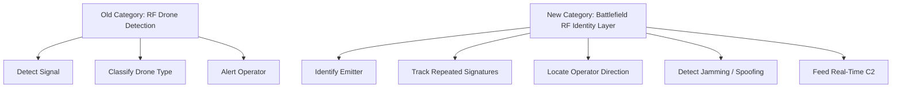

---

## 9. Core Product Architecture

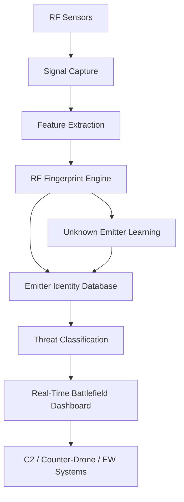

### Component Breakdown

| Component | Function |
|---|---|
| RF Sensor Node | Captures signals from drones, controllers, jammers, and radios |
| Signal Processing Layer | Converts raw RF into structured signal features |
| Fingerprint Engine | Identifies unique device-level and model-level signal patterns |
| Emitter Database | Stores known friendly, hostile, unknown, and historical signatures |
| Threat Classifier | Assigns risk level and likely emitter class |
| Direction / Geolocation Layer | Estimates direction or location when multiple sensors are available |
| Mission Dashboard | Shows live RF activity, alerts, confidence, and emitter history |
| C2 Integration | Sends alerts to command systems, counter-drone tools, and EW operators |

---

## 10. Real-Time Battlefield Workflow

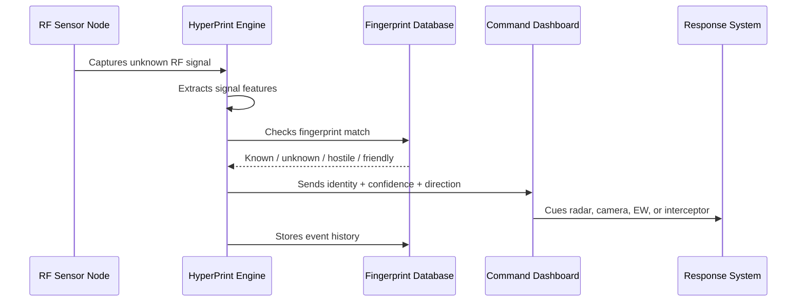

---

## 11. Use Case Classification

| Use Case | Buyer | Urgency | What HyperPrint Detects | Output |
|---|---|---:|---|---|
| Border drone intrusion | Army / border force | Very high | Drone and controller signal | Alert, identity, direction |
| Airbase protection | Air force / base security | Very high | Drone, controller, repeater, jammer | Perimeter RF threat map |
| Battlefield ISR defense | Army / EW unit | Very high | Recon drone downlink/control link | Early warning and tracking |
| Counter-swarm defense | Defense / C-UAS unit | High | Multiple correlated drone signals | Swarm warning and prioritization |
| Jamming detection | Signals / EW unit | High | GNSS/RF interference patterns | Jammer alert and direction |
| Friendly drone deconfliction | Drone command unit | High | Friendly drone fingerprints | Prevent friendly-fire response |
| Critical infrastructure | Oil, power, ports | Medium-high | Unauthorized drone activity | Security alert and forensics |
| Law enforcement | Police / public safety | Medium | Drone and operator activity | Evidence and airspace record |
| Battlefield intelligence | Defense intelligence | High | Repeat emitter history | Pattern-of-life database |

---

## 12. Threat Classification

| Threat Type | RF Signature Pattern | Risk Level | Suggested Response |
|---|---|---:|---|
| Consumer drone | Known commercial control/video signal | Medium | Track, classify, identify operator direction |
| Modified FPV drone | Control/video signal, unusual behavior | High | Alert C-UAS, cue visual/radar, protect asset |
| ISR drone | Persistent link, route-like behavior | High | Track, classify, deny collection |
| Swarm activity | Multiple related signals | Very high | Area alert, multi-sensor confirmation |
| Rogue friendly drone | Friendly-like but unauthorized pattern | Medium-high | Verify mission authorization |
| Unknown emitter | No database match | High | Log, track, escalate confidence |
| Jammer | Wideband or targeted interference behavior | Very high | Spectrum alert, comms protection |
| Spoofer | Identity/location mismatch | High | Flag deception and verify with other sensors |
| Relay node | Link-extension behavior | High | Map network chain |

---

## 13. Data Products

HyperPrint should not only sell detection alerts. It should sell battlefield RF data products.

| Data Product | Description | Value |
|---|---|---|
| Live RF Threat Map | Real-time map of drone/controller/jammer activity | Command awareness |
| Emitter Identity Graph | Links drones, controllers, locations, and repeated signatures | Intelligence correlation |
| Friendly Emitter Library | Approved drone/radio fingerprints | Deconfliction |
| Hostile Emitter Watchlist | Known hostile signatures | Faster future detection |
| Operator Direction Layer | Direction or likely zone of controller | Source targeting and search |
| RF Pattern-of-Life Report | Time/location recurrence analysis | Border and battlefield intelligence |
| Jammer Activity Timeline | When/where interference appears | EW planning |
| Sensor Confidence Score | Confidence by signal quality and model match | Better response decisions |

---

## 14. Battlefield Intelligence Graph

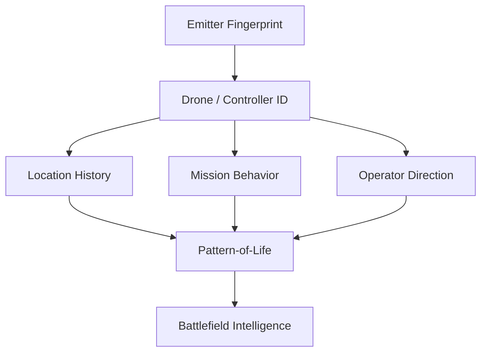

This graph allows commanders to move from isolated alerts to intelligence:

- Which emitters repeat?
- Where do they appear?
- What time windows are common?
- Which launch areas are likely?
- Which drones are part of the same network?
- Which RF signatures appear before attacks?

---

## 15. Industry Stack

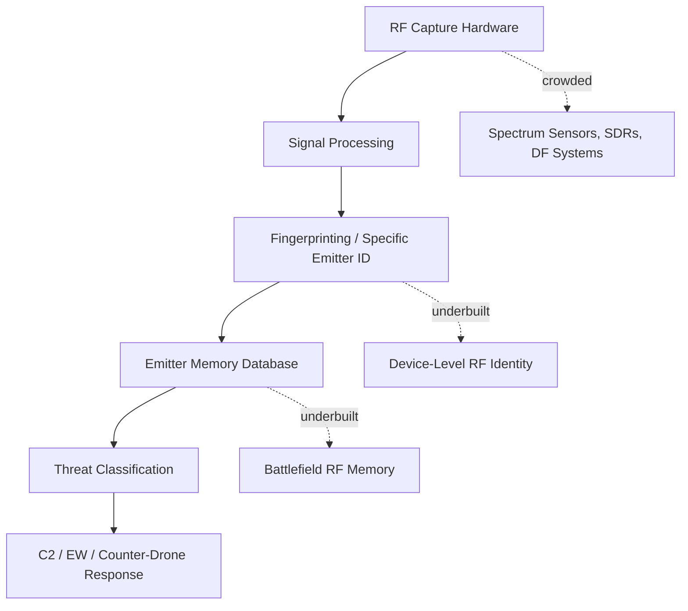

| Layer | Crowding | Market Reality | HyperPrint Opportunity |
|---|---:|---|---|
| RF sensors | High | Many spectrum and SDR vendors exist | Use existing sensors first |
| Direction finding | Medium-high | Mature but expensive | Integrate as optional layer |
| Drone RF detection | Medium-high | Many C-UAS companies | Differentiate with identity memory |
| RF fingerprinting AI | Low-medium | Research active, commercial gap remains | Build productized models and database |
| Emitter intelligence database | Low | Underbuilt in C-UAS | Own the memory layer |
| Real-time C2 integration | Medium | Many dashboards exist | Integrate rather than replace |

---

## 16. Competitor Overview

| Company | Founded | Country | Valuation / Market Cap | Category | Core Product | Main Customers |
|---|---:|---|---:|---|---|---|
| **DroneShield** | 2014 approx. | Australia | Approx. A$2.8B-A$3.0B public market range in 2026 sources | Counter-UAS / RF sensing / EW | DroneSentry, RfAI, RF sensors | Defense, government, law enforcement, critical infrastructure |
| **Dedrone by Axon** | 2014 | USA / Germany origin | Acquired by Axon in 2024; prior funding over $130M reported | Airspace security / C-UAS | DedroneTracker.AI, RF sensors | Public safety, defense, airports, critical sites |
| **Sentrycs** | Private | Israel | Acquired by Ondas in 2025 | Cyber-over-RF C-UAS | Sentrycs C-UAS | Defense, airports, dense urban sites |
| **D-Fend Solutions** | 2016 | Israel | Motorola Solutions announced $1.5B acquisition in 2026 | RF cyber counter-drone | EnforceAir | Defense, DHS, DoD, DOJ, airports, critical infrastructure |
| **SkySafe** | Private | USA | Private; valuation not disclosed | RF drone detection and forensics | SkySafe platform | Critical infrastructure, commercial, government |
| **CRFS** | 2007 | UK | Private | RF spectrum monitoring / geolocation | RFeye | Defense, SIGINT, regulators, spectrum operators |
| **Aaronia** | 2003 | Germany | Private | RF measurement / drone detection | AARTOS | Government, police, military, critical infrastructure |
| **Rohde & Schwarz** | 1933 | Germany | Private | RF detection / direction finding / C-UAS | ARDRONIS | Defense, government, airports, critical sites |

---

## 17. Competitor Deep Dive

## 17.1 DroneShield

| Field | Details |
|---|---|
| Company | DroneShield |
| Country | Australia |
| Category | Counter-UAS, RF sensing, electronic warfare |
| Core Product | DroneSentry, RfAI, RF sensors, counter-drone systems |
| Main Customers | Defense, government, law enforcement, critical infrastructure |
| Strength | Strong C-UAS brand, RF sensing, AI sensor fusion, public market visibility |
| Weakness | Broader C-UAS focus; not positioned mainly as battlefield RF identity memory |
| Category Fit | Counter-drone RF detection and response |

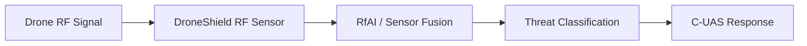

**HyperPrint differentiation:**  
Focus deeper on fingerprint history, emitter watchlists, recurring operator patterns, and battlefield RF memory.

---

## 17.2 Dedrone by Axon

| Field | Details |
|---|---|
| Company | Dedrone by Axon |
| Founded | 2014 |
| Country | USA / Germany origin |
| Category | Airspace security and counter-drone |
| Core Product | DedroneTracker.AI, Dedrone RF sensors |
| Main Customers | Public safety, military, airports, government, critical sites |
| Strength | Multi-sensor C2, AI-driven airspace security, Axon distribution |
| Weakness | Broad airspace security platform; may be less focused on emitter-level battlefield intelligence |
| Category Fit | Counter-drone C2 platform |

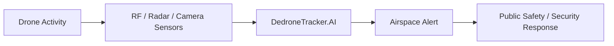

**HyperPrint differentiation:**  
Own the RF identity layer that can feed Dedrone-like dashboards, rather than competing only as another dashboard.

---

## 17.3 Sentrycs

| Field | Details |
|---|---|
| Company | Sentrycs |
| Country | Israel |
| Category | Cyber-over-RF counter-drone |
| Core Product | RF-based detect, track, identify, and controlled mitigation |
| Main Customers | Defense, urban security, airports, sensitive sites |
| Strength | Passive RF detection and cyber-over-RF approach |
| Weakness | Focused on counter-drone mitigation, not general battlefield RF fingerprint intelligence |
| Category Fit | RF cyber C-UAS |

**HyperPrint differentiation:**  
Use RF fingerprinting beyond mitigation: intelligence history, operator mapping, friendly/hostile libraries, and emitter correlation.

---

## 17.4 D-Fend Solutions

| Field | Details |
|---|---|
| Company | D-Fend Solutions |
| Founded | 2016 |
| Country | Israel |
| Category | RF cyber counter-drone |
| Core Product | EnforceAir |
| Main Customers | U.S. DHS, DoD, DOJ, NATO countries, airports, critical infrastructure |
| Valuation Signal | Motorola Solutions announced a $1.5B acquisition in 2026 |
| Strength | Non-jamming takeover and strong counter-drone traction |
| Weakness | Centered on drone takeover; not a general RF intelligence database |
| Category Fit | RF cyber C-UAS |

**HyperPrint differentiation:**  
Do not lead with takeover. Lead with detection, identity, attribution, and live battlefield intelligence.

---

## 17.5 SkySafe

| Field | Details |
|---|---|
| Company | SkySafe |
| Country | USA |
| Category | RF drone detection and airspace intelligence |
| Core Product | SkySafe airspace intelligence platform |
| Main Customers | Critical infrastructure, commercial, government |
| Strength | Real-time and historical drone data, forensics positioning |
| Weakness | More civil/security focused than battlefield RF intelligence |
| Category Fit | Drone detection and forensics |

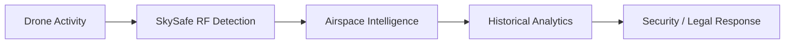

**HyperPrint differentiation:**  
Build for military real-time operations: emitter watchlists, EW alerts, swarm correlation, and C2 integration.

---

## 17.6 CRFS

| Field | Details |
|---|---|
| Company | CRFS |
| Founded | 2007 |
| Country | UK |
| Category | Spectrum monitoring and RF geolocation |
| Core Product | RFeye |
| Main Customers | Defense, SIGINT, spectrum regulators, security teams |
| Strength | RF sensing, capture, monitoring, and geolocation capability |
| Weakness | Platform is broader spectrum intelligence; not specifically packaged as drone RF fingerprint product |
| Category Fit | RF spectrum intelligence infrastructure |

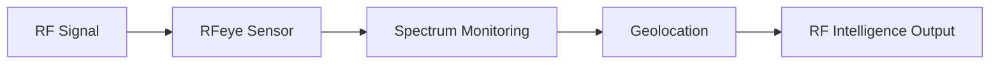

**HyperPrint differentiation:**  
Use CRFS-like sensors as hardware inputs while owning the drone/controller fingerprinting and battlefield identity database.

---

## 17.7 Aaronia

| Field | Details |
|---|---|
| Company | Aaronia |
| Founded | 2003 |
| Country | Germany |
| Category | RF measurement, spectrum monitoring, drone detection |
| Core Product | AARTOS drone detection system |
| Main Customers | Government, police, military, critical infrastructure |
| Strength | RF measurement hardware, spectrum monitoring, German engineering positioning |
| Weakness | More sensor/system oriented than AI identity-memory oriented |
| Category Fit | RF detection and spectrum monitoring |

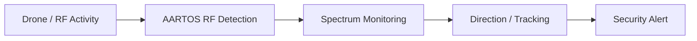

**HyperPrint differentiation:**  
Layer AI-based fingerprint identity, emitter history, and C2-ready intelligence on top of RF capture infrastructure.

---

## 17.8 Rohde & Schwarz

| Field | Details |
|---|---|
| Company | Rohde & Schwarz |
| Founded | 1933 |
| Country | Germany |
| Category | RF systems, test equipment, defense electronics, C-UAS |
| Core Product | ARDRONIS |
| Main Customers | Defense, government, airports, critical sites |
| Strength | Deep RF expertise, direction finding, commercial drone signal classification |
| Weakness | Premium enterprise/defense system; less startup-flexible and less focused on custom local battlefield RF databases |
| Category Fit | RF detection and direction finding |

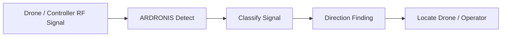

**HyperPrint differentiation:**  
Compete with software intelligence, local model training, sovereign emitter databases, and integration with cheaper distributed RF sensor nodes.

---

## 18. Strategic Positioning Map

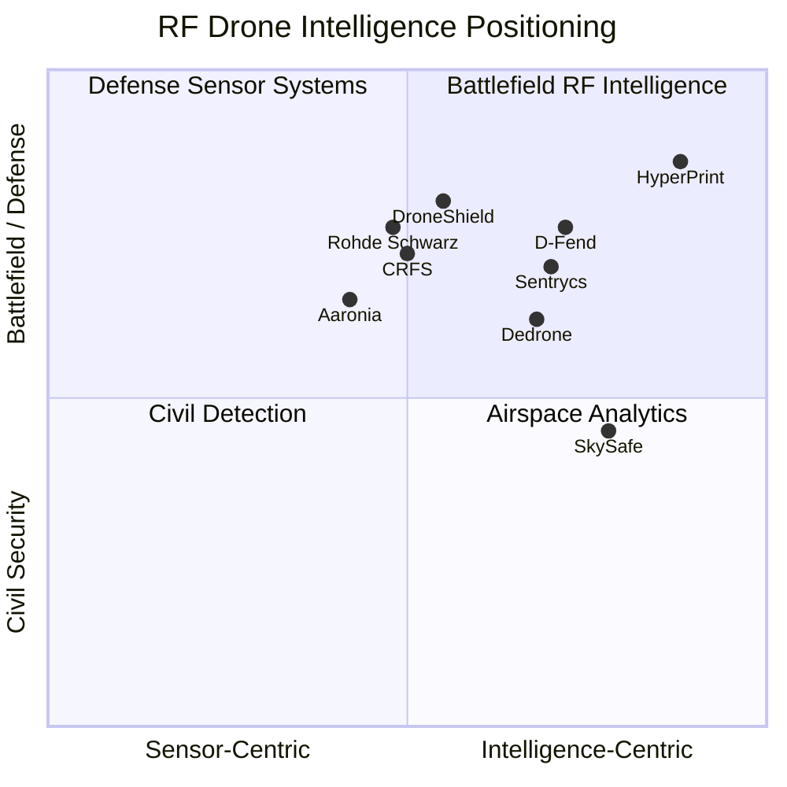

---

## 19. What We Do Differently

There are already many counter-drone systems. Most detect drones, classify signals, or trigger a mitigation workflow.

HyperPrint is different because it treats RF as a **battlefield intelligence source**, not just a sensor alert.

| Dimension | Existing Systems | HyperPrint |
|---|---|---|
| Primary focus | Drone detection / mitigation | Emitter identity and battlefield RF memory |
| Data model | Event alerts | Historical emitter graph |
| Identification | Drone type / protocol | Drone, controller, jammer, repeater, specific device |
| Advantage | Know a drone is present | Know what it is, where it came from, whether it appeared before |
| Integration | Often closed C-UAS stack | Feeds C2, EW, radar, camera, counter-drone, and intelligence systems |
| Deployment | Fixed or premium systems | Fixed, mobile, tactical, low-cost distributed nodes |
| Sovereignty | Vendor-controlled databases | Local friendly/hostile RF libraries |
| Best use | Site protection | Battlefield RF situational awareness |

---

## 20. Product Modules

| Module | Description | Buyer Value |
|---|---|---|
| HyperPrint RF Node | Passive RF capture sensor | Early warning and signal collection |
| HyperPrint Fingerprint Engine | AI model for emitter classification | Identify drone/controller/jammer patterns |
| HyperPrint Emitter Library | Database of friendly, hostile, and unknown signatures | Faster future classification |
| HyperPrint Operator Mapper | Direction/location correlation for controllers | Identify likely operator areas |
| HyperPrint Swarm Correlator | Detects related multi-drone RF behavior | Swarm warning |
| HyperPrint Jammer Detector | Flags hostile interference patterns | Protect friendly comms and GNSS |
| HyperPrint C2 API | Sends alerts to command systems | Real-time operational integration |
| HyperPrint Forensics | Post-event replay and evidence trail | Intelligence and investigation |

---

## 21. MVP Scope

### MVP 1: RF Drone Detection + Classification

| Feature | Included |
|---|---|
| Passive RF signal capture | Yes |
| Drone vs non-drone classification | Yes |
| Drone model/type probability | Yes |
| Controller signal detection | Yes |
| Confidence score | Yes |
| Live dashboard | Basic |
| Historical event log | Basic |
| Friendly emitter library | Basic |

### MVP 2: Fingerprint Memory + Operator Direction

| Feature | Included |
|---|---|
| Repeat emitter matching | Yes |
| Unknown emitter tracking | Yes |
| Operator direction estimate | Yes, with compatible sensors |
| RF pattern-of-life | Yes |
| C2 export/API | Yes |
| Alert prioritization | Yes |

### MVP 3: Battlefield RF Intelligence

| Feature | Included |
|---|---|
| Swarm RF correlation | Yes |
| Jammer/spoofer classification | Yes |
| Multi-sensor fusion | Yes |
| Mobile tactical kit | Yes |
| Edge deployment | Yes |
| Sovereign RF database | Yes |

---

## 22. Roadmap

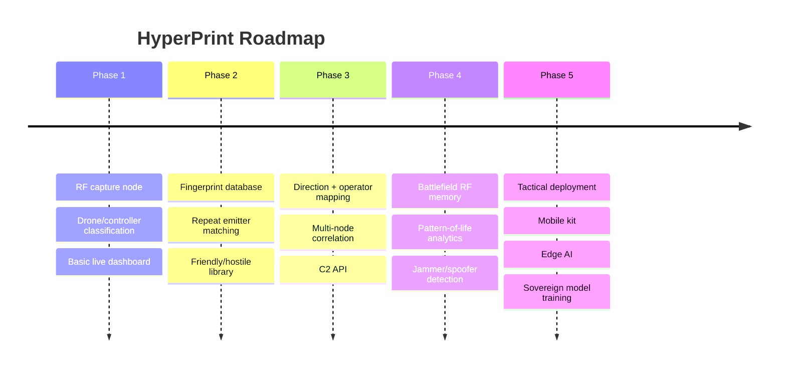

---

## 23. Business Model

| Model | Description | Best For |
|---|---|---|
| Sensor + software kit | RF node + HyperPrint dashboard | Defense pilots and site security |
| Per-site license | Annual license per protected base/sector | Airbases, ports, border posts |
| Per-node license | License by number of RF nodes | Distributed deployments |
| Defense intelligence deployment | On-prem RF database and model server | Military and intelligence units |
| OEM integration | API/SDK for C-UAS companies | Sensor and defense system partners |
| Data subscription | Updated drone signature libraries | Long-term customers |
| Sovereign package | Local model training and national RF library | India and allied defense markets |

---

## 24. Buyer Personas

| Buyer | What They Care About | Pitch |
|---|---|---|
| Military advisor | Tactical advantage | Identify drones, controllers, jammers, and repeat emitters before visual contact |
| EW unit | Spectrum dominance | Turn RF noise into classified battlefield intelligence |
| Border force | Intrusion detection | Detect and track drones/controllers across border sectors |
| Airbase commander | Base protection | Passive early warning for drone and jammer activity |
| Counter-drone unit | Response prioritization | Know which drone threat deserves which response |
| Intelligence unit | Pattern-of-life | Build historical emitter intelligence over time |
| Critical infrastructure operator | Legal detection | Detect and document drone activity without disruptive mitigation |
| Investor | Category creation | RF identity is the missing intelligence layer inside counter-drone and EW markets |

---

## 25. Key Advantages

| Advantage | Why It Matters |
|---|---|
| Passive detection | HyperPrint can listen without revealing its own position |
| Earlier warning | RF activity can appear before visual confirmation |
| Device-level intelligence | Same drone/controller can be recognized again |
| Operator mapping | Controller direction gives tactical source intelligence |
| Friendly deconfliction | Reduces accidental action against friendly drones |
| Counter-swarm support | Helps identify coordinated RF behavior |
| EW awareness | Detects jamming and spoofing patterns |
| Lower response cost | Helps choose proportional countermeasures |
| Historical intelligence | Converts incidents into long-term battlefield knowledge |
| C2 integration | Turns RF signals into immediate command action |

---

## 26. Final Strategic Positioning

### Simple Positioning

> HyperPrint is the RF fingerprinting platform that identifies drones, controllers, jammers, and hostile emitters in real time.

### Defense Positioning

> HyperPrint gives battlefield units a passive RF identity layer for drone defense, operator tracking, jammer detection, and spectrum intelligence.

### Investor Positioning

> Counter-drone systems detect threats. HyperPrint remembers and identifies the emitters behind them.

### Client Positioning

> We help you detect the drone, identify the controller, classify the threat, map the RF environment, and respond faster with less uncertainty.

---

## 27. Final Recommendation

Build **HyperPrint** as a passive RF fingerprinting and battlefield emitter intelligence platform.

Do not position it only as a counter-drone sensor. That market is already crowded.

Position it as:

1. RF identity layer.
2. Drone/controller fingerprint database.
3. Real-time battlefield RF intelligence.
4. Friendly/hostile emitter deconfliction system.
5. Operator direction and pattern-of-life engine.
6. C2-ready API for counter-drone, EW, radar, and visual systems.

The strongest wedge is a low-cost distributed RF sensor network with an AI fingerprinting engine and sovereign local emitter database.

---

## 28. Reference Sources

- [RFUAV: Benchmark Dataset for UAV Detection and Identification](https://arxiv.org/abs/2503.09033)
- [Physical-Layer-Based UAV Identification: A Comprehensive Review](https://arc.aiaa.org/doi/10.2514/1.I011458)
- [DroneRFb-DIR Dataset](https://www.scidb.cn/en/detail?dataSetId=84cf9101e739402784b1396783881202)
- [Composite Ensemble Learning Framework for Passive Drone Identification](https://pmc.ncbi.nlm.nih.gov/articles/PMC11397939/)
- [Advances and Challenges in Drone Detection and Classification Techniques](https://pmc.ncbi.nlm.nih.gov/articles/PMC10780901/)
- [DroneShield Fixed-Site Counter-UAS Systems](https://www.droneshield.com/products-fixed-site)
- [Dedrone / Axon Acquisition Announcement](https://www.dedrone.com/press/axon-to-acquire-dedrone-accelerating-the-next-generation-of-drone-solutions-to-protect-more-lives-in-more-places)
- [Sentrycs Cyber-over-RF Counter-Drone Solutions](https://sentrycs.com/)
- [D-Fend Solutions EnforceAir](https://d-fendsolutions.com/enforceair/)
- [Motorola Solutions to Acquire D-Fend Solutions](https://www.reuters.com/technology/motorola-solutions-buy-d-fend-solutions-15-billion-2026-06-01/)
- [SkySafe Drone Detection and Airspace Intelligence](https://www.skysafe.io/)
- [CRFS Drone Detection and RFeye](https://www.crfs.com/solutions/drone-detection)
- [Aaronia AARTOS Drone Detection](https://aaronia.com/en/solutions/drone-detection)
- [Rohde & Schwarz ARDRONIS Locate Advanced](https://www.rohde-schwarz.com/us/products/aerospace-defense-security/radio-frequency-solutions/ardronis-locate-advanced_63493-617805.html)
