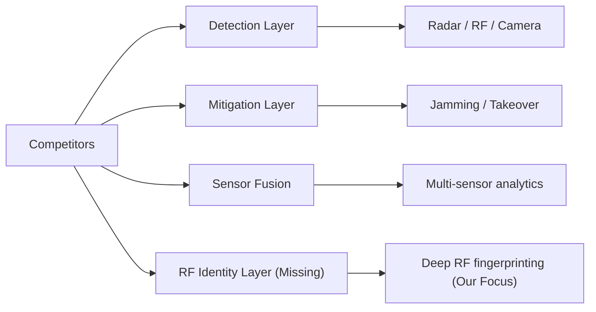
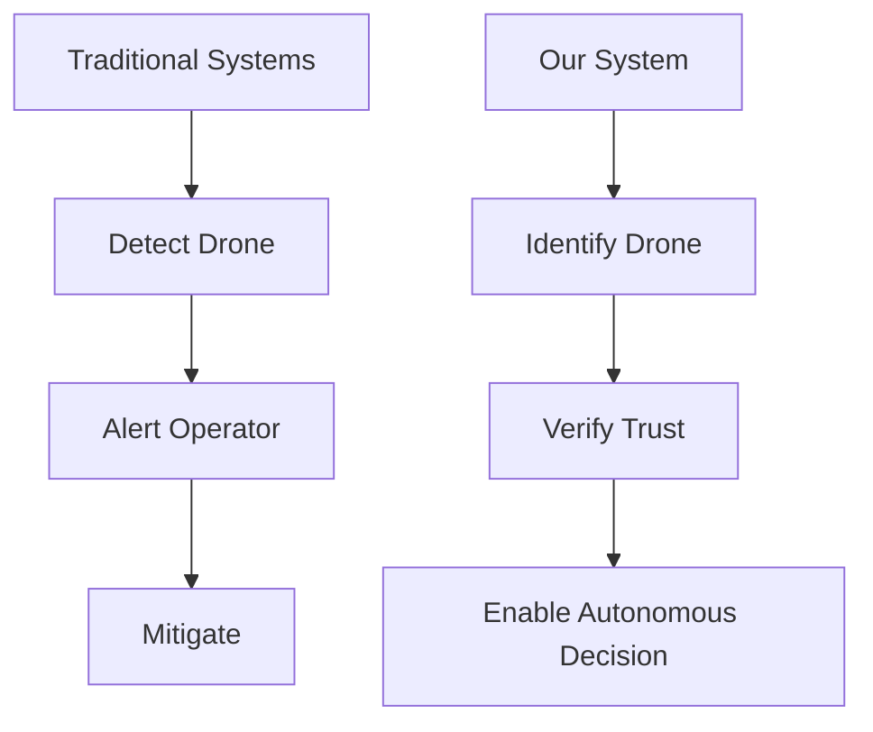
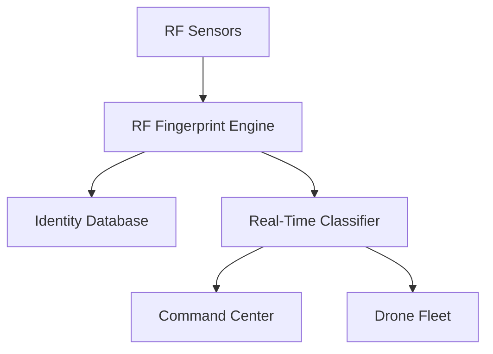
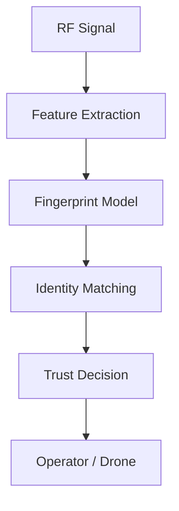

# Product Note 02: RF Fingerprinting for Drone Security

## 1. Product Thesis

RF fingerprinting for drones is a defense-grade identification and trust layer that uniquely identifies drones and transmitters based on their radio frequency emissions. It enables detection of spoofed, rogue, or adversarial drones even when encryption is present or compromised.

The opportunity is not only to build another RF sensing tool. The stronger opportunity is to build a real-time RF identity and trust operating layer for military drones, swarm systems, border surveillance, and critical infrastructure protection.

---

## 2. Why This Product Matters

Modern drone operations rely heavily on RF communication. However, encryption alone does not guarantee trust. Adversaries can:

* Spoof identities
* Replay signals
* Inject malicious transmitters
* Deploy rogue drones

RF fingerprinting adds a physical-layer identity that is extremely difficult to replicate.

### Core Battlefield Problems

| Problem               | Impact                                                                 |
| --------------------- | ---------------------------------------------------------------------- |
| Drone spoofing        | Enemy can impersonate friendly drones                                  |
| Rogue drone intrusion | Unauthorized drones enter protected airspace                           |
| Signal replay attacks | Previously captured signals reused to bypass authentication            |
| Weak identity systems | Cryptographic identity alone may be compromised or bypassed            |
| RF ambiguity          | Difficult to distinguish between friendly and hostile transmitters     |
| Swarm trust breakdown | Drone-to-drone coordination fails without reliable identity validation |

---

## 3. Target Users

| User Segment                      | Use Case                                                   |
| --------------------------------- | ---------------------------------------------------------- |
| Military units                    | Drone identification, anti-spoofing, battlefield awareness |
| Border security                   | Detection of unauthorized UAVs crossing borders            |
| Air defense systems               | Identification of friendly vs hostile drones               |
| Police and homeland security      | Urban drone monitoring and threat detection                |
| Critical infrastructure operators | Protection of airports, ports, power plants, pipelines     |
| Drone OEMs                        | Embed RF identity modules into drone platforms             |

---

## 4. Competitor Landscape (Expanded)

| Company         | Core Product                        | Main USP                                          | Strongest Market Position                | Gap We Can Attack                                                       |
| --------------- | ----------------------------------- | ------------------------------------------------- | ---------------------------------------- | ----------------------------------------------------------------------- |
| Dedrone         | Counter-drone detection platform    | Multi-sensor drone detection (RF, radar, cameras) | Urban and infrastructure drone detection | Focus on detection, less on deep RF identity modeling                   |
| DroneShield     | Counter-UAS systems                 | RF detection + jamming + mitigation               | Defense and critical infrastructure      | More mitigation-focused, less emphasis on RF fingerprint identity layer |
| Rohde & Schwarz | RF monitoring and spectrum analysis | High-precision RF sensing and signal intelligence | Government and defense RF monitoring     | Expensive, not drone-specific identity layer                            |
| Echodyne        | Radar-based drone detection         | Compact radar for UAV detection                   | Defense and infrastructure               | Radar-focused, not RF fingerprinting                                    |
| Black Sage      | Counter-UAS platform                | Integrated detection and mitigation               | Military and homeland security           | Platform-level solution, not focused on RF identity intelligence        |

---

## 5. Deep Competitor Analysis

### Competitive Architecture Comparison

### Key Insight

All competitors operate in **Detection → Alert → Mitigation** pipeline.

None operate in:

> **Identity → Trust → Autonomous Decision Layer**

---

## 6. Why No One Has Fully Solved This Yet

| Barrier                          | Explanation                                                             |
| -------------------------------- | ----------------------------------------------------------------------- |
| RF complexity                    | RF signals vary due to environment, hardware drift, and interference    |
| Data scarcity                    | Large labeled RF fingerprint datasets are hard to collect               |
| Real-time processing difficulty  | High-speed signal processing requires specialized hardware/software     |
| Defense procurement inertia      | Governments prefer proven detection systems over new identity paradigms |
| Lack of integration mindset      | Existing systems treat RF as detection, not identity infrastructure     |
| Swarm systems are still emerging | Demand for identity layer increases only with autonomous swarm adoption |

### Strategic Insight

> The market has been solving **"Is there a drone?"**
> Not **"Which exact drone is this?"**

---

## 7. Gap Analysis (Expanded)

| Market Gap                                        | Why It Exists                               | Opportunity                                           | Strategic Impact |
| ------------------------------------------------- | ------------------------------------------- | ----------------------------------------------------- | ---------------- |
| Lack of deep RF identity modeling                 | Focus on detection rather than identity     | Build RF fingerprint database and identity engine     | High             |
| Weak integration with drone communication systems | Detection systems operate separately        | Integrate RF identity with communication layer        | Very High        |
| Limited swarm trust validation                    | Systems designed for single drone detection | Enable drone-to-drone identity verification           | Critical         |
| High cost of RF intelligence systems              | Traditional SIGINT systems are expensive    | Build lightweight, scalable RF fingerprinting modules | High             |
| Limited real-time identity analytics              | Processing complexity                       | Develop real-time RF identity inference engine        | Very High        |

---

## 8. What Makes Us Different

### Core Differentiation Table

| Dimension          | Competitors            | Our Approach                         |
| ------------------ | ---------------------- | ------------------------------------ |
| Primary Focus      | Detection / Mitigation | Identity + Trust Layer               |
| RF Usage           | Signal detection       | Deep fingerprint extraction          |
| Data Layer         | Event-based            | Persistent identity database         |
| Swarm Capability   | Limited                | Native swarm trust validation        |
| Integration        | External systems       | Embedded into communication stack    |
| Intelligence Depth | Surface-level          | Physical-layer identity intelligence |

### Differentiation Diagram

---

## 9. Proposed Product Direction

### Product Name Placeholder

RF Identity and Trust Layer for Drones

### One-Line Pitch

A real-time RF fingerprinting and identity system that detects, verifies, and tracks drones based on their unique radio signatures.

---

## 10. Product Modules

| Module                | Description                                              |
| --------------------- | -------------------------------------------------------- |
| RF Fingerprint Engine | Extracts unique signal features from drone transmissions |
| Identity Database     | Stores known drone RF signatures                         |
| Real-Time Classifier  | Matches incoming signals to known identities             |
| Spoof Detection       | Detects anomalies and impersonation attempts             |
| Swarm Trust Layer     | Enables drone-to-drone identity validation               |
| Integration API       | Connects with communication systems and command centers  |
| Monitoring Dashboard  | Visualizes RF activity and identity status               |

---

## 11. Application Diagram

---

## 12. System View

---

## 13. How We Can Enter the Market

### Entry Strategy Table

| Phase   | Strategy                                                   |
| ------- | ---------------------------------------------------------- |
| Phase 1 | Build MVP RF fingerprint detection system                  |
| Phase 2 | Partner with drone OEMs for data collection                |
| Phase 3 | Deploy pilot with defense or border security agencies      |
| Phase 4 | Integrate into drone communication stacks                  |
| Phase 5 | Expand into swarm systems and autonomous defense platforms |

### Go-To-Market Diagram

---

## 14. Product Wedge

### MVP: RF Fingerprint Detection System

Build a prototype that:

* Captures RF signals
* Extracts fingerprints
* Classifies known vs unknown drones
* Displays results on a dashboard

---

## 15. Board Discussion Points

| Question                                        | Recommended Answer                                               |
| ----------------------------------------------- | ---------------------------------------------------------------- |
| Is this detection or identity?                  | Identity-first system with detection capability                  |
| Who will buy this?                              | Defense, border security, infrastructure operators               |
| How is this different from counter-drone tools? | Focus on identity intelligence, not just detection or mitigation |
| What is the first prototype?                    | RF fingerprint detection and classification system               |

---

## 16. Risks

| Risk                                 | Mitigation                                     |
| ------------------------------------ | ---------------------------------------------- |
| RF variability                       | Use robust machine learning models             |
| Data collection challenges           | Partner with drone OEMs and defense labs       |
| Real-time processing complexity      | Optimize edge computing pipelines              |
| Competition from large defense firms | Focus on lightweight, drone-specific solutions |

---

## 17. Recommended Positioning

Do not pitch this as:

> Another drone detection system.

Pitch it as:

> The RF identity and trust layer for drone ecosystems.

---

## 18. Decision Score

| Criteria                  | Score | Notes                          |
| ------------------------- | ----- | ------------------------------ |
| Market urgency            | 8/10  | Rising drone threats           |
| Prototype feasibility     | 7/10  | Requires RF expertise          |
| Defense relevance         | 9/10  | Critical for identification    |
| Differentiation potential | 9/10  | Strong identity-based approach |
| Capital intensity         | 7/10  | Moderate                       |
| India opportunity         | 9/10  | Strong sovereign tech need     |

---

## 19. Recommendation

This is a strong complementary product to encrypted communication systems.

It can evolve into a core layer for drone identity, trust, and counter-drone intelligence.

---

## 20. Sources To Validate Further

* Dedrone: RF-based drone detection systems
* DroneShield: Counter-UAS RF detection and mitigation
* Rohde & Schwarz: RF monitoring and SIGINT systems
* Echodyne: Radar-based drone detection
* Black Sage: Integrated counter-UAS platforms
* Research: RF fingerprinting, wireless device identification, physical-layer security
