# HyperSight VPS

**Category:** Visual Positioning System / GPS-Denied Drone Autonomy  
**One-line thesis:** HyperSight VPS enables drones to localize, navigate, avoid obstacles, and complete missions in BVLOS, GPS-denied, communication-denied, and high-risk areas using onboard vision, inertial sensing, maps, and edge autonomy.

---

## 1. Product Definition

| Item | Description |
|---|---|
| **Product name** | HyperSight VPS |
| **Category** | Visual Positioning System for drones |
| **New category framing** | GPS-Denied Autonomous Navigation Layer |
| **Core users** | Defense forces, border security, disaster response, critical infrastructure operators, industrial inspection teams, drone OEMs |
| **Core value** | Let drones complete missions without continuous GPS or continuous communication |
| **Strategic wedge** | Edge-based visual-inertial navigation module for BVLOS and critical-area drone missions |

---

## 2. Executive Summary

HyperSight VPS is a drone navigation and autonomy layer that allows drones to understand where they are and where they are going using onboard perception instead of depending only on GPS or constant communication.

It combines:

- Cameras.
- IMU/inertial sensors.
- Optical flow.
- Visual-inertial odometry.
- Visual SLAM.
- LiDAR/depth data when available.
- Stored maps or satellite imagery.
- Semantic landmarks.
- Edge mission logic.

The goal is simple:

> A drone should continue the task even if GPS is jammed, the communication link drops, or the operator cannot continuously guide it.

This is critical for BVLOS missions, border surveillance, defense ISR, search and rescue, underground/indoor inspection, ship/port security, forest operations, mines, tunnels, refineries, and disaster zones.

---

## 3. Why VPS Matters

Most drones depend on GPS and communication links for stable flight, waypoint navigation, return-to-home, tracking, and mission execution.

But in high-critical areas, these assumptions fail:

- GPS can be jammed.
- GPS can be spoofed.
- Radio communication can be blocked.
- LTE/5G may not exist.
- Satcom may be too expensive or unavailable.
- Buildings, tunnels, forests, mountains, and urban canyons can degrade signals.
- Enemy EW can intentionally break command and navigation links.

VPS fixes this by moving navigation intelligence onboard.

Instead of asking, “Where does GPS say I am?”, the drone asks:

- What do I see?
- How am I moving?
- What landmarks are around me?
- What did the map look like before?
- What changed?
- Can I safely continue, hold, return, or reroute?

---

## 4. Problem Section

### Current Problem

| Problem | Impact |
|---|---|
| GPS dependency | Drone can drift, fail mission, or become unsafe when GPS is denied |
| Communication dependency | Drone cannot continue if command link drops |
| BVLOS risk | Operator cannot visually recover the drone if navigation fails |
| Poor indoor/urban performance | GPS becomes unreliable near buildings, tunnels, mines, forests, and inside facilities |
| Jamming/spoofing | Drone may follow false location data |
| Manual fallback | Human operator may not react fast enough |
| Limited onboard autonomy | Many drones can fly waypoints but cannot reason locally under degraded conditions |

### Market Pain

BVLOS and defense drone missions need higher autonomy because the operator cannot continuously see or control the drone. GPS-denied drone navigation is now a dedicated market, with 2026 market estimates showing growth from roughly USD 178M in 2026 to USD 438M by 2036 for GPS-denied drone alternative navigation systems.

---

## 5. How VPS Fixes BVLOS

BVLOS stands for **Beyond Visual Line of Sight**. In BVLOS missions, the drone operates beyond the operator’s direct view.

BVLOS fails when:

- GPS is unavailable.
- Communication drops.
- The drone faces obstacles.
- The drone cannot confirm location.
- The operator cannot manually intervene.

HyperSight VPS helps by giving the drone an onboard navigation fallback.

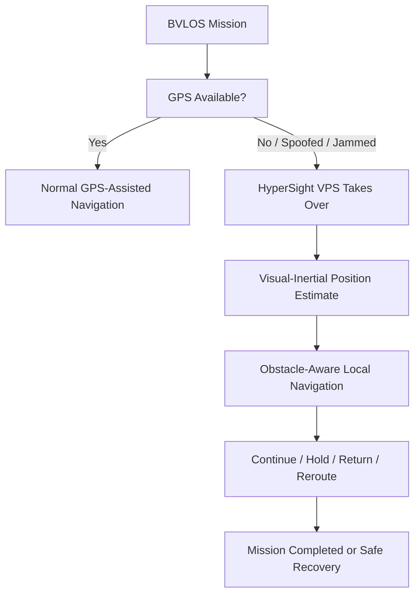

### BVLOS Benefits

| BVLOS Risk | HyperSight VPS Response |
|---|---|
| GPS loss | Switch to visual-inertial navigation |
| Comms loss | Continue pre-approved mission logic onboard |
| Obstacle risk | Use perception-based obstacle avoidance |
| Operator unavailable | Execute autonomous decision states |
| Spoofed location | Compare GPS with visual/inertial/map consistency |
| Mission uncertainty | Log path, confidence, and decision events |

---

## 6. Operating Without Continuous Communication

HyperSight VPS is designed for **comms-degraded autonomy**.

The drone does not need live operator commands for every step. Instead, the mission is loaded before flight with rules:

- Mission route.
- Safe zones.
- No-fly zones.
- Task objective.
- Fallback actions.
- Return conditions.
- Maximum drift tolerance.
- Battery threshold.
- Communication retry policy.
- Emergency landing policy.

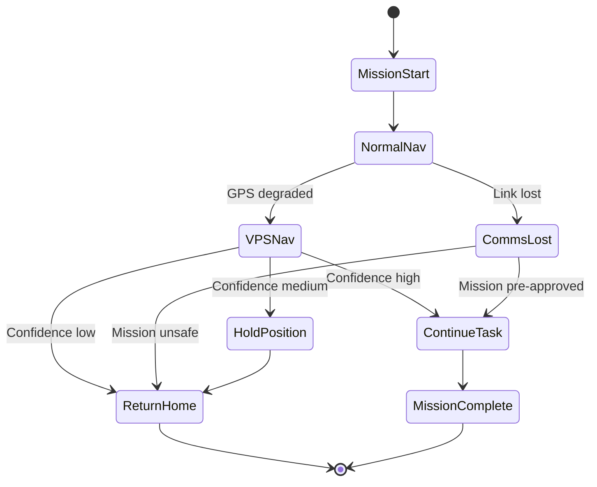

This allows the drone to complete tasks in areas where live control is not possible.

---

## 7. Types of VPS

## 7.1 Optical Flow VPS

Optical flow estimates motion by tracking pixel movement between frames.

| Factor | Details |
|---|---|
| Best for | Low-altitude position hold, indoor hover, short-range motion estimate |
| Sensors | Downward camera + IMU + rangefinder |
| Strength | Low cost, lightweight, good for stable hover |
| Weakness | Drift over time, needs texture and lighting |


---

## 7.2 Visual-Inertial Odometry

VIO combines camera movement with IMU data to estimate position and motion.

| Factor | Details |
|---|---|
| Best for | GPS-denied flight, indoor/outdoor transition, lightweight drones |
| Sensors | Camera + IMU |
| Strength | Strong balance of cost, size, and performance |
| Weakness | Can drift without map correction or loop closure |

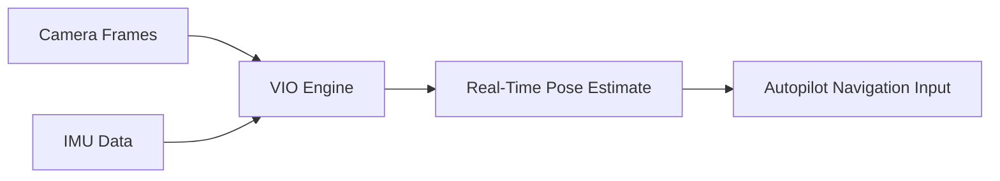

---

## 7.3 Visual SLAM

Visual SLAM builds a map while localizing the drone inside that map.

| Factor | Details |
|---|---|
| Best for | Indoor, tunnels, mines, warehouses, buildings, unknown spaces |
| Sensors | Mono/stereo/RGB-D camera + IMU |
| Strength | Builds local map and reduces drift through loop closure |
| Weakness | More compute-heavy; can struggle in dust, smoke, darkness, low texture |

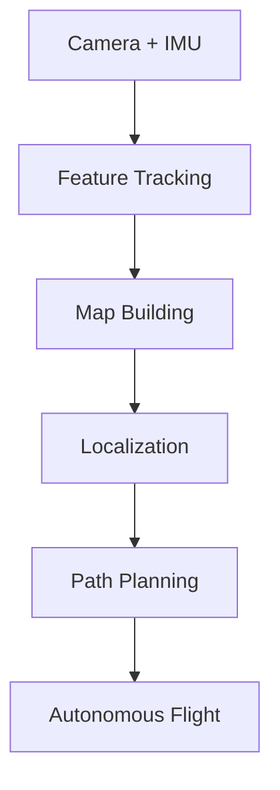

---

## 7.4 LiDAR / Depth SLAM

LiDAR or depth-based SLAM uses 3D range data to localize and map.

| Factor | Details |
|---|---|
| Best for | Dark, dusty, low-texture, industrial, mine, tunnel, forest environments |
| Sensors | 2D/3D LiDAR, depth camera, IMU |
| Strength | Strong 3D structure awareness |
| Weakness | Higher cost, higher weight, higher power draw |

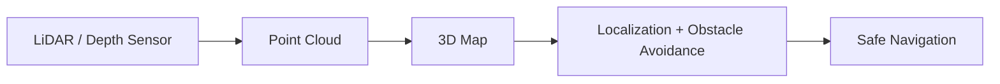

---

## 7.5 Terrain-Relative / Map-Matching VPS

This method compares live camera imagery with stored satellite images, maps, or terrain references.

| Factor | Details |
|---|---|
| Best for | Outdoor BVLOS, GPS spoofing detection, long-route navigation |
| Sensors | Downward/forward camera + map database + IMU |
| Strength | Can reduce drift and provide absolute position correction |
| Weakness | Needs updated maps and visible terrain features |

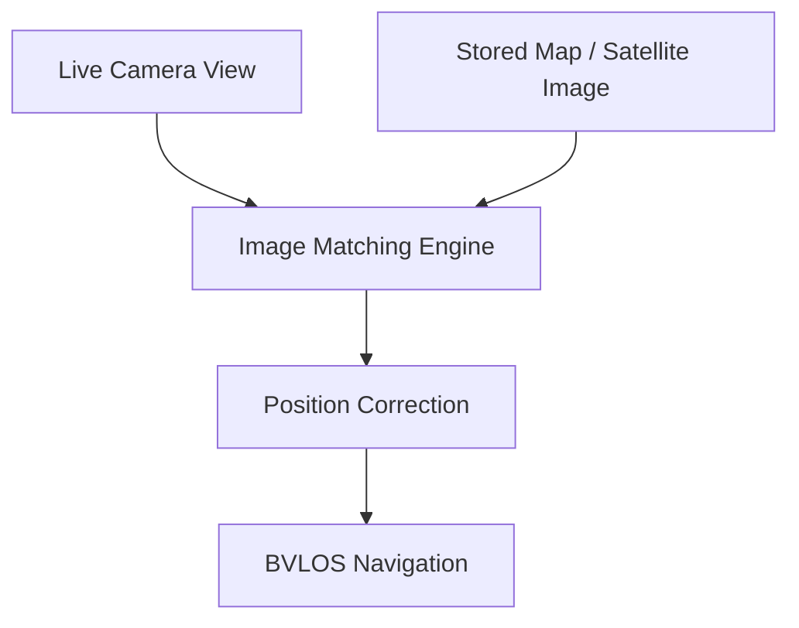

---

## 7.6 Semantic Landmark VPS

Semantic VPS uses recognizable objects and structures as navigation references.

| Factor | Details |
|---|---|
| Best for | Urban areas, campuses, factories, bases, ports, refineries |
| Sensors | Camera + object recognition + map |
| Strength | Human-like navigation using landmarks |
| Weakness | Requires robust object detection and updated scene understanding |


---

## 7.7 Cooperative VPS

Multiple drones share relative position, map fragments, or observations.

| Factor | Details |
|---|---|
| Best for | Swarms, search missions, defense reconnaissance, disaster zones |
| Sensors | Camera/IMU on multiple drones + mesh link |
| Strength | Improves coverage and resilience |
| Weakness | Needs secure coordination and robust local autonomy if comms degrade |

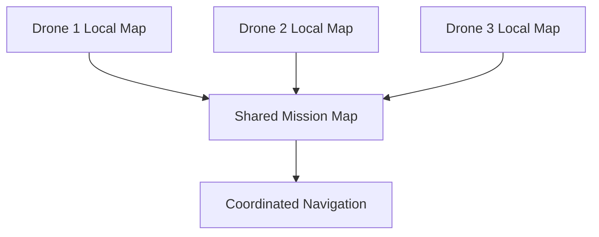

---

## 8. VPS Type Comparison

| VPS Type | GPS-Denied | Comms-Denied | BVLOS Fit | Cost | Compute | Best Use |
|---|---:|---:|---:|---:|---:|---|
| Optical Flow | Medium | Medium | Low-medium | Low | Low | Hover and short indoor motion |
| VIO | High | High | Medium-high | Low-medium | Medium | Lightweight GPS-denied navigation |
| Visual SLAM | High | High | Medium | Medium | High | Indoor/unknown mapping |
| LiDAR/Depth SLAM | Very high | High | Medium-high | High | High | Mines, tunnels, dark/dusty areas |
| Terrain Map Matching | High | High | Very high | Medium | Medium-high | Outdoor BVLOS |
| Semantic Landmark VPS | Medium-high | High | High | Medium | High | Urban and industrial sites |
| Cooperative VPS | High | Medium-high | High | Medium-high | High | Multi-drone missions |

---

## 9. High-Critical Area Use Cases

| Use Case | Problem | HyperSight VPS Advantage |
|---|---|---|
| Border surveillance | GPS jamming, terrain masking, weak comms | Continue patrol using visual-inertial navigation |
| Defense ISR | Contested RF, spoofing, comms loss | Execute pre-approved route and return safely |
| Airbase security | Drone must inspect perimeter without constant pilot view | Autonomous inspection with obstacle avoidance |
| Mines and tunnels | No GPS, poor lighting, unknown obstacles | LiDAR/depth SLAM navigation |
| Refineries and power plants | GPS multipath, metal structures, safety risks | Landmark and VIO-based inspection |
| Disaster zones | Broken networks, dust, smoke, debris | Local navigation without cloud dependency |
| Forest operations | GPS blockage, visual clutter | VIO + LiDAR/depth fusion |
| Port and ship operations | GPS multipath, moving platforms | Visual landing and local positioning |
| Urban canyon BVLOS | GPS errors near tall buildings | Map matching + semantic landmarks |
| Critical logistics | Communication may drop mid-route | Continue/hold/return mission logic |

---

## 10. Real-Time Battlefield Advantages

| Real-Time Capability | Battlefield Advantage |
|---|---|
| GPS-denied localization | Drone can continue operating under jamming |
| Visual obstacle avoidance | Lower crash risk in unknown or damaged environments |
| Comms-loss autonomy | Mission can continue without live operator control |
| Spoofing detection | Drone can reject inconsistent GPS signals |
| Terrain-relative navigation | Route can continue over long distances without GPS |
| Target-zone search pattern | Drone can complete search/inspection task locally |
| Safe return logic | Reduces drone loss when communication fails |
| Multi-drone map sharing | Teams can cover larger areas with less operator load |
| Edge mission logs | Post-mission audit even without live data stream |

---

## 11. Product Architecture

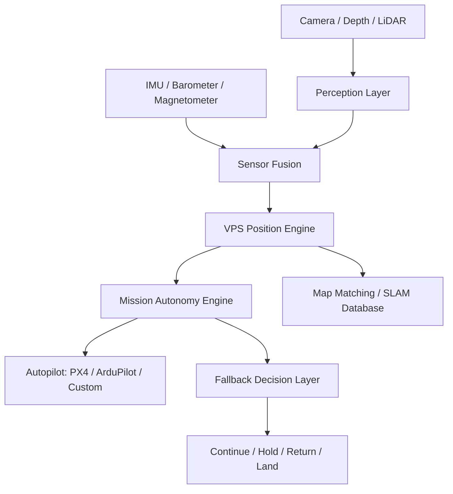

### Architecture Components

| Component | Function |
|---|---|
| Vision Input | Uses onboard cameras for motion, terrain, obstacles, and landmarks |
| IMU Fusion | Stabilizes pose estimate and reduces short-term error |
| VIO Engine | Estimates drone movement without GPS |
| SLAM Engine | Builds and uses a local map for navigation |
| Map-Matching Engine | Compares live imagery with stored references |
| Obstacle Layer | Detects local obstacles and unsafe paths |
| Mission Autonomy Engine | Executes pre-approved tasks without continuous communication |
| Fallback Layer | Chooses continue, hold, reroute, return, or land |
| Autopilot Bridge | Sends position and mission updates to PX4, ArduPilot, or custom stack |
| Mission Log | Records decisions, confidence, location estimate, and sensor health |

---

## 12. Critical Mission Flow

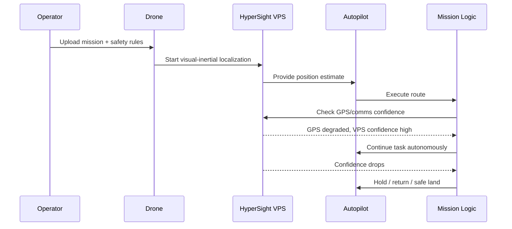

---

## 13. Category Definition

### Old Category: Drone GPS Backup

Old framing:

- Help drone hover indoors.
- Provide visual position hold.
- Use optical flow when GPS is weak.
- Assist landing.

### New Category: GPS-Denied Mission Autonomy

HyperSight VPS should create a bigger category:

- BVLOS autonomy.
- Comms-denied mission execution.
- GPS spoofing resistance.
- Map-relative navigation.
- Edge-based task completion.
- Critical-area autonomy.
- Drone survivability in degraded environments.

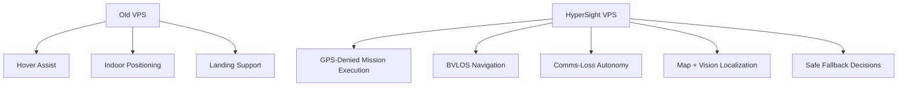

---

## 14. Market Gap Analysis

| Gap | Current Reality | HyperSight Opportunity |
|---|---|---|
| GPS-denied gap | Many drones fail or degrade without GPS | Onboard VIO/SLAM/map-matching fallback |
| BVLOS trust gap | Regulators and buyers need proof of safe autonomy | Logs, confidence scores, safety state machine |
| Comms-loss gap | Many drones depend on live control or cloud | Edge autonomy with pre-approved rules |
| Cost gap | High-end autonomy is expensive | Modular VPS kit for existing drones |
| Integration gap | Solutions are often tied to one platform | PX4, ArduPilot, and custom autopilot bridge |
| Degraded environment gap | Pure camera systems fail in dust/dark/low texture | Multi-sensor VPS: vision + IMU + depth/LiDAR/thermal |
| Sovereignty gap | Defense buyers need local control | On-prem maps, local model training, sovereign stack |
| Mission gap | Most VPS gives position, not task completion | Position + mission logic + fallback actions |

---

## 15. Competitor Overview

| Company | Founded | Country | Valuation / Market Cap | Category | Core Product | Main Customers |
|---|---:|---|---:|---|---|---|
| **Skydio** | 2014 | USA | Reported $4.4B valuation in 2026 Series F | Autonomous drones | Skydio drones and autonomy stack | Public safety, defense, enterprise inspection |
| **Shield AI** | 2015 | USA | Reported $12.7B valuation in 2026 | Defense autonomy | Hivemind, V-BAT, AI pilot software | Defense forces, OEMs, allied militaries |
| **Exyn Technologies** | 2014 | USA | Private; raised $35M Series B in 2022 | GPS-denied autonomy | Autonomous drone mapping stack | Mining, industrial, inspection, GPS-denied mapping |
| **Near Earth Autonomy** | 2012 approx. | USA | Private | Aerial autonomy | Autonomy systems for takeoff, flight, landing with/without GPS | Defense, logistics, aircraft OEMs |
| **ModalAI** | 2018 approx. | USA | Private | Drone autonomy hardware/software | VOXL autopilots, VIO, perception SDK | Drone developers, Blue UAS ecosystem, robotics |
| **OKSI** | 1980s origin | USA | Private | Defense autonomy / GPS-denied navigation | OMNInav, OMNISCIENCE | Defense and unmanned systems |
| **Palantir VNav + Red Cat** | Palantir 2003 / Red Cat public | USA | Palantir public; Red Cat public | Visual navigation software | VNav on Black Widow drone | Defense drone programs |
| **Advanced Navigation** | 2012 | Australia | Private | Inertial navigation and assured PNT | INS, sensor fusion, GNSS-denied navigation systems | Defense, aerospace, autonomous systems |

---

## 16. Competitor Diagrams

## 16.1 Skydio

| Field | Details |
|---|---|
| Category | Autonomous drone platform |
| Strength | Strong onboard autonomy, obstacle avoidance, enterprise/public safety adoption |
| Weakness | More closed hardware ecosystem; less flexible for third-party defense drone stacks |
| Strategic Positioning | Full drone product with autonomy built in |

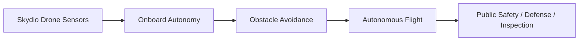

**HyperSight difference:**  
Be a platform-neutral VPS layer that can integrate into existing airframes and autopilots.

---

## 16.2 Shield AI

| Field | Details |
|---|---|
| Category | Defense AI pilot and autonomy |
| Strength | Strong defense positioning, GPS-denied/comms-jammed autonomy, high valuation |
| Weakness | Large defense platform play; may be too expensive or heavy for smaller OEMs |
| Strategic Positioning | AI pilot for autonomous missions and teaming |


**HyperSight difference:**  
Focus specifically on the VPS/navigation layer, priced and packaged for modular deployment.

---

## 16.3 Exyn Technologies

| Field | Details |
|---|---|
| Category | GPS-denied robotic autonomy |
| Strength | Strong in complex indoor, mapping, and industrial GPS-denied spaces |
| Weakness | More mapping/industrial focused than BVLOS tactical drone navigation |
| Strategic Positioning | Autonomous robots for complex GPS-denied environments |


**HyperSight difference:**  
Target BVLOS, defense, border, and comms-denied task completion, not only mapping.

---

## 16.4 Near Earth Autonomy

| Field | Details |
|---|---|
| Category | Aircraft autonomy |
| Strength | Takeoff, flight, landing, obstacle avoidance, GPS-denied capability |
| Weakness | Enterprise/defense integration-heavy |
| Strategic Positioning | Autonomy systems for uncrewed aircraft operations |


**HyperSight difference:**  
Offer a smaller modular VPS stack for more drone classes and existing fleets.

---

## 16.5 ModalAI

| Field | Details |
|---|---|
| Category | Drone autonomy compute and autopilot hardware |
| Strength | VOXL hardware, VIO, PX4-friendly developer ecosystem |
| Weakness | Hardware-centric; customers still need mission-level autonomy layer |
| Strategic Positioning | Edge AI compute and autonomy platform for drones |


**HyperSight difference:**  
Can use ModalAI-like hardware as compute input while owning the mission-grade VPS and fallback logic layer.

---

## 16.6 OKSI

| Field | Details |
|---|---|
| Category | Defense GPS-denied navigation and autonomy |
| Strength | GPS-denied focus, defense experience, multi-modality navigation |
| Weakness | Defense-specialized, likely premium and program-driven |
| Strategic Positioning | Defense-grade autonomous navigation and perception |


**HyperSight difference:**  
Build a sovereign, modular, India-friendly VPS layer with lower-cost deployment options.

---

## 16.7 Palantir VNav + Red Cat

| Field | Details |
|---|---|
| Category | Visual navigation software for defense drones |
| Strength | Edge visual navigation, existing-sensor approach, defense software credibility |
| Weakness | Tied to select platforms and defense partnerships |
| Strategic Positioning | Software-defined GPS-denied visual navigation |


**HyperSight difference:**  
Compete with open integration, PX4/ArduPilot support, local maps, and sovereign deployment.

---

## 16.8 Advanced Navigation

| Field | Details |
|---|---|
| Category | Assured PNT and inertial navigation |
| Strength | High-quality INS, sensor fusion, aerospace/defense-grade navigation |
| Weakness | Hardware and inertial-navigation focused; less drone-vision mission logic |
| Strategic Positioning | Resilient PNT for defense and autonomous systems |


**HyperSight difference:**  
Fuse vision, map matching, semantic perception, and mission fallback on top of inertial navigation.

---

## 17. Strategic Positioning Map

```mermaid
quadrantChart
    title VPS / GPS-Denied Navigation Positioning
    x-axis Platform-Specific --> Platform-Neutral
    y-axis Basic Navigation --> Mission Autonomy
    quadrant-1 Modular Mission Autonomy
    quadrant-2 Full-Stack Autonomy Platforms
    quadrant-3 Basic VPS / Sensors
    quadrant-4 Integration Middleware
    Skydio: [0.25, 0.80]
    Shield AI: [0.35, 0.95]
    Exyn: [0.45, 0.78]
    Near Earth: [0.50, 0.82]
    ModalAI: [0.70, 0.55]
    OKSI: [0.58, 0.82]
    Palantir VNav: [0.62, 0.75]
    Advanced Navigation: [0.65, 0.60]
    HyperSight VPS: [0.88, 0.86]
```

---

## 18. What We Do Differently

There are already strong autonomy and navigation companies.

But many solutions are:

- Full drone platforms.
- High-end defense software.
- Hardware-specific.
- Expensive.
- Closed.
- Focused on navigation but not mission completion.
- Focused on GPS-denied operation but not BVLOS safety evidence.
- Built for one class of drone.

HyperSight VPS should be different.

| Dimension | Existing Systems | HyperSight VPS |
|---|---|---|
| Product model | Full drone / premium autonomy / hardware system | Modular VPS and autonomy layer |
| Integration | Often closed or platform-specific | PX4, ArduPilot, and custom autopilot compatible |
| Mission logic | Navigation-first | Navigation + task completion + fallback decisions |
| BVLOS support | Depends on platform | Built around BVLOS evidence and confidence logs |
| Comms loss | Often handled inside closed stack | Explicit comms-denied state machine |
| GPS spoofing | Varies | Cross-check GPS with visual/inertial/map consistency |
| Cost | Often high | Tiered: camera-only, VIO, SLAM, LiDAR/depth |
| Deployment | Vendor-controlled | Sovereign/on-prem maps and local model training |

---

## 19. Product Modules

| Module | Description | Buyer Value |
|---|---|---|
| HyperSight VPS Core | Visual-inertial position engine | GPS-denied navigation |
| HyperSight MapMatch | Live imagery matched to stored maps | BVLOS drift correction |
| HyperSight SafeState | Continue/hold/return/land logic | Comms-loss safety |
| HyperSight Obstacle Layer | Detects obstacles and unsafe path zones | Critical-area safety |
| HyperSight Mission Executor | Runs pre-approved task logic onboard | Complete tasks without continuous control |
| HyperSight Confidence Engine | Scores navigation reliability | BVLOS compliance and trust |
| HyperSight Autopilot Bridge | PX4/ArduPilot/custom interface | Fast integration |
| HyperSight Mission Logs | Records path, sensor health, fallback decisions | Audit and defense review |
| HyperSight Sovereign Maps | Local map database and model training | Defense sovereignty |

---

## 20. MVP Scope

### MVP 1: GPS-Denied Position Engine

| Feature | Included |
|---|---|
| Camera + IMU VIO | Yes |
| PX4 / ArduPilot bridge | Yes |
| GPS degraded detection | Yes |
| Position confidence score | Yes |
| Basic mission log | Yes |
| Local dashboard | Basic |

### MVP 2: BVLOS Safety Layer

| Feature | Included |
|---|---|
| Comms-loss state machine | Yes |
| Continue/hold/return/land logic | Yes |
| Map-matching correction | Yes |
| Obstacle detection | Basic |
| Route confidence monitoring | Yes |
| Mission replay | Yes |

### MVP 3: Critical Area Autonomy

| Feature | Included |
|---|---|
| Visual SLAM | Yes |
| LiDAR/depth support | Optional |
| Semantic landmark navigation | Yes |
| GPS spoofing detection | Yes |
| Onboard task execution | Yes |
| Multi-drone map sharing | Optional |
| Sovereign map/model deployment | Yes |

---

## 21. Roadmap

```mermaid
timeline
    title HyperSight VPS Roadmap
    Phase 1 : VIO core
            : PX4/ArduPilot bridge
            : GPS degraded detection
    Phase 2 : Comms-loss autonomy
            : Safe-state logic
            : Mission confidence logs
    Phase 3 : Map matching
            : Terrain-relative navigation
            : BVLOS route correction
    Phase 4 : Critical-area SLAM
            : Obstacle layer
            : Semantic landmarks
    Phase 5 : Defense deployment
            : Sovereign maps
            : Multi-drone VPS
            : Hardened edge module
```

---

## 22. Business Model

| Model | Description | Best For |
|---|---|---|
| VPS module kit | Camera/compute/software module | Defense pilots, OEM demos |
| Per-drone license | Annual software license per drone | Fleet operators |
| SDK license | Integrate VPS into drone platforms | Drone OEMs |
| Critical-site deployment | Site-specific maps and safety rules | Refineries, ports, power plants |
| Defense deployment | On-prem VPS + sovereign map database | Military and border security |
| Mission assurance subscription | Updated models, maps, logs, support | Long-term customers |

---

## 23. Buyer Personas

| Buyer | What They Care About | Pitch |
|---|---|---|
| Military advisor | Mission continuity under jamming | Drones can continue tasks even when GPS and comms degrade |
| Border force | BVLOS patrol reliability | Patrol routes continue beyond operator view with onboard navigation |
| Drone OEM | Differentiation | Add GPS-denied autonomy without building full stack |
| Critical infrastructure operator | Safety and inspection continuity | Drone can inspect high-risk areas without continuous connectivity |
| Disaster response team | No-network operation | Search routes can continue when infrastructure is down |
| Investor | Category creation | GPS-denied autonomy is becoming mandatory for serious drone operations |

---

## 24. Key Advantages

| Advantage | Why It Matters |
|---|---|
| GPS independence | Drone can operate under jamming, spoofing, indoor, urban, or forest conditions |
| Communication independence | Drone can continue pre-approved mission logic without live control |
| BVLOS safety | Supports safe operation beyond visual line of sight |
| Mission completion | Drone does not simply fail when GPS drops |
| Lower drone loss | Safe return/hold/land logic reduces loss |
| Critical-area suitability | Works in refineries, tunnels, mines, ports, and disaster zones |
| Sovereign deployment | Maps and models can stay locally controlled |
| Platform-neutral | Works across multiple drones and autopilots |
| Scalable cost | Camera-only to LiDAR/depth configurations |
| Defense relevance | Enables operation in contested and degraded environments |

---

## 25. Final Strategic Positioning

### Simple Positioning

> HyperSight VPS lets drones navigate and complete missions without depending on GPS or continuous communication.

### Defense Positioning

> A GPS-denied autonomous navigation layer for BVLOS, contested, and communication-degraded drone missions.

### Investor Positioning

> As drones move into defense, inspection, logistics, and BVLOS operations, GPS-denied navigation becomes a core autonomy infrastructure layer.

### Client Positioning

> We help your drone complete the task safely even when GPS is jammed, communication drops, or the environment is too critical for manual control.

---

## 26. Final Recommendation

Build **HyperSight VPS** as a platform-neutral GPS-denied autonomy layer.

Do not position it as only “visual hover” or “GPS backup.”

Position it as:

1. BVLOS mission safety layer.
2. GPS-denied navigation engine.
3. Comms-loss task completion system.
4. Visual-inertial and map-relative autonomy stack.
5. Critical-area drone autonomy platform.
6. Sovereign navigation layer for defense and industrial drones.

The strongest wedge is:

> A lightweight VPS module that integrates with PX4/ArduPilot and lets existing drones continue pre-approved BVLOS missions when GPS or communication fails.

---

## 27. Reference Sources

- [GPS-Denied Drone Alternative Navigation Market, Future Market Insights](https://www.futuremarketinsights.com/reports/gps-denied-drone-alternative-navigation-market)
- [NorthStrive GPS-Denied Autonomous Drone Navigation Technology](https://www.gpsworld.com/northstrive-acquires-patented-gps-denied-autonomous-drone-navigation-tech-option/)
- [Exyn GPS-Denied Drone Mapping](https://www.exyn.com/drones-for-mapping-gps-denied-areas)
- [Skydio Series F and Valuation Announcement](https://www.skydio.com/blog/skydio-series-f)
- [Shield AI Hivemind](https://shield.ai/hivemind/)
- [Shield AI $5.3B Valuation Press Release](https://shield.ai/shield-ai-raises-240m-at-5-3b-valuation-to-scale-hivemind-enterprise-an-ai-powered-autonomy-developer-platform/)
- [Reuters: Shield AI $12.7B Valuation](https://www.reuters.com/business/aerospace-defense/defense-technology-startup-shield-ai-valued-127-billion-latest-funding-round-2026-03-26/)
- [Near Earth Autonomy](https://www.nearearth.aero/)
- [ModalAI VIO for Autonomous Drones](https://www.modalai.com/blogs/blog/beyond-gps-how-voxl-uses-vio-to-power-autonomous-drones)
- [OKSI OMNInav GPS-Denied Navigation](https://oksi.ai/omninav-gps-denied-navigation/)
- [Red Cat / Palantir VNav Flight Testing](https://ir.redcatholdings.com/news-events/press-releases/detail/198/red-cat-successfully-completes-flight-testing-of-palantirs-vnav-software-on-black-widow-drone)
- [Advanced Navigation GPS-Denied Sensor Fusion](https://www.advancednavigation.com/tech-articles/real-flight-data-real-results-demonstrating-ins-aiding-technologies-for-gps-denied-resilient-pnt/)
- [ArduPilot Non-GPS Navigation](https://ardupilot.org/copter/docs/common-non-gps-navigation-landing-page.html)
- [Robust Visual SLAM for UAV Navigation in GPS-Denied and Degraded Environments](https://arxiv.org/abs/2605.03678)
- [Vision-Depth Landmarks and Inertial Fusion for Navigation](https://arxiv.org/abs/1903.01659)
